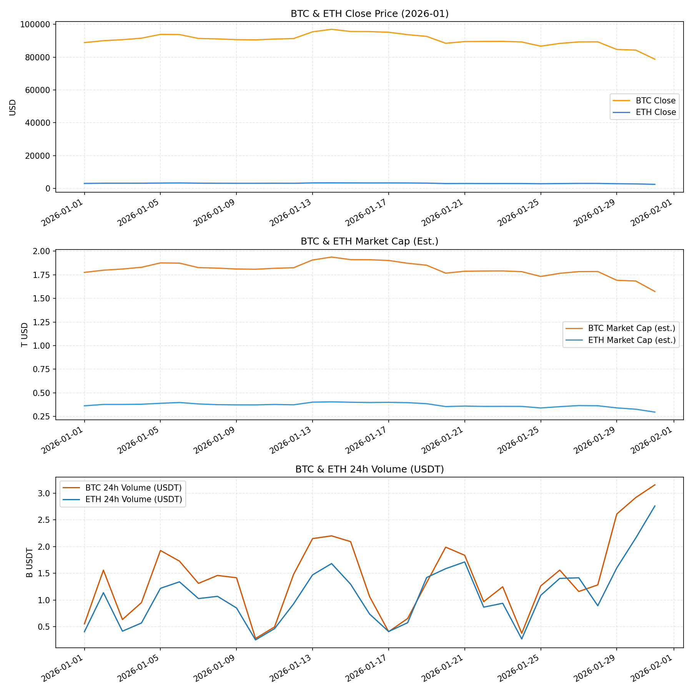

# 二级市场月度报告（CEX 参考口径）

- 月份：2026-01（数据覆盖：2026-01-01 至 2026-01-31）
- 生成时间：2026-02-04 (UTC)

## 数据可用性说明
- BTC/ETH 价格与成交量来自 Binance 日线 K 线（USDT 计价）。
- BTC/ETH 市值为估算值：使用 CMC 最新流通量 × 当日收盘价，未考虑月内供给变化。

## 关键结论（基于可得数据）
- BTC：88,839 → 78,741，区间涨跌 -11.37%；估算市值变动 -11.37%。
- ETH：3,004.19 → 2,451.95，区间涨跌 -18.38%；估算市值变动 -18.38%。
- ETH/BTC 比率：0.0338 → 0.0311（-7.92%），ETH 相对 BTC 走弱。
- BTC 与 ETH 日收益相关性：0.93（同步性高）。

## 市场结构（参考 Binance / Coinbase / OKX 月报框架）
### 市场表现
| 资产 | 起点收盘 | 终点收盘 | 区间涨跌 | 最高/最低 | 价格波动(区间) |
| --- | --- | --- | --- | --- | --- |
| BTC | 88,839 | 78,741 | -11.37% | 96,952 / 78,741 | 0.1211 |
| ETH | 3,004.19 | 2,451.95 | -18.38% | 3,354.92 / 2,451.95 | 0.1905 |

### 流动性与成交量
| 资产 | 24h 成交量均值 | 24h 成交量高/低 | 成交量-收益相关性 |
| --- | --- | --- | --- |
| BTC | $1.42B | $3.16B / $281.32M | -0.08 |
| ETH | $1.10B | $2.76B / $254.50M | -0.05 |

### 市值结构（估算）
| 资产 | 起点市值 | 终点市值 | 变化 |
| --- | --- | --- | --- |
| BTC | $1.78T | $1.57T | -11.37% |
| ETH | $362.59B | $295.93B | -18.38% |

### 全市场快照（CMC 最新）
- 全市场市值：$2.56T，24h 成交量：$165.59B
- BTC/ETH 统治力：59.11% / 10.53%

### 其他可用指标（CMC 最新）
| 指标 | 当前值 |
| --- | --- |
| 活跃币种数 | 8950 |
| 活跃交易所数 | 922 |
| 活跃交易对数 | 120165 |
| 稳定币市值 | $283.32B |
| 稳定币24h成交量 | $163.05B |
| DeFi 市值 | $62.11B |
| DeFi 24h 成交量 | $16.72B |
| 衍生品24h成交量 | $1.43T |

### 情绪指标（恐惧贪婪指数快照）
- 当前：14（Extreme Fear）；昨日：17；上周：29；上月：26

## 关联性解读（基于可得数据）
- BTC 与 ETH 收益相关性较高，表明系统性风险因子主导。
- ETH/BTC 比率变动提示资金在 BTC 与 ETH 之间的风险偏好切换。
- 成交量与收益相关性偏弱，显示交易活跃度对价格方向的解释力有限。

## 图表

## 数据来源
- Binance Klines（日线，BTCUSDT/ETHUSDT）
- CoinMarketCap Global Metrics / Quotes（快照与流通量）
- Alternative.me 恐惧贪婪指数