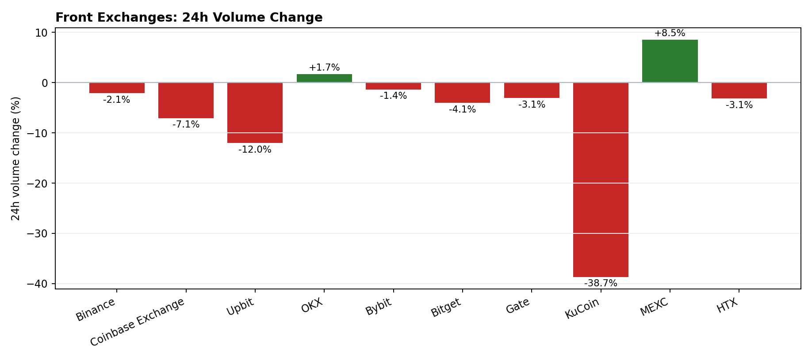
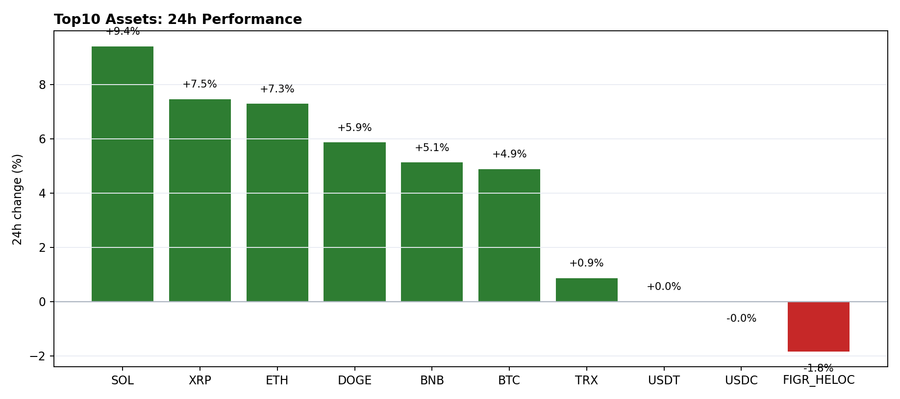
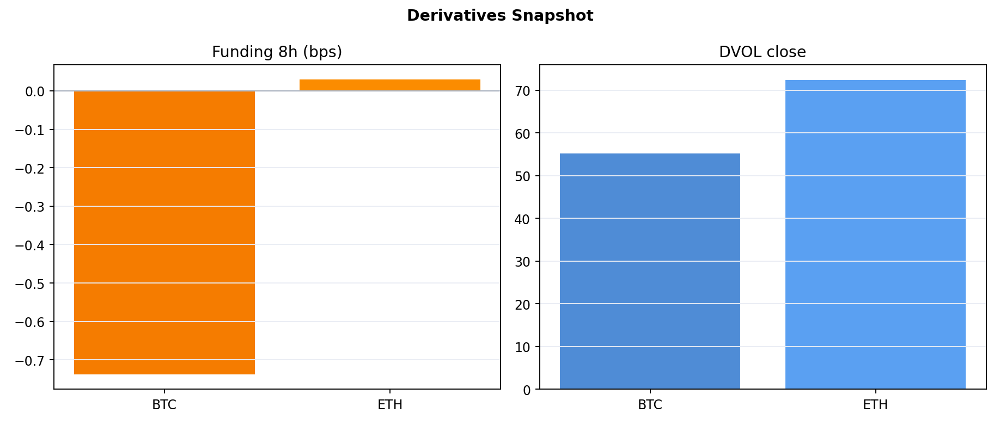

# Secondary Market Daily Brief (2026-02-28)

## Key Takeaways
- Market cap: $2.27T (-2.36%) | 24h volume: $97.31B (-6.68%)
- Breadth (Top10 assets): 8 up / 2 down | BTC dominance: 57.98% (+0.00pct)
- Derivatives: BTC/ETH funding_8h -0.000074 / +0.000003; DVOL 55.21 / 72.38

## Daily Pulse
- Target day: 2026-02-28
- Total market cap: $2.27T
- 24h volume: $97.31B
- BTC dominance: 57.98%

## Exchange Flow
- Fastest 24h expansion: MEXC (+8.52%)
- Weakest 24h flow: KuCoin (-38.68%)
- Data source: CMC exchange quotes latest

## Derivatives & Risk
- Funding/OI from Deribit ticker; DVOL from Deribit volatility index hourly close.

## Sentiment
- Fear & Greed: 11 (-2 d/d)
- Data source: Alternative.me /fng/

## What To Watch (Next 24h)
- Whether funding reverts to neutral after intraday volatility spikes.
- Whether outside-top assets broaden gainers in next session.
- Whether exchange flow concentration eases or remains in top venues.

## Sources
- CMC global metrics historical (data-api)
- CMC exchange quotes latest (data-api)
- CoinGecko coins/markets
- Deribit public API
- Alternative.me F&G API
