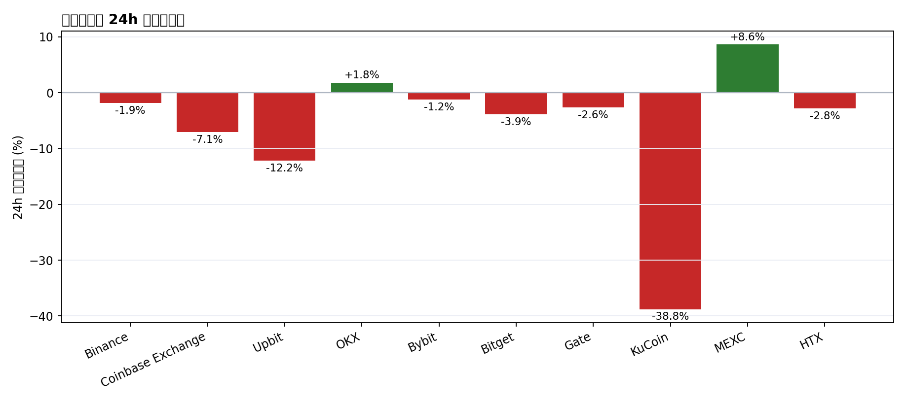
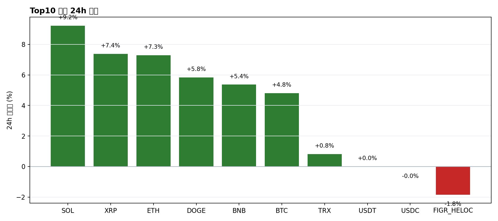
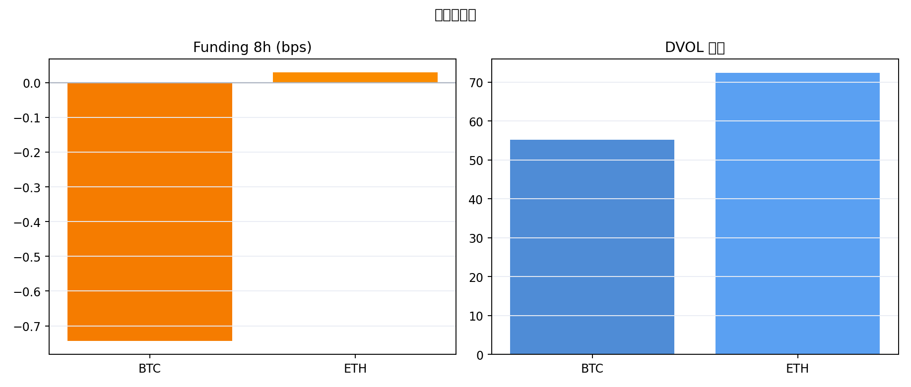

# 二级市场日报（2026-02-28）

## 关键结论
- 全市场市值：$2.27T（-2.36%） | 24h 成交额：$97.31B（-6.68%）
- 资产广度（Top10）：上涨 8 / 下跌 2 | BTC 主导率：57.98%（+0.00pct）
- 衍生品：BTC/ETH funding_8h -0.000074 / +0.000003；DVOL 55.21 / 72.38

## 当日脉冲
- 统计日期：2026-02-28
- 全市场总市值：$2.27T
- 24h 成交额：$97.31B
- BTC 主导率：57.98%

## 交易所资金流
- 24h 增长最快：MEXC（+8.62%）
- 24h 最弱：KuCoin（-38.78%）
- 数据来源：CMC exchange quotes latest

## 衍生品与风险
- Funding/OI 来自 Deribit ticker；DVOL 来自 Deribit volatility index 小时级收盘。

## 情绪
- 恐惧贪婪指数：11（较前日 -2）
- 数据来源：Alternative.me /fng/

## 未来24小时观察点
- Funding 在波动冲击后是否回归中性。
- Top10 外资产是否出现更广泛的上涨扩散。
- 交易所流量集中度是否缓和，还是继续向头部聚集。

## 数据来源
- CMC global metrics historical (data-api)
- CMC exchange quotes latest (data-api)
- CoinGecko coins/markets
- Deribit public API
- Alternative.me F&G API
