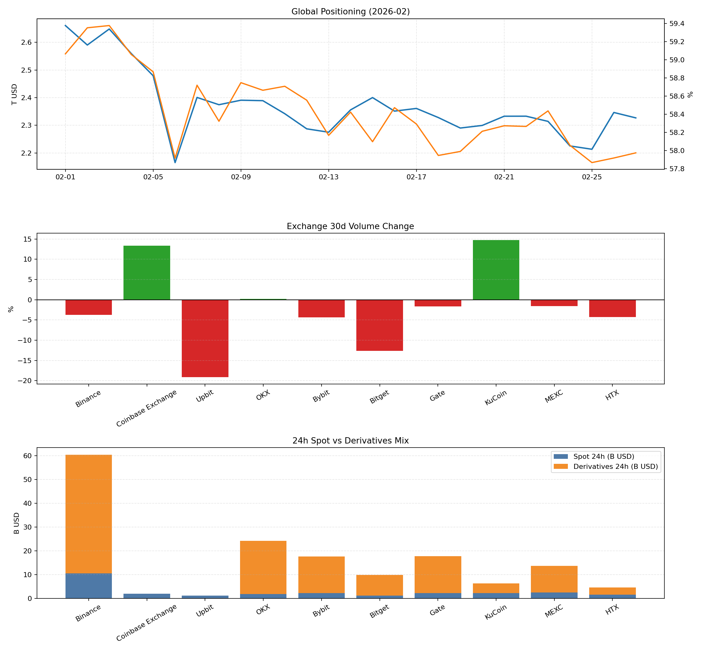

# 我们的二级市场月报（2026-02）

- 报告定位：参考 Coinbase/OKX/KuCoin 的结构，形成“定位 + 风险透明 + 日度跟踪”三段式。
- 生成时间（UTC）：2026-02-27 09:02:28Z
- 数据快照时间（CMC）：2026-02-27T09:02:26.075Z
- 覆盖交易所：Binance, Coinbase Exchange, Upbit, OKX, Bybit, Bitget, Gate, KuCoin, MEXC, HTX

## A. 参考样式拆解（你提到的三家）
- Coinbase《Crypto Market Positioning》：以市场结构和仓位信号为主，常见章节是 Technicals、Flows、Market Depth、Volume、Open Interest。
- OKX《Proof of Reserves》：核心是“可验证透明度”，强调 Merkle Tree + zk-STARK 以及储备覆盖率。
- KuCoin《Daily Market Report》：偏交易台快报，结构是 Summary、Major Asset Changes、Industry Highlights、今日催化剂与观察位。

## B. Executive Summary（Positioning）
- 前排交易所滚动 30 天总成交额：$3.95T（估算环比 -2.77%）
- 全市场总市值（CMC）：$2.66T -> $2.33T（月内 -12.54%）
- 全市场 24h 成交额（日均）：$123.42B
- BTC Dominance：+59.07% -> +57.97%（变动 -1.09%）
- 市场情绪（Alternative.me F&G）：13 / 100（Extreme Fear）

## C. Exchange Cross-Section（前排交易所横截面）
| Rank | Exchange | 30d Volume | 30d Change | 7d Change | 24h Spot | 24h Deriv | Spot Share(24h) |
| --- | --- | --- | --- | --- | --- | --- | --- |
| 1 | Binance | $1.31T | -3.76% | +29.23% | $10.50B | $49.89B | +17.38% |
| 2 | Coinbase Exchange | $51.46B | +13.35% | +31.16% | $2.04B | $0 | +100.00% |
| 3 | Upbit | $38.46B | -19.12% | -12.96% | $1.20B | $0 | +100.00% |
| 6 | OKX | $706.23B | +0.22% | +33.92% | $1.84B | $22.37B | +7.58% |
| 7 | Bybit | $551.89B | -4.38% | +33.21% | $2.26B | $15.39B | +12.82% |
| 8 | Bitget | $289.25B | -12.64% | +26.97% | $1.23B | $8.67B | +12.42% |
| 9 | Gate | $434.94B | -1.62% | +28.81% | $2.25B | $15.47B | +12.71% |
| 10 | KuCoin | $196.12B | +14.75% | -47.34% | $2.18B | $4.08B | +34.82% |
| 14 | MEXC | $211.84B | -1.60% | +7.26% | $2.55B | $11.17B | +18.62% |
| 23 | HTX | $160.86B | -4.31% | +40.81% | $1.52B | $3.03B | +33.45% |

## D. Risk Transparency（PoR 风格章节）
- 现阶段我们可稳定拿到的是“交易行为与结构”数据（量、变化率、现货/衍生品拆分）。
- 这版的风险代理指标：
  - 24h 结构：样本内现货占比 +17.49%，衍生品占比 +82.51%。
  - 30 天分化：增幅前三 KuCoin +14.75%, Coinbase Exchange +13.35%, OKX +0.22%。
  - 30 天回落前三 Upbit -19.12%, Bitget -12.64%, Bybit -4.38%。
- 当前缺口（需 PoR 原站补充）：负债口径、钱包地址级储备明细、资产负债比与审计证明。

## E. Daily Bulletin（KuCoin 风格快照）
- Today’s Outlook：样本 30d 总量延续收缩，但结构性分化明显（少数平台逆势放量）。
- Major Changes（30d）：
  - KuCoin: +14.75%
  - Coinbase Exchange: +13.35%
  - Upbit: -19.12%
  - Bitget: -12.64%
- Watchlist（下一期建议）:
  - 若 BTC Dominance 继续回落且衍生品占比继续上行，需关注高杠杆波动放大风险。
  - 若成交额回升集中于少数交易所，关注流动性集中度风险。

## 图表

## 数据与来源
- CMC Exchange Quotes: `https://api.coinmarketcap.com/data-api/v3/exchange/quotes/latest`
- CMC Global Historical: `https://api.coinmarketcap.com/data-api/v3/global-metrics/quotes/historical`
- Alternative.me F&G: `https://api.alternative.me/fng/`
- 风格参考：
  - Coinbase Institutional: Crypto Market Positioning (February 2026)
  - OKX Proof of Reserves
  - KuCoin Crypto Daily Market Report (Feb 25, 2026)

## 文件
- 数据表：`our_style_exchange_data.csv`
- 图表：`our_style_dashboard.png`