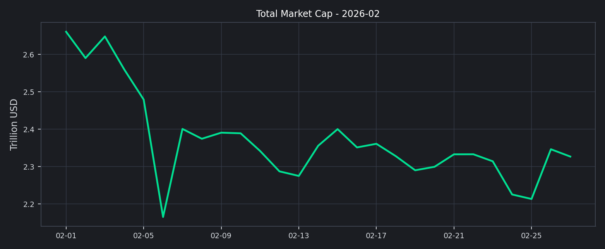
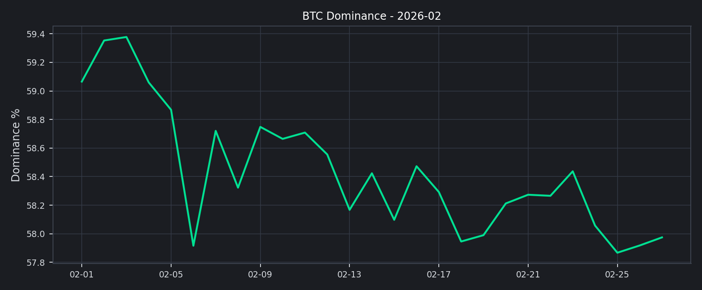
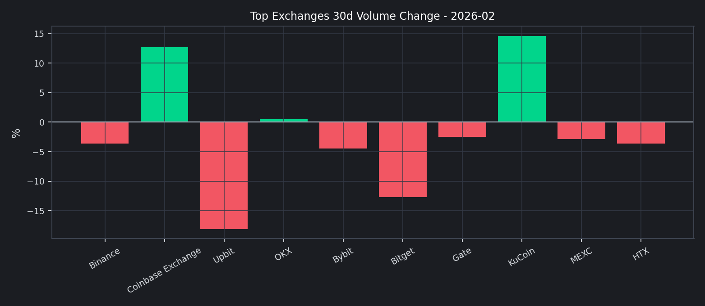
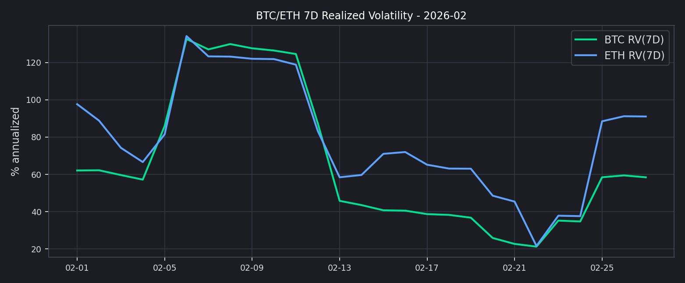
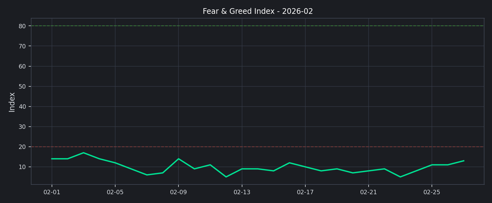

# 202602

## 2026 年 02 月核心市场洞察

- 市值与主导率分析
- 前排交易所成交结构分析
- 市场情绪：恐惧贪婪指数
- 风险与运营建议

本月市场呈现“去杠杆回落、结构分化”的特征，前排交易所整体成交额较前一观察窗口收缩，但头部内部出现分化。

### 2026 年 02 月核心结论
- 总成交额与流动性：前排样本滚动 30 天成交额为 $3.95T，估算环比 -2.84%。
- 全市场总市值：$2.66T -> $2.33T，月内变化 -12.54%。
- 全市场日均 24h 成交额：$123.42B。
- BTC 主导率：+59.07% -> +57.97%。
- 恐惧贪婪指数：13（Extreme Fear）。
- 稳定币资金面：市值 $285.89B，24h 成交量 $99.44B。

值得注意的是，本期市值下行与主导率回落并存，说明市场风险偏好没有简单回归，仍处于结构性再定价阶段。

## 市值与主导率分析
根据 CMC 全市场历史数据，2 月份总市值整体下移；BTC 主导率虽有回落，但仍维持在高位区间。

这意味着交易量仍倾向集中在核心资产交易对，长尾资产流动性修复较慢。

## 前排交易所成交结构分析
我们以 CMC 前排样本进行横向对比，重点观察 `30d 成交额变化` 与 `24h 现货/衍生品结构`。

关键观察：
1. 增幅靠前：KuCoin (+14.60%), Coinbase Exchange (+12.71%)。
2. 回落靠前：Upbit (-18.09%), Bitget (-12.73%)。
3. 结构上，衍生品成交占比在样本内依旧偏高，波动放大风险需持续跟踪。

## 资金费率与波动率观察
参考交易所衍生品月报口径，本节给出资金费率快照与波动率代理指标。
- Deribit funding 快照暂不可用（接口异常），已使用波动率与成交结构作为替代监测。
- 全市场衍生品 24h 成交量（CMC）：$801.57B

该图使用 BTC/ETH 7 日已实现波动率（年化）作为期权隐波的替代温度计：上行通常对应风险对冲需求抬升。

## 市场情绪：恐惧贪婪指数
恐惧贪婪指数在本月维持低位震荡，零售情绪修复缓慢。

关键时点分析：
1. 若指数持续低于 25，通常意味着风险偏好尚未恢复。
2. 若指数快速回升并突破 50，往往对应短期交易活跃度提升。

## 社媒与搜索热度（Trending）
以 CoinGecko Trending 作为公开可得的搜索热度代理。
| Symbol | Name | MCap Rank | Price (BTC) |
| --- | --- | --- | --- |
| BTC | Bitcoin | 1 | 1.00000000 |
| ROBO | Fabric Protocol | 333 | 0.00000050 |
| VVV | Venice Token | 162 | 0.00007477 |
| POWER | Power Protocol | 141 | 0.00002020 |
| PENGU | Pudgy Penguins | 106 | 0.00000011 |
| LUNC | Terra Luna Classic | 161 | 0.00000000 |
| SOL | Solana | 7 | 0.00128952 |
| SUI | Sui | 30 | 0.00001410 |
| VIRTUAL | Virtuals Protocol | 102 | 0.00001083 |
| ETH | Ethereum | 2 | 0.02993031 |

## 稳定币与资金面观察
- 稳定币市值：$285.89B
- 稳定币 24h 成交量：$99.44B
- DeFi 市值：$58.45B
- DeFi 24h 成交量：$10.65B

## 风险与运营建议
1. 风险监控：将“衍生品占比 + 30d 量能变化 + F&G”纳入统一预警面板。
2. 业务策略：在主流币对维持深度，同时控制长尾币对库存与做市风险。
3. 对外披露：参考 PoR 风格，补充负债口径与地址级储备说明，增强用户信任。

## 附录：前排交易所明细
| Rank | Exchange | 30d Volume | 30d Change | 7d Change | 24h Spot | 24h Deriv |
| --- | --- | --- | --- | --- | --- | --- |
| 1 | Binance | $1.31T | -3.64% | +27.56% | $10.46B | $49.84B |
| 2 | Coinbase Exchange | $51.45B | +12.71% | +28.73% | $2.00B | $0 |
| 3 | Upbit | $38.47B | -18.09% | -14.26% | $1.20B | $0 |
| 6 | OKX | $706.25B | +0.47% | +32.43% | $1.85B | $22.32B |
| 7 | Bybit | $551.87B | -4.49% | +31.29% | $2.26B | $15.33B |
| 8 | Bitget | $289.21B | -12.73% | +24.60% | $1.22B | $8.64B |
| 9 | Gate | $434.81B | -2.48% | +26.10% | $2.26B | $14.91B |
| 10 | KuCoin | $196.11B | +14.60% | -47.73% | $2.18B | $4.08B |
| 14 | MEXC | $211.66B | -2.86% | +6.51% | $2.58B | $10.80B |
| 23 | HTX | $160.89B | -3.63% | +40.63% | $1.55B | $3.02B |

## 数据源
- CMC Exchange Quotes: `https://api.coinmarketcap.com/data-api/v3/exchange/quotes/latest`
- CMC Global Historical: `https://api.coinmarketcap.com/data-api/v3/global-metrics/quotes/historical`
- CMC Global Latest: `https://api.coinmarketcap.com/data-api/v3/global-metrics/quotes/latest`
- CoinGecko Trending: `https://api.coingecko.com/api/v3/search/trending`
- CoinGecko Market Chart: `https://api.coingecko.com/api/v3/coins/{id}/market_chart`
- Deribit Ticker: `https://www.deribit.com/api/v2/public/ticker`
- Alternative.me F&G: `https://api.alternative.me/fng/`
- CMC 快照时间：`2026-02-27T09:17:13.579Z`
- 明细数据：`yuque_style_exchange_data.csv`