# 202602

## 2026 年 02 月二级市场月报（整月口径）

- 报告区间：2026-02-01 至 2026-02-28（整月）
- 生成时间：2026-02-28 06:43 UTC
- 口径说明：仅使用当月数据，核心指标按月内日频序列计算，衍生品指标按月内可得快照与日线汇总。
- 范围限定：本报告不使用跨月/跨年的趋势回看窗口。

## 数据可用性说明
- 全市场口径：CMC Global Metrics 日频历史。
- Top 资产与结构分化：CoinGecko + DefiLlama + CryptoSlam 月度快照。
- 衍生品口径：Deribit 公开 API（Funding、OI、DVOL）。
- 交易所横向比较：CMC 前排交易所样本（Binance/Coinbase/OKX/Bybit/KuCoin 等）。

## 参考样本与方法
- Coinbase（机构定位框架）：https://www.coinbase.com/institutional/research-insights/research/trading-insights/crypto-market-positioning-february-2026
- Binance（月报图表框架）：https://www.binance.com/en/research/analysis/monthly-market-insights-2026-02/
- KuCoin（日频脉冲语气）：https://www.kucoin.com/news/articles/crypto-daily-market-report-february-25-2026

## 2026 年 02 月核心结论
- 全市场市值：$2.66T -> $2.27T，月内变化 -14.61%。
- 全市场日均成交额：$122.49B。
- BTC 主导率：59.07% -> 57.98%，变化 -1.09pct。
- Top 资产月度分化：跌幅最小 TRX -4.27%；跌幅最大 ETH -36.81%。
- 市场广度（Top10外占比，月末近端）：21.36%
- Deribit 资金费率（8h）：BTC=-0.000042，ETH=-0.000042。
- Deribit DVOL（月内）：BTC 46.29~82.62（月末 54.59）；ETH 64.24~95.78（月末 72.99）。

## 市值与主导率分析
本月总市值与主导率同步回落，说明下跌阶段并非单一资产虹吸，而是风险资产整体再定价。

| 指标 | 月初 | 月末/均值 | 月内变化 |
| --- | --- | --- | --- |
| 全市场总市值 | $2.66T | $2.27T | -14.61% |
| 全市场日均成交额 | N/A | $122.49B | N/A |
| BTC 主导率 | 59.07% | 57.98% | -1.09pct |

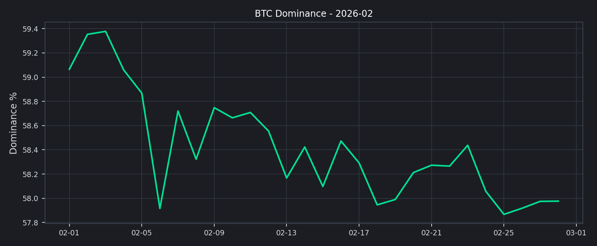

## 前排交易所成交结构分析
前排样本 30d 成交额合计约 $3.90T，估算环比 -7.11%。
增幅靠前为 KuCoin（+118.51%），回落靠前为 MEXC（-24.36%）。

| Rank | Exchange | 30d Volume | 30d Change | 7d Change | 24h Spot | 24h Deriv |
| --- | --- | --- | --- | --- | --- | --- |
| 1 | Binance | $1.31T | -11.39% | +8.81% | $8.53B | $52.05B |
| 2 | Coinbase Exchange | $51.32B | +2.24% | +6.85% | $1.92B | $0 |
| 3 | Upbit | $38.81B | +4.78% | +3.18% | $1.64B | $0 |
| 6 | OKX | $703.25B | -12.17% | +18.59% | $1.67B | $21.12B |
| 7 | Bybit | $481.13B | -11.03% | +16.62% | $2.54B | $15.60B |
| 8 | Bitget | $309.64B | -9.41% | +22.76% | $1.14B | $9.76B |
| 9 | Gate | $497.07B | -0.91% | +21.05% | $2.01B | $16.56B |
| 10 | KuCoin | $227.25B | +118.51% | -47.54% | $1.88B | $10.30B |
| 15 | MEXC | $156.27B | -24.36% | -15.53% | $2.59B | $10.53B |
| 25 | HTX | $126.80B | -8.80% | +33.16% | $1.78B | $2.73B |

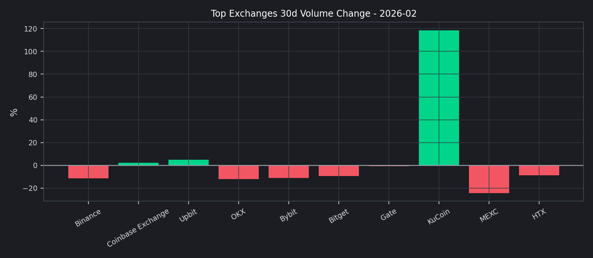

## 板块与资产分化
| 资产 | 月度涨跌 |
| --- | --- |
| TRX | -4.27% |
| WBT | -11.27% |
| BCH | -22.71% |
| ADA | -23.80% |
| DOGE | -26.32% |
| BTC | -27.48% |
| XRP | -29.75% |
| BNB | -33.47% |
| SOL | -35.94% |
| ETH | -36.81% |

| 指标 | 月末值 |
| --- | --- |
| Top10 外市值占比 | 21.36% |
| DeFi TVL（总量） | $93.05B |
| DeFi 链份额（ETH/SOL/BSC/Others） | 56.97% / 6.93% / 5.95% / 21.39% |
| NFT 月成交额 | $291.78M |

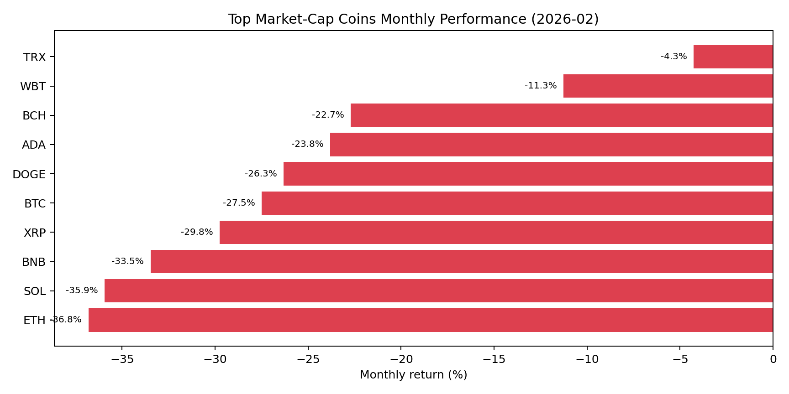

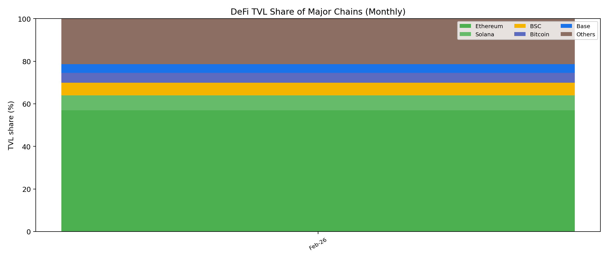

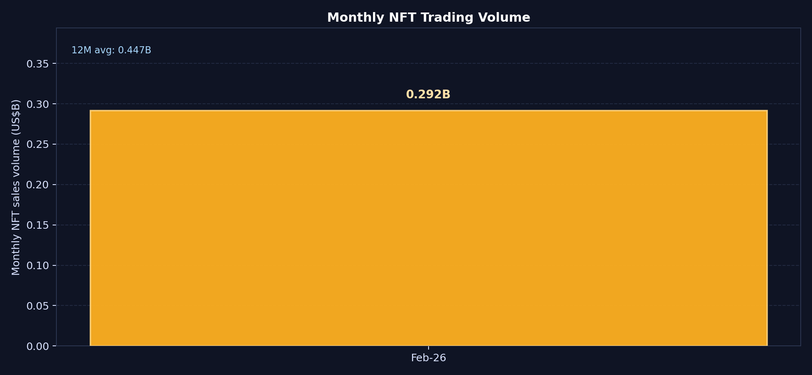

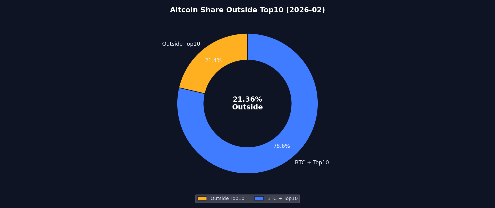

## 衍生品市场洞察（Deribit）
| 指标 | BTC | ETH |
| --- | --- | --- |
| Perp Funding（8h） | -0.000042 | -0.000042 |
| Future OI（聚合） | $2.42B | $593.90M |
| Option OI（聚合） | $394,474 | $1.99M |
| DVOL（月内区间） | 46.29 ~ 82.62（末值 54.59） | 64.24 ~ 95.78（末值 72.99） |

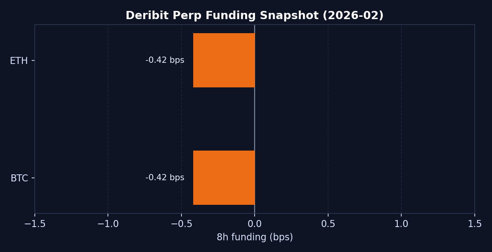

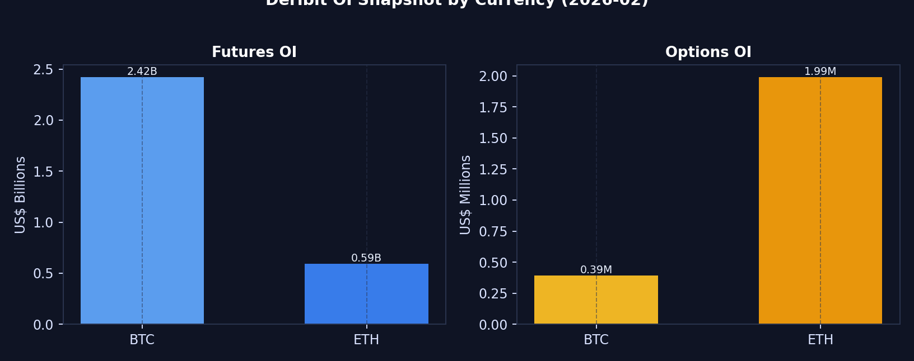

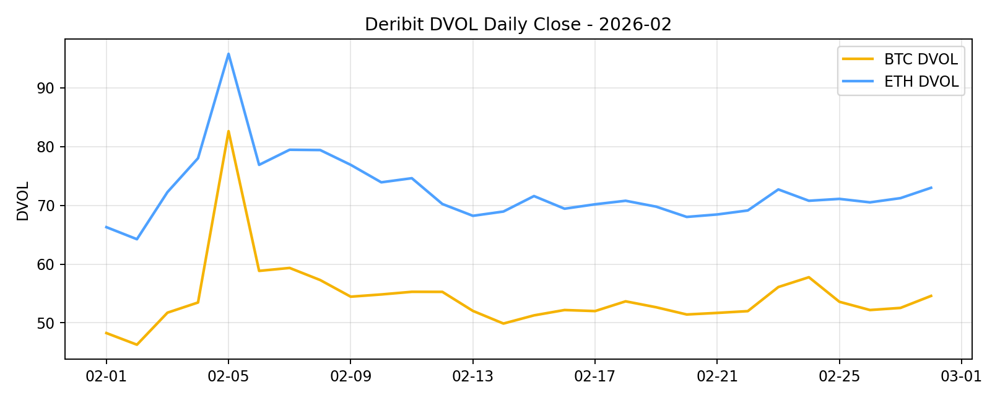

## 情绪与波动观察
在价格回撤阶段，情绪与波动率仍处于偏脆弱区间，短线更容易出现‘低流动性放大波动’。

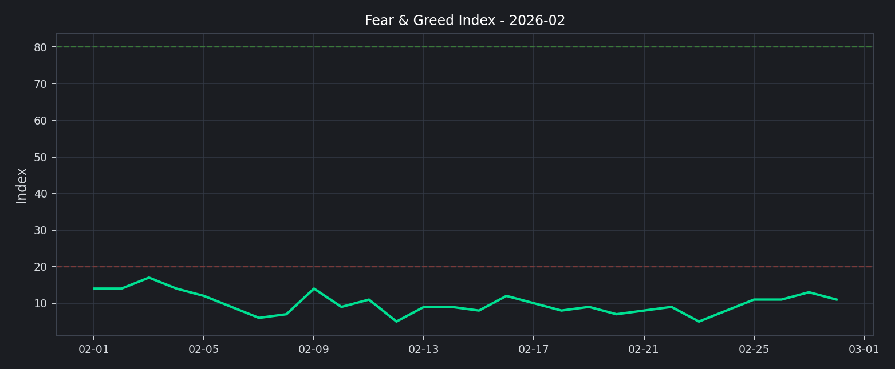

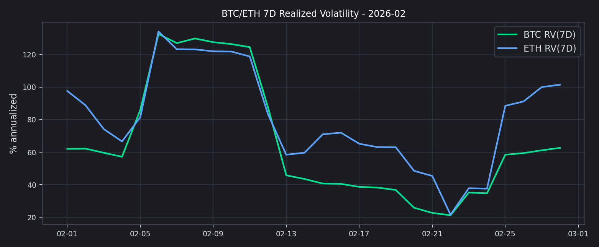

## 图表逐项解读（按 1 月月报风格）

### 图 1：全市场总市值（日频）

- 数据现象：市值从 $2.66T 回落至 $2.27T，月内变化 -14.61%。
- 区间特征：月内高低点区间 $2.66T -> $2.17T，区间回撤 -18.61%。
- 解释：总体风险偏好走弱，资金在月内以降杠杆和防守配置为主。

### 图 2：BTC 主导率（日频）

- 数据现象：BTC.D 从 59.07% 下降至 57.98%，变化 -1.09pct。
- 区间特征：主导率波动区间 57.87% ~ 59.38%。
- 解释：主导率虽回落，但仍处高位，说明资金尚未全面切回高 Beta 长尾资产。

### 图 3：前排交易所 30d 成交额变化

- 数据现象：样本内上涨 3 家、下跌 7 家，中位数变动 -9.10%。
- 分化点：增幅第一 KuCoin（+118.51%），跌幅第一 MEXC（-24.36%）。
- 解释：现货与衍生品流量进一步向头部集中，长尾平台交易恢复弱于主流平台。

### 图 4：Top 资产月度收益分布

- 数据现象：最强 TRX -4.27%，最弱 ETH -36.81%，首尾价差 32.54pct。
- 结构特征：上涨资产 0 个，下跌资产 10 个。
- 解释：2 月呈现系统性回撤，防御型/低波动资产相对抗跌。

### 图 5：DeFi TVL 链份额

- 数据现象：总 TVL $93.05B，ETH/SOL/BSC/Others 份额分别为 56.97% / 6.93% / 5.95% / 21.39%。
- 解释：以太坊仍是绝对流动性中枢，多链分散但尚未改变主链主导格局。

### 图 6：NFT 月成交额

- 数据现象：2 月 NFT 交易额约 $291.78M。
- 解释：NFT 量能仍处低位，零售风险偏好尚未恢复到高波动题材。

### 图 7：Top10 外市值占比

- 数据现象：Top10 外市值占比 21.36%，核心资产合计占比 78.64%。
- 解释：市场广度仍弱，资金主要围绕 BTC 与头部资产交易。

### 图 8：Deribit 资金费率（Perp）

- 数据现象：BTC=-0.000042、ETH=-0.000042（8h）。
- 解释：费率整体略负，杠杆端短线偏空，但拥挤度不高。

### 图 9：Deribit OI 结构（Future vs Option）

- 数据现象：BTC Future OI $2.42B、Option OI $394,474；ETH Future OI $593.90M、Option OI $1.99M。
- 结构特征：Option/Future OI 比例 BTC 0.0163%、ETH 0.3349%。
- 解释：OI 主要集中在永续/期货，期权端更偏风险对冲与事件交易。

### 图 10：Deribit DVOL（月内）

- 数据现象：BTC DVOL 46.29~82.62（峰值日 2026-02-05）；ETH DVOL 64.24~95.78（峰值日 2026-02-05）。
- 波动脉冲：BTC 峰值较低位 +78.48%，ETH 峰值较低位 +49.10%。
- 解释：月内出现阶段性恐慌定价，随后隐含波动率回落，风险溢价边际收敛。

### 图 11：恐惧贪婪指数（日频）

- 数据现象：月末指数 11（Extreme Fear），月内区间 5~17，均值 10.00。
- 极端恐惧天数：28 天。
- 解释：零售情绪修复缓慢，风险偏好恢复仍需要更长验证周期。

### 图 12：BTC/ETH 7D 已实现波动率

- 数据现象：月末 BTC RV 62.76%、ETH RV 101.53%；月内区间 BTC 21.22%~132.66%，ETH 21.57%~134.22%。
- 相对波动：月末 ETH 较 BTC 高 38.77pct。
- 解释：ETH 波动弹性仍高于 BTC，风险预算配置需维持分层仓位管理。

## 风险与运营建议
1. 盘口与库存：主流币对维持深度优先，长尾币对库存上限与滑点阈值同步收紧。
2. 风控联动：将 Funding、DVOL、Top10 外占比纳入统一预警，触发阈值时自动提升保证金提示。
3. 用户沟通：在恐惧区间加强风险教育与仓位管理提示，减少顺势追空导致的连锁清算。

## 月内图表索引
- core_chart_1_marketcap.png
- core_chart_2_btc_dom.png
- fig2_top10_monthly_performance.png
- fig3_defi_tvl_share.png
- fig4_monthly_nft_volume.png
- fig6_altcoin_outside_top10_share.png
- chart_deribit_funding.png
- chart_deribit_oi.png
- chart_deribit_dvol.png
- core_chart_3_exchange_30d_change.png
- core_chart_4_fng.png
- core_chart_5_realized_vol.png

## 数据源
- CMC Global Historical: `https://api.coinmarketcap.com/data-api/v3/global-metrics/quotes/historical`
- CMC Exchange Quotes: `https://api.coinmarketcap.com/data-api/v3/exchange/quotes/latest`
- CoinGecko Markets: `https://api.coingecko.com/api/v3/coins/markets`
- DefiLlama Historical TVL: `https://api.llama.fi/v2/historicalChainTvl`
- CryptoSlam Global Sales: `https://web-api.cryptoslam.io/v1/global/sales`
- Deribit Public API: `https://www.deribit.com/api/v2`
- Alternative.me F&G: `https://api.alternative.me/fng/`
- CoinMetrics (State of the Network #348): `https://coinmetrics.substack.com/p/state-of-the-network-issue-348`

## 执行状态
- fig2: ok
- fig3: ok
- fig4: ok
- fig6: ok
- deribit: ok
- core_report: ok
