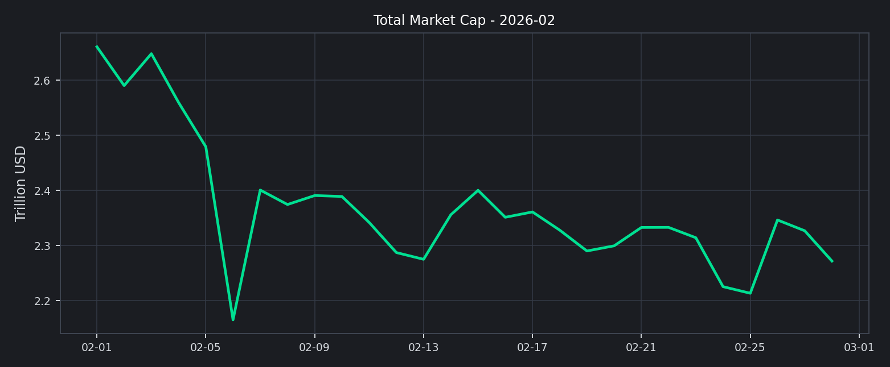

# 202602

## 2026 年 02 月核心市场洞察

- 市值与主导率分析
- 前排交易所成交结构分析
- 市场情绪：恐惧贪婪指数
- 风险与运营建议

本月市场呈现“去杠杆回落、结构分化”的特征，前排交易所整体成交额较前一观察窗口收缩，但头部内部出现分化。

### 2026 年 02 月核心结论
- 总成交额与流动性：前排样本滚动 30 天成交额为 $3.90T，估算环比 -7.11%。
- 全市场总市值：$2.66T -> $2.27T，月内变化 -14.61%。
- 全市场日均 24h 成交额：$122.49B。
- BTC 主导率：+59.07% -> +57.98%。
- 恐惧贪婪指数：11（Extreme Fear）。
- 稳定币资金面：市值 $285.85B，24h 成交量 $91.95B。

值得注意的是，本期市值下行与主导率回落并存，说明市场风险偏好没有简单回归，仍处于结构性再定价阶段。

## 市值与主导率分析
根据 CMC 全市场历史数据，2 月份总市值整体下移；BTC 主导率虽有回落，但仍维持在高位区间。

这意味着交易量仍倾向集中在核心资产交易对，长尾资产流动性修复较慢。

## 前排交易所成交结构分析
我们以 CMC 前排样本进行横向对比，重点观察 `30d 成交额变化` 与 `24h 现货/衍生品结构`。

关键观察：
1. 增幅靠前：KuCoin (+118.51%), Upbit (+4.78%)。
2. 回落靠前：MEXC (-24.36%), OKX (-12.17%)。
3. 结构上，衍生品成交占比在样本内依旧偏高，波动放大风险需持续跟踪。

## 资金费率与波动率观察
参考交易所衍生品月报口径，本节给出资金费率快照与波动率代理指标。
- Deribit BTC-PERP funding: +0.00%
- Deribit ETH-PERP funding: +0.00%
- 全市场衍生品 24h 成交量（CMC）：$820.78B

该图使用 BTC/ETH 7 日已实现波动率（年化）作为期权隐波的替代温度计：上行通常对应风险对冲需求抬升。

## 市场情绪：恐惧贪婪指数
恐惧贪婪指数在本月维持低位震荡，零售情绪修复缓慢。

关键时点分析：
1. 若指数持续低于 25，通常意味着风险偏好尚未恢复。
2. 若指数快速回升并突破 50，往往对应短期交易活跃度提升。

## 社媒与搜索热度（Trending）
以 CoinGecko Trending 作为公开可得的搜索热度代理。
| Symbol | Name | MCap Rank | Price (BTC) |
| --- | --- | --- | --- |
| ROBO | Fabric Protocol | 279 | 0.00000065 |
| PENGU | Pudgy Penguins | 109 | 0.00000010 |
| BTC | Bitcoin | 1 | 1.00000000 |
| ETH | Ethereum | 2 | 0.02914054 |
| SOL | Solana | 7 | 0.00123442 |
| GWEI | ETHGas | 322 | 0.00000068 |
| SUI | Sui | 31 | 0.00001344 |
| LUNC | Terra Luna Classic | 154 | 0.00000000 |
| VIRTUAL | Virtuals Protocol | 106 | 0.00001010 |
| SAHARA | Sahara AI | 367 | 0.00000034 |

## 稳定币与资金面观察
- 稳定币市值：$285.85B
- 稳定币 24h 成交量：$91.95B
- DeFi 市值：$54.39B
- DeFi 24h 成交量：$9.23B

## 风险与运营建议
1. 风险监控：将“衍生品占比 + 30d 量能变化 + F&G”纳入统一预警面板。
2. 业务策略：在主流币对维持深度，同时控制长尾币对库存与做市风险。
3. 对外披露：参考 PoR 风格，补充负债口径与地址级储备说明，增强用户信任。

## 附录：前排交易所明细
| Rank | Exchange | 30d Volume | 30d Change | 7d Change | 24h Spot | 24h Deriv |
| --- | --- | --- | --- | --- | --- | --- |
| 1 | Binance | $1.31T | -11.39% | +8.81% | $8.53B | $52.05B |
| 2 | Coinbase Exchange | $51.32B | +2.24% | +6.85% | $1.92B | $0 |
| 3 | Upbit | $38.81B | +4.78% | +3.18% | $1.64B | $0 |
| 6 | OKX | $703.25B | -12.17% | +18.59% | $1.67B | $21.12B |
| 7 | Bybit | $481.13B | -11.03% | +16.62% | $2.54B | $15.60B |
| 8 | Bitget | $309.64B | -9.41% | +22.76% | $1.14B | $9.76B |
| 9 | Gate | $497.07B | -0.91% | +21.05% | $2.01B | $16.56B |
| 10 | KuCoin | $227.25B | +118.51% | -47.54% | $1.88B | $10.30B |
| 15 | MEXC | $156.27B | -24.36% | -15.53% | $2.59B | $10.53B |
| 25 | HTX | $126.80B | -8.80% | +33.16% | $1.78B | $2.73B |

## 数据源
- CMC Exchange Quotes: `https://api.coinmarketcap.com/data-api/v3/exchange/quotes/latest`
- CMC Global Historical: `https://api.coinmarketcap.com/data-api/v3/global-metrics/quotes/historical`
- CMC Global Latest: `https://api.coinmarketcap.com/data-api/v3/global-metrics/quotes/latest`
- CoinGecko Trending: `https://api.coingecko.com/api/v3/search/trending`
- CoinGecko Market Chart: `https://api.coingecko.com/api/v3/coins/{id}/market_chart`
- CoinMetrics (State of the Network #348): `https://coinmetrics.substack.com/p/state-of-the-network-issue-348`
- Deribit Ticker: `https://www.deribit.com/api/v2/public/ticker`
- Alternative.me F&G: `https://api.alternative.me/fng/`
- CMC 快照时间：`2026-02-28T06:43:01.069Z`
- 明细数据：`yuque_style_exchange_data.csv`