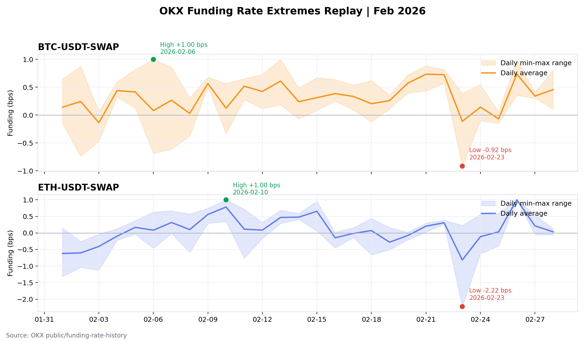
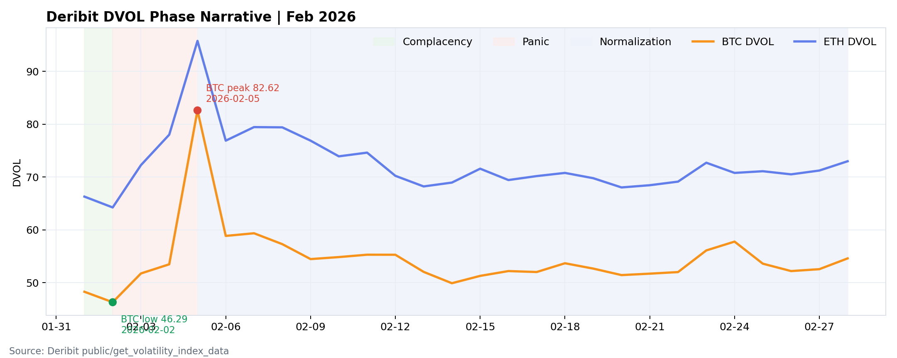
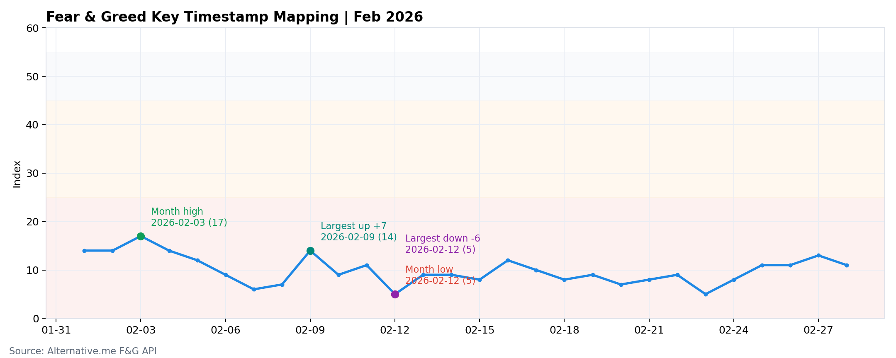
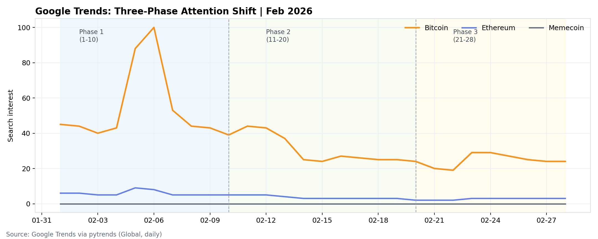
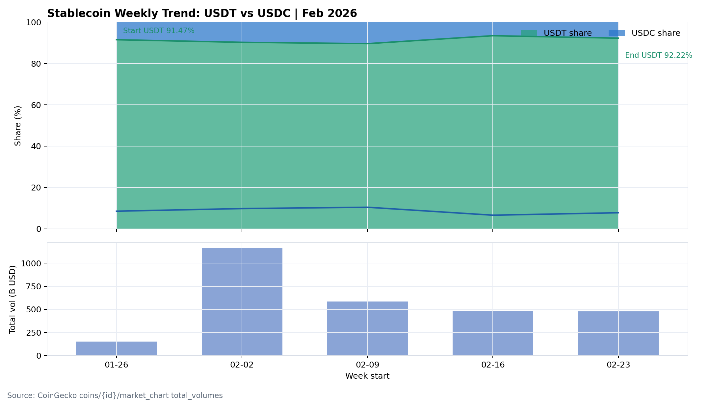

# 2026-02 缺口补齐补充（可并入月报）

- 目标：补齐与 1 月版式对比中缺失的 5 项模块。
- 区间：2026-02-01 至 2026-02-28。

## 1) 单一交易所 Funding 极值时序复盘（OKX）

数据来源：OKX `public/funding-rate-history`（BTC-USDT-SWAP / ETH-USDT-SWAP）
- BTC：高点 +0.000100（2026-02-06），低点 -0.000092（2026-02-23），月均 +0.000032。
- ETH：高点 +0.000100（2026-02-10），低点 -0.000222（2026-02-23），月均 +0.000009。
- 结论：该项可补齐（已产出明细 CSV）。

## 2) DVOL 分阶段叙事（Complacency / Panic）

数据来源：Deribit `public/get_volatility_index_data`（月内日线）
- BTC：低波阶段低点 46.29（2026-02-02）-> 恐慌阶段高点 82.62（2026-02-05）-> 月末 54.59。
- ETH：低波阶段低点 64.24（2026-02-02）-> 恐慌阶段高点 95.78（2026-02-05）-> 月末 72.99。
- 结论：该项可补齐（已形成阶段化叙事模板）。

## 3) F&G 关键时点映射

数据来源：Alternative.me `fng`
- 月内高点：17（Extreme Fear，2026-02-03）；月内低点：5（Extreme Fear，2026-02-12）。
- 最大单日上行：+7（2026-02-09）；最大单日下行：-6（2026-02-12）。
- 结论：该项可补齐（已从“区间值”升级为“关键时点”）。

## 4) Google Trends 搜索热度三阶段

数据来源：Google Trends（pytrends），关键词 `Bitcoin / Ethereum / Memecoin`，全球。
- 阶段一（1-10日）：Bitcoin 均值 53.9，Ethereum 均值 5.9，Memecoin 均值 0.0。
- 阶段二（11-20日）：Bitcoin 均值 30.0，Ethereum 均值 3.4，Memecoin 均值 0.0。
- 阶段三（21-28日）：Bitcoin 均值 24.6，Ethereum 均值 2.8，Memecoin 均值 0.0。
- 结论：该项可补齐（已产出日频 CSV 与三阶段汇总）。

## 5) 稳定币周度趋势（USDT vs USDC）

数据来源：CoinGecko `coins/{id}/market_chart` 的 `total_volumes`（USDT/USDC）
- 周初（2026-01-26）：USDT 占比 91.47%，USDC 占比 8.53%。
- 周末（2026-02-23）：USDT 占比 92.22%，USDC 占比 7.78%。
- 结论：该项可补齐（已产出周频对比 CSV）。

## 产出文件
- `okx_funding_btc_feb2026.csv`
- `okx_funding_eth_feb2026.csv`
- `fng_daily_feb2026.csv`
- `google_trends_daily_feb2026.csv`（若成功）
- `stablecoin_weekly_usdt_usdc_feb2026.csv`
