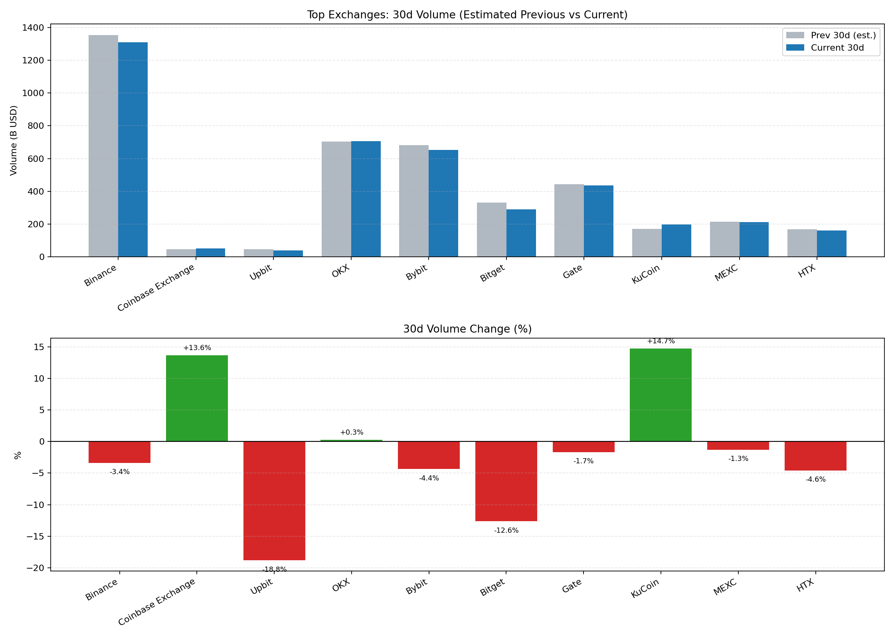

# 前排交易所 2 月二级市场变化报告（CMC 口径）

- 生成时间（UTC）：2026-02-27 08:50:14Z
- 数据快照时间（CMC）：2026-02-27T08:50:13.730Z
- 样本：Binance, Coinbase Exchange, Upbit, OKX, Bybit, Bitget, Gate, KuCoin, MEXC, HTX
- 口径说明：
  - `volume30d` 为滚动 30 天成交额，不等于完整自然月。
  - `percentChangeVolume30d` 为当前滚动 30 天相对前一滚动 30 天变化。
  - 本报告将其作为“2 月窗口变化”的近似观测。

## 关键结论
- 前排样本合计滚动 30 天成交额：$4.05T
- 估算前一滚动 30 天成交额：$4.16T
- 合计变化：-2.67%
- 30 天增幅靠前：
  - KuCoin: +14.70%
  - Coinbase Exchange: +13.64%
  - OKX: +0.26%
- 30 天回落靠前：
  - Upbit: -18.82%
  - Bitget: -12.63%
  - HTX: -4.59%

## 明细表（按 CMC 排名）
| Rank | Exchange | 30d Volume | 30d Change | Est. Prev 30d | 24h Spot | 24h Derivatives |
| --- | --- | --- | --- | --- | --- | --- |
| 1 | Binance | $1.31T | -3.38% | $1.35T | $10.56B | $49.96B |
| 2 | Coinbase Exchange | $51.47B | +13.64% | $45.29B | $2.03B | $0 |
| 3 | Upbit | $38.46B | -18.82% | $47.38B | $1.20B | $0 |
| 6 | OKX | $706.23B | +0.26% | $704.41B | $1.84B | $22.34B |
| 7 | Bybit | $651.44B | -4.37% | $681.20B | $2.27B | $15.39B |
| 8 | Bitget | $289.25B | -12.63% | $331.05B | $1.23B | $8.68B |
| 9 | Gate | $434.98B | -1.67% | $442.37B | $2.26B | $15.36B |
| 10 | KuCoin | $196.12B | +14.70% | $170.99B | $2.18B | $4.09B |
| 14 | MEXC | $211.85B | -1.29% | $214.63B | $2.56B | $11.09B |
| 23 | HTX | $160.85B | -4.59% | $168.59B | $1.51B | $3.02B |

## 图表

## 参考链接（月报/口径参考）
- CMC Spot Exchanges: https://coinmarketcap.com/rankings/exchanges/
- Coinbase Institutional (Feb 2026): https://www.coinbase.com/institutional/research-insights/research/trading-insights/crypto-market-positioning-february-2026
- OKX Proof of Reserves (Feb 2026 snapshots): https://www.okx.com/proof-of-reserves
- KuCoin Market Bulletin (Feb 2026): https://www.kucoin.com/news/articles/crypto-daily-market-report-february-25-2026

## 数据文件
- CSV: `top10_feb_secondary_data.csv`
- Chart: `top10_feb_secondary_chart.png`

## 数据源（API）
- `https://api.coinmarketcap.com/data-api/v3/exchange/quotes/latest`