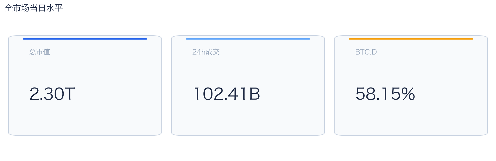
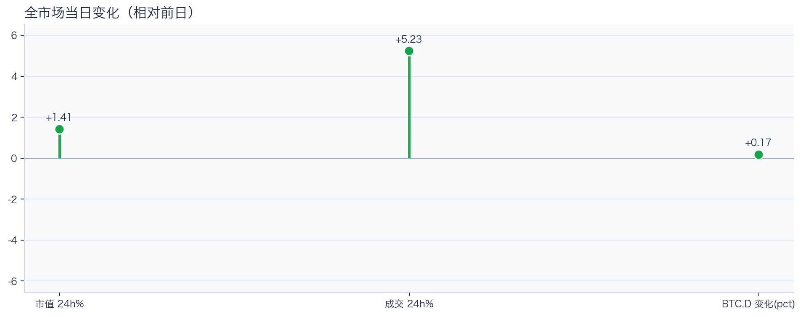
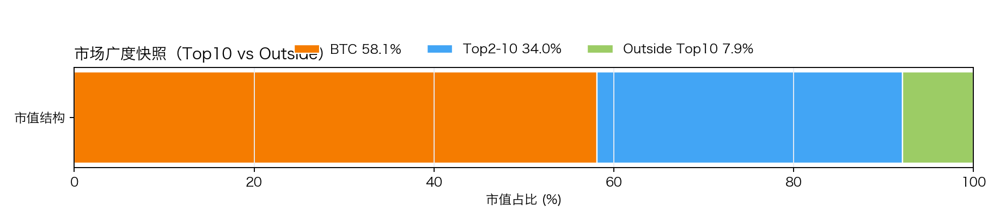
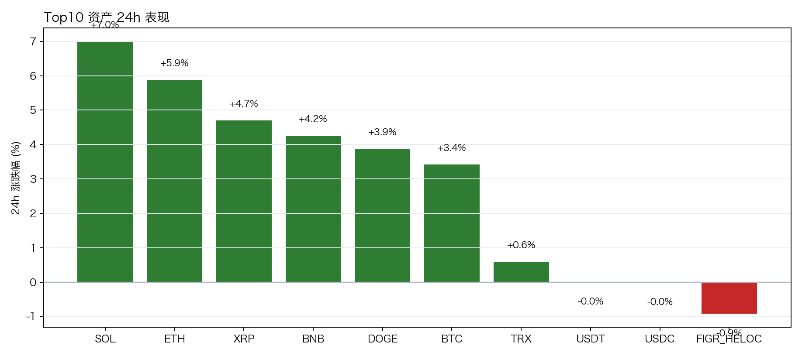
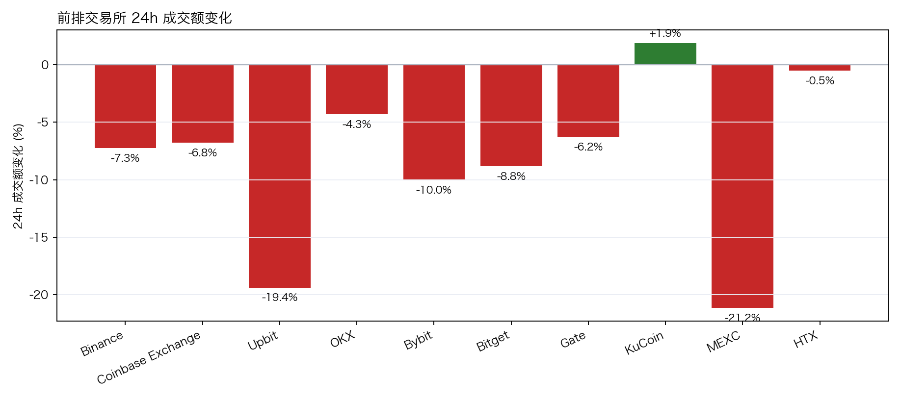
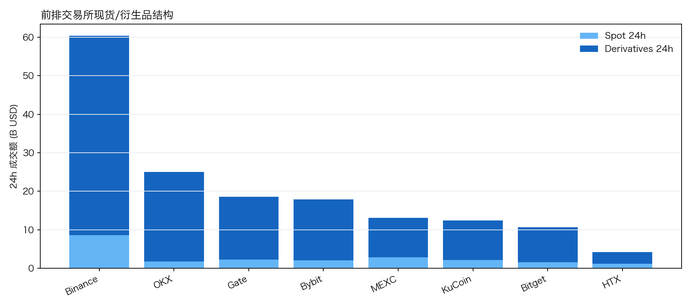
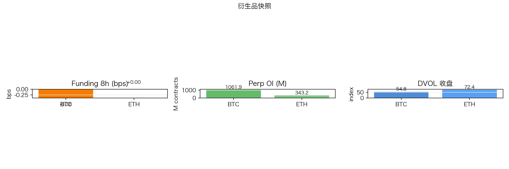
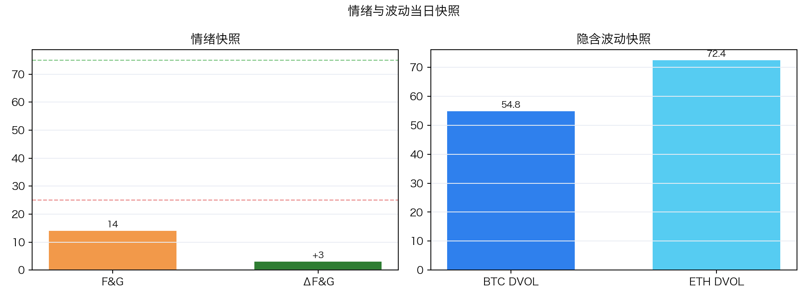

# 二级市场日报（2026-03-01）

## 关键结论
- 全市场市值 $2.30T（24h +1.41%），成交额 $102.41B（24h +5.23%）。
- BTC 主导率 58.15%（+0.17pct），Top10 外占比 7.87% 。
- Top10 资产上涨 7 / 下跌 3，平均涨跌幅 +2.88%，首尾分化 7.91pct。
- 衍生品：BTC/ETH funding 分别为 -0.38bps / +0.00bps，DVOL 收盘 54.76 / 72.43。

## 今日盘面判断
如果只用一句话概括今天的市场，关键词是 `Tactical Rebound`。价格与成交共振上行，但广度仍集中于核心资产，当前更像交易性修复而非趋势反转。广度仍偏窄，增量风险偏好尚未形成持续外溢。这意味着短线虽然有可交易的弹性，但要把它理解成新一轮趋势启动，证据还不够。

## 驱动在发生什么
从流动性结构看，多数平台成交走弱，流动性恢复仍依赖少数头部平台；从杠杆维度看，杠杆拥挤度整体可控；在风险定价层面，期权端对尾部波动的定价仍偏谨慎；再结合情绪仍在恐惧区，反弹更容易受到外部事件扰动。整体来看，盘面更像是修复中的高波动环境，而不是低波动顺趋势环境。

## 市场脉冲

截至 2026-03-01，全市场市值 $2.30T，24h 成交额 $102.41B，BTC 主导率 58.15%。
价格与成交同步上行，属于健康修复结构；若次日成交不掉队，修复延续概率更高。在这种盘面下，成交能否继续跟上，是判断明天反弹延续还是回吐的第一道分水岭。
数据来源：CMC `global-metrics/quotes/historical`

相对前日，市值 +1.41%、成交 +5.23%、BTC.D +0.17pct。
把这组变化拆开看，比看单一涨跌更有用：价格、成交、主导率三者同向时，行情更有连续性；一旦出现背离，走势往往会变得更短促、更反复。
数据来源：CMC `global-metrics/quotes/historical`

## 主导率与市场广度

当前结构为 BTC 58.15% / Top2-10 33.98% / Top10 外 7.87%。长尾占比仍偏低，广度修复还未形成持续趋势。
Top10 外占比处于低位，风险偏好仍主要停留在 BTC 与头部资产。换句话说，资金目前更愿意在高流动性的核心资产里做仓位调整，而不是大面积扩散到长尾资产。
数据来源：CMC 全市场 + CoinGecko Top10 市值聚合

## 资产与交易所资金流

Top10 中领涨 SOL（+6.99%），尾部 FIGR_HELOC（-0.92%），均值 +2.88%。分化 7.91pct，结构性交易仍是主导。
上涨家数明显占优，但首尾分化仍大，表明反弹并非无差别普涨。对交易而言，这通常意味着“选币”比“全市场方向”更重要，错配带来的收益差会明显放大。
数据来源：CoinGecko `coins/markets`

前排样本上涨 1 家、下跌 9 家，均值 -8.26%。KuCoin 最强（+1.87%），MEXC 最弱（-21.16%）。
最强与最弱平台的 24h 变化差达到 23.02pct，说明流动性仍在选择性回流，头部平台的价格发现能力更强。当平台间流量分化明显时，报价连续性和滑点表现会同步分化，执行层面要更关注成交质量。
数据来源：CMC `exchange/quotes/latest`

样本内衍生品成交占比 84.53%。若该占比继续走高且 funding 不同步回落，短线波动脉冲通常会增强。
衍生品仍是主导成交形态，价格连续性更多由杠杆侧情绪决定。这也是为什么同样的消息面在当前阶段更容易被放大成大振幅走势。
数据来源：CMC `exchange/quotes/latest`（spotVolumeUsd / derivativeVolumeUsd）

## 衍生品与情绪

Funding 仍在中性附近，BTC/ETH 分别 -0.38bps / +0.00bps；Perp OI 为 $1.06B / $343.22M；DVOL 位于 Neutral（中性波动定价） / Panic（高波动溢价）。
资金费率接近中性，说明方向拥挤度有限；但 DVOL 仍偏高，市场对突发波动仍保留保险溢价。因此更合适的做法不是激进追单边，而是围绕波动管理仓位和节奏。
数据来源：Deribit `public/ticker`、`public/get_volatility_index_data`

F&G 当日 14（较前日 +3）；配合 BTC/ETH DVOL 54.76/72.43，当前更像情绪修复中的高波动区。
恐惧区内出现边际改善，说明市场开始试探修复，但尚不足以支持激进风险暴露。只有当情绪、广度和成交三者同时改善，市场才更可能从“反弹交易”切换到“趋势交易”。
数据来源：Alternative.me `/fng/` + Deribit DVOL

## 明日要盯的三个触发器
1. 若 Top10 外占比继续抬升且 BTC.D 回落，说明风险偏好开始从核心资产向外扩散。
2. 若衍生品占比继续上升而 funding 仍中性，盘面大概率维持高波动震荡而非顺滑上行。
3. 若 F&G 反弹但 DVOL 不降，代表情绪与风险定价背离，追涨胜率会明显下降。

## 交易与风控含义
- 仓位管理优先级高于方向押注，建议保持核心仓位稳定、战术仓位滚动。
- 若交易所衍生品占比继续上升，建议同步收紧杠杆和止损参数。
- 关注情绪改善与广度扩散是否同步发生，二者背离时避免追逐单边。

