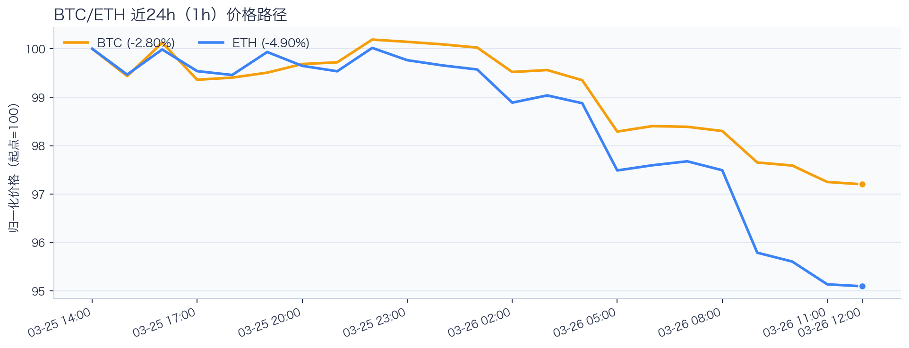
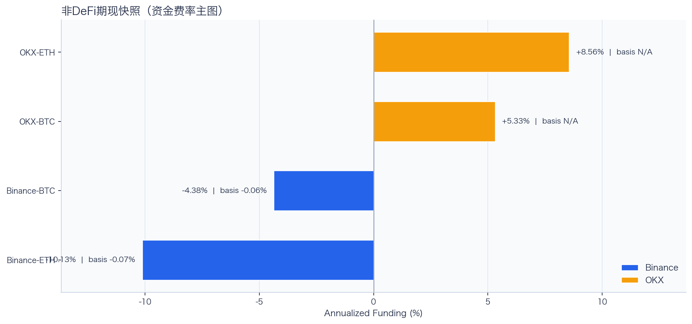
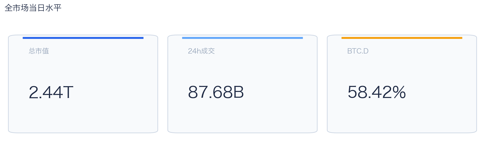
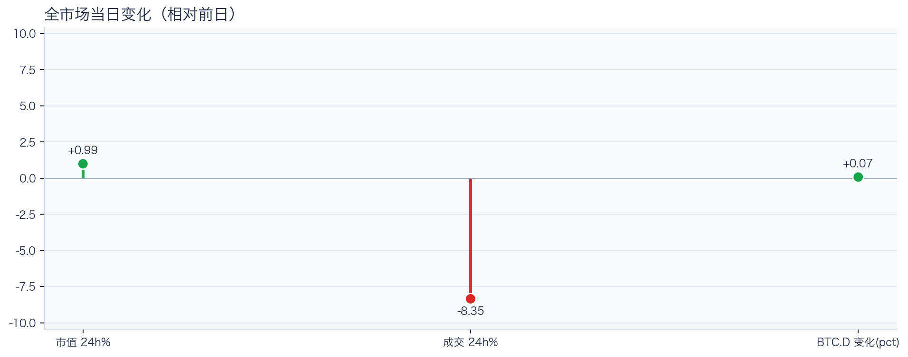
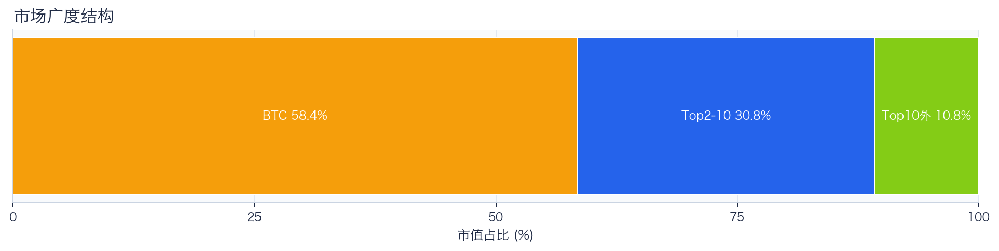
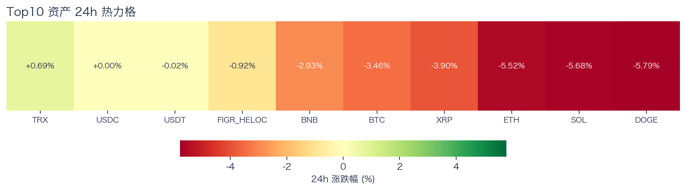
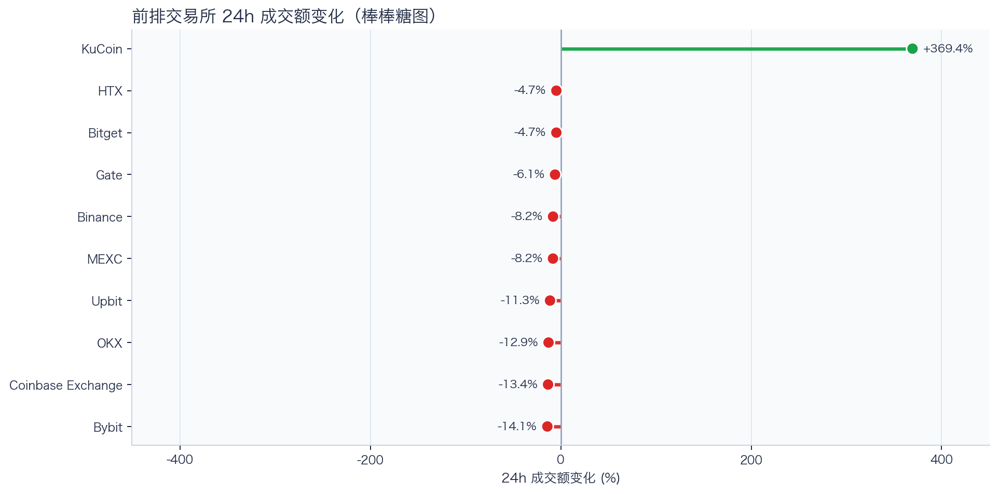
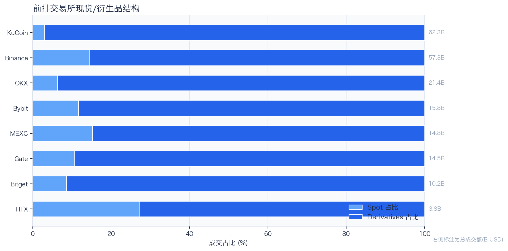
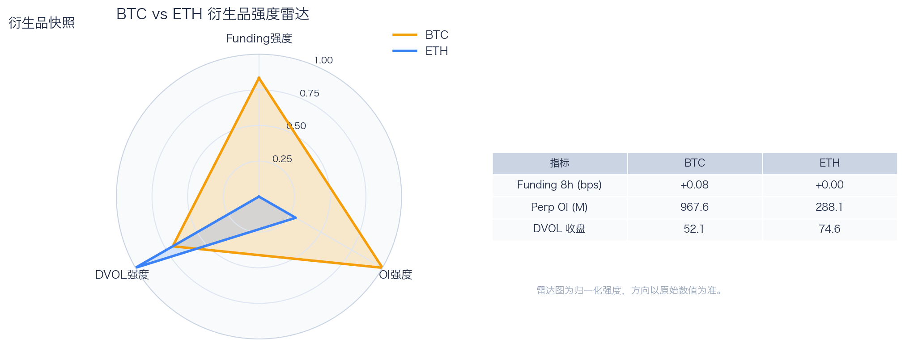
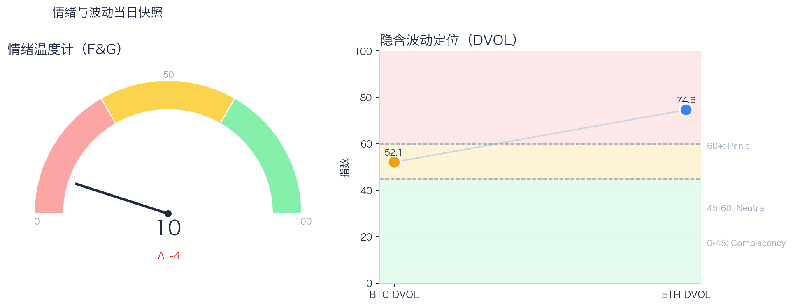

# 二级市场日报（2026-03-26）

## 关键结论
- 全市场市值 $2.44T（24h +0.99%），成交额 $87.68B（24h -8.35%）。
- BTC 主导率 58.42%（+0.07pct），Top10 外占比 10.77%。
- Top10 资产上涨 2 / 下跌 8，平均涨跌幅 -2.75%，首尾分化 6.48pct。
- 衍生品：BTC/ETH 资金费率分别为 +0.08bps / +0.00bps，DVOL 收盘 52.11 / 74.64。

## 今日盘面判断
如果只用一句话概括今天的市场，关键词是 `Range Trading`。价格与成交未形成同向趋势，市场仍在区间内进行结构轮动。长尾占比处于中性修复区，需继续观察是否出现连续两日抬升。这意味着短线虽然有可交易的弹性，但要把它理解成新一轮趋势启动，证据还不够。

## 核心驱动因素
从流动性结构看，多数平台成交走弱，流动性恢复仍依赖少数头部平台；从杠杆维度看，杠杆拥挤度整体可控；在风险定价层面，期权端对尾部波动的定价仍偏谨慎；再结合情绪仍在恐惧区，反弹更容易受到外部事件扰动。整体来看，盘面更像是修复中的高波动环境，而不是低波动顺趋势环境。

## BTC/ETH 24h 趋势判断

- BTC：$69,241.80（24h -3.44%，区间 $69,192.96 - $71,963.71，当前位于区间 2%）=> 偏弱，下行主导。
- ETH：$2,067.59（24h -5.50%，区间 $2,062.94 - $2,198.16，当前位于区间 3%）=> 偏弱，下行主导。
- 简评：BTC 偏弱震荡下行，ETH 相对更弱。

## 稳定币收益情况（链上协议）
按安全优先（协议成熟度、链层风险、是否依赖激励）筛选了 10 个主流池；原生供给利率均值约 +2.02%。
其中包含奖励补贴的池有 1 个，补贴收益已单列，不与原生利率混合。

核心观察
- 利率结构：Total APY 位于 0.00% 至 3.40% 区间。
- 资金集中：TVL 主要集中在 Aave-USDT（Ethereum，TVL $1.57B）、Aave-USDC（Ethereum，TVL $883.93M）。
- 收益领先：当前收益靠前样本包括 Spark-USDT（Ethereum，Total 3.40%）、Compound-USDC（Ethereum，Total 2.58%）。

风险提示
- 利用率达到 70% 以上的池有 3 个，杠杆需求主要集中在头部池。
- 利用率最高样本：Aave-USDC（Ethereum） 74.08%，Borrow APY 3.27%。
- 奖励收益池数量：1 个。当前收益主体仍以原生利率为主。

数据覆盖：Aave API(8)，Compound API(7)，DefiLlama(20)。

稳定币收益对照表（安全优先）
| 协议 | 链 | 币种 | Supply | Borrow | Rewards | Total | Utilization | TVL | 数据源 |
|---|---|---|---:|---:|---:|---:|---:|---:|---|
| Aave | Ethereum | USDT | 1.89% | 3.05% | N/A | 1.87% | 69.12% | $1.57B | DefiLlama+Aave API |
| Spark | Ethereum | USDT | 3.40% | N/A | N/A | 3.40% | N/A | $664.37M | DefiLlama |
| Compound | Ethereum | USDC | 2.48% | 3.41% | 0.10% | 2.58% | 68.90% | $375.27M | DefiLlama+Compound API |
| Morpho | Ethereum | SUSDS | N/A | N/A | N/A | 0.00% | N/A | $232.67M | DefiLlama |
| Aave | Ethereum | USDC | 2.17% | 3.27% | N/A | 2.15% | 74.08% | $883.93M | DefiLlama+Aave API |
| Aave | Ethereum | PYUSD | 2.13% | 3.84% | N/A | 2.11% | 62.25% | $128.07M | DefiLlama+Aave API |
| Aave | Ethereum | USDS | 0.08% | 5.67% | N/A | 0.08% | 1.94% | $55.52M | DefiLlama+Aave API |
| Aave | Ethereum | DAI | 2.20% | 4.05% | N/A | 2.18% | 73.13% | $37.89M | DefiLlama+Aave API |
| Aave | Arbitrum | USDC | 1.46% | 2.71% | N/A | 1.44% | 60.13% | $107.37M | DefiLlama+Aave API |
| Aave | Base | USDC | 2.37% | 3.67% | N/A | 2.34% | 72.07% | $103.29M | DefiLlama+Aave API |

稳定币收益对比（扩展样本，TVL≥$1M，共 22 条）
| 币种 | 协议 | 链 | Supply | Borrow | Rewards | Total | Utilization | TVL | 数据源 |
|---|---|---|---:|---:|---:|---:|---:|---:|---|
| USDC | Aave | Ethereum | 2.17% | 3.27% | N/A | 2.15% | 74.08% | $883.93M | DefiLlama+Aave API |
| USDC | Aave | Arbitrum | 1.46% | 2.71% | N/A | 1.44% | 60.13% | $107.37M | DefiLlama+Aave API |
| USDC | Aave | Base | 2.37% | 3.67% | N/A | 2.34% | 72.07% | $103.29M | DefiLlama+Aave API |
| USDC | Spark | Ethereum | 3.75% | N/A | N/A | 3.75% | N/A | $411.17M | DefiLlama |
| USDC | Compound | Ethereum | 2.48% | 3.41% | 0.10% | 2.58% | 68.90% | $375.27M | DefiLlama+Compound API |
| USDC | Compound | Arbitrum | 2.37% | 3.33% | 0.00% | 2.37% | 65.73% | $21.09M | DefiLlama+Compound API |
| USDC | Compound | Base | 3.04% | 3.85% | 0.00% | 3.04% | 84.55% | $10.25M | DefiLlama+Compound API |
| USDT | Aave | Ethereum | 1.89% | 3.05% | N/A | 1.87% | 69.12% | $1.57B | DefiLlama+Aave API |
| USDT | Spark | Ethereum | 3.40% | N/A | N/A | 3.40% | N/A | $664.37M | DefiLlama |
| USDT | Compound | Ethereum | 2.55% | 3.46% | 0.10% | 2.65% | 70.73% | $198.77M | DefiLlama+Compound API |
| USDT | Compound | Arbitrum | 2.44% | 3.38% | 0.00% | 2.44% | 67.65% | $20.33M | DefiLlama+Compound API |
| DAI | Aave | Ethereum | 2.20% | 4.05% | N/A | 2.18% | 73.13% | $37.89M | DefiLlama+Aave API |
| DAI | Aave | Arbitrum | 1.76% | 3.66% | N/A | 1.72% | 64.73% | $1.73M | DefiLlama+Aave API |
| USDS | Aave | Ethereum | 0.08% | 5.67% | N/A | 0.08% | 1.94% | $55.52M | DefiLlama+Aave API |
| USDS | Spark | Ethereum | 2.55% | N/A | N/A | 2.55% | N/A | $30.67M | DefiLlama |
| USDS | Compound | Ethereum | 3.03% | 3.84% | 1.47% | 4.50% | 84.28% | $5.81M | Compound API |
| USDS | Compound | Base | 1.96% | 3.31% | 0.00% | 1.96% | 36.29% | $1.18M | Compound API |
| SUSDS | Spark | Ethereum | 0.00% | N/A | N/A | 0.00% | N/A | $3.43M | DefiLlama |
| SUSDS | Morpho | Ethereum | N/A | N/A | N/A | 0.00% | N/A | $232.67M | DefiLlama |
| SUSDS | Morpho | Arbitrum | N/A | N/A | N/A | 0.00% | N/A | $13.96M | DefiLlama |
| PYUSD | Aave | Ethereum | 2.13% | 3.84% | N/A | 2.11% | 62.25% | $128.07M | DefiLlama+Aave API |
| PYUSD | Spark | Ethereum | 0.83% | N/A | N/A | 0.83% | N/A | $77.67M | DefiLlama |

跨源补充（比 taoli 更全）
- 新增对比源：DefiLlama 全量稳定币池（筛选口径）+ Bitcompare CeFi 利率，并与现有链上主流池快照交叉核对。
- 覆盖规模：原链上精表 22 条；DefiLlama 扩展样本 65 条（展示 Top20）；Bitcompare 稳定币利率样本 5 条。
- 覆盖维度：扩展样本覆盖 44 个协议、13 条链、44 类稳定币。
- 口径说明：Bitcompare 为平台展示 APY，taoli 为 Binance 借币年化，两者用于横向参考，不等价于无风险套利收益。

稳定币收益补充表（DefiLlama 扩展，TVL≥$30M，去重后 Top20）
| 币种 | 协议 | 链 | Base | Rewards | Total | TVL | 数据源 |
|---|---|---|---:|---:|---:|---:|---|
| SUSDS | sky-lending | Ethereum | N/A | N/A | 3.75% | $6.59B | DefiLlama API |
| SUSDE | ethena-usde | Ethereum | 3.53% | N/A | 3.53% | $3.57B | DefiLlama API |
| USDC | maple | Ethereum | 4.19% | 0.00% | 4.19% | $3.18B | DefiLlama API |
| USDT | maple | Ethereum | 3.83% | 0.00% | 3.83% | $1.88B | DefiLlama API |
| USDY | ondo-yield-assets | Ethereum | 3.55% | N/A | 3.55% | $586.89M | DefiLlama API |
| USDC | jupiter-lend | Solana | 2.28% | 1.14% | 3.41% | $517.40M | DefiLlama API |
| BUSD0 | usual-usd0 | Ethereum | N/A | 2.55% | 2.55% | $507.69M | DefiLlama API |
| SUSDS | sky-lending | Arbitrum | N/A | N/A | 3.75% | $357.37M | DefiLlama API |
| USDD | justlend | Tron | 0.00% | 4.90% | 4.90% | $314.09M | DefiLlama API |
| SUSDAI | usd-ai | Arbitrum | 5.68% | N/A | 5.68% | $280.45M | DefiLlama API |
| DAI | sky-lending | Ethereum | N/A | N/A | 1.25% | $252.97M | DefiLlama API |
| USDX | stables-labs-usdx | BSC | 1.35% | N/A | 1.35% | $241.97M | DefiLlama API |
| SRUSDE | strata-markets | Ethereum | 2.74% | N/A | 2.74% | $223.88M | DefiLlama API |
| USDC | fluid-lending | Ethereum | 4.76% | 1.08% | 5.84% | $192.25M | DefiLlama API |
| WSRUSD | reservoir-protocol | Ethereum | N/A | N/A | 4.75% | $188.08M | DefiLlama API |
| USDY | ondo-yield-assets | Solana | 3.55% | N/A | 3.55% | $179.75M | DefiLlama API |
| USD1 | lista-lending | BSC | 1.88% | 0.00% | 1.88% | $158.27M | DefiLlama API |
| USCC | superstate-uscc | Ethereum | 3.23% | N/A | 3.23% | $149.61M | DefiLlama API |
| LIQUIDUSD | ether.fi-liquid | Ethereum | 4.19% | N/A | 4.19% | $139.55M | DefiLlama API |
| USDYC | ondo-yield-assets | Ethereum | 3.55% | N/A | 3.55% | $125.01M | DefiLlama API |

CeFi 稳定币收益/成本对比（Bitcompare vs taoli）
| 币种 | Bitcompare 最高APY | 对应平台 | taoli(Binance借币年化) | 利差(APY-借币) |
|---|---:|---|---:|---:|
| DAI | 7.00% | EarnPark | N/A | N/A |
| TUSD | 20.00% | YouHodler | N/A | N/A |
| USDC | 5.00% | EarnPark | 2.99% | 2.01% |
| USDP | 11.50% | Nexo | N/A | N/A |
| USDT | 30.00% | EarnPark | 3.04% | 26.96% |

交易含义：当前稳定币收益更偏“头部池中等收益 + 局部高利用率”结构，策略上优先流动性与透明度，再考虑收益增强。
部分池的 Borrow 与 Utilization 暂未返回，表内仅展示已获取字段。

## 非 DeFi（交易所期现）

样本范围覆盖 Binance 与 OKX 的 BTC/ETH 现货与永续，用于观察 funding 与 basis 的当期结构。
- Funding 最高样本：OKX-ETH，年化约 8.56%。
- Funding 最低样本：Binance-ETH，年化约 -10.13%。
- Basis 偏离最大：Binance-ETH，相对指数约 -0.07%。

借币成本多源对比表
| 资产 | Binance(日/年) | OKX(日/年) | Bybit(日/年) | Backpack(日/年) | KuCoin(日/年) | 最低日利率 |
|---|---:|---:|---:|---:|---:|---:|
| USDT | 0.01%/3.04% · 100k | 0.01%/2.51% · 5.0M | 0.01%/3.07% · 8.0M | 0.01%/2.56% · 50.0M | N/A | OKX 0.01% |
| USDC | 0.01%/2.99% · 100k | 0.01%/2.51% · 1.0M | 0.01%/2.92% · 3.5M | 0.00%/1.39% · 300.0M | N/A | Backpack 0.00% |
| DAI | N/A | N/A | 0.07%/26.75% · 482k | N/A | N/A | Bybit 0.07% |
| USDE | N/A | N/A | 0.01%/5.00% · 1.0M | N/A | N/A | Bybit 0.01% |
| BTC | 0.00%/0.40% · 60 | 0.00%/1.01% · 175 | 0.00%/0.40% · 300 | 0.00%/0.29% · 3k | N/A | Backpack 0.00% |
| ETH | 0.01%/2.12% · 400 | 0.01%/2.01% · 7k | 0.01%/2.22% · 2k | 0.01%/2.99% · 20k | N/A | OKX 0.01% |
说明：统一按日利率/年化展示，单元格尾部为可借额度。
- 交易含义：当 funding 年化显著高于 basis 且持续为正，carry 交易更偏向收取 funding；若 basis 与 funding 同步回落，需降低杠杆并关注资金回流速度。
该部分与链上收益分开统计，便于比较两类策略的收益与风险结构。

## 市场脉冲

截至 2026-03-26，全市场市值 $2.44T，24h 成交额 $87.68B，BTC 主导率 58.42%。
价格上涨但成交回落，反弹质量偏弱，需警惕高位回吐。在这种盘面下，成交能否继续跟上，是判断明天反弹延续还是回吐的第一道分水岭。

相对前日，市值 +0.99%、成交 -8.35%、BTC.D +0.07pct。
把这组变化拆开看，比看单一涨跌更有用：价格、成交、主导率三者同向时，行情更有连续性；一旦出现背离，走势往往会变得更短促、更反复。

## 主导率与市场广度

当前结构为 BTC 58.42% / Top2-10 30.81% / Top10 外 10.77%。长尾占比仍偏低，广度修复还未形成持续趋势。
Top10 外占比处于中性区域，说明扩散迹象出现但尚未形成持续趋势。换句话说，资金目前更愿意在高流动性的核心资产里做仓位调整，而不是大面积扩散到长尾资产。

## 资产与交易所资金流

Top10 中领涨 TRX（+0.69%），尾部 DOGE（-5.79%），均值 -2.75%。分化 6.48pct，结构性交易仍是主导。
下跌家数占优，风险偏好修复仍较脆弱，短线追高性价比一般。对交易而言，这通常意味着“选币”比“全市场方向”更重要，错配带来的收益差会明显放大。

前排样本上涨 1 家、下跌 9 家，均值 +28.58%。KuCoin 最强（+369.43%），Bybit 最弱（-14.12%）。
最强与最弱平台的 24h 变化差达到 383.55pct，说明流动性仍在选择性回流，头部平台的价格发现能力更强。当平台间流量分化明显时，报价连续性和滑点表现会同步分化，执行层面要更关注成交质量。

样本内衍生品成交占比 89.33%。若该占比继续走高且 funding 不同步回落，短线波动脉冲通常会增强。
衍生品占比处于高位，行情更容易出现脉冲式放大，风控阈值建议偏保守。这也是为什么同样的消息面在当前阶段更容易被放大成大振幅走势。

## 衍生品与情绪

资金费率（Funding）仍在中性附近，BTC/ETH 分别 +0.08bps / +0.00bps；未平仓合约（OI）为 $967.62M / $288.12M；隐含波动率指数（DVOL）位于 Neutral（中性波动定价） / Panic（高波动溢价）。
资金费率接近中性，说明方向拥挤度有限；但 DVOL 仍偏高，市场对突发波动仍保留保险溢价。因此更合适的做法不是激进追单边，而是围绕波动管理仓位和节奏。

恐惧与贪婪指数（F&G）当日 10（较前日 -4）；配合 BTC/ETH DVOL 52.11/74.64，当前更像情绪修复中的高波动区。
情绪维持在恐惧区，反弹通常更依赖事件驱动，持续性需要成交确认。只有当情绪、广度和成交三者同时改善，市场才更可能从“反弹交易”切换到“趋势交易”。

## 未来24小时观察
1. 若 Top10 外占比继续抬升且 BTC.D 回落，说明风险偏好开始从核心资产向外扩散。
2. 若衍生品占比继续上升而 funding 仍中性，盘面大概率维持高波动震荡而非顺滑上行。
3. 若 F&G 反弹但 DVOL 不降，代表情绪与风险定价背离，追涨胜率会明显下降。

## 交易与风控含义
- 仓位管理优先级高于方向押注，建议保持核心仓位稳定、战术仓位滚动。
- 若交易所衍生品占比继续上升，建议同步收紧杠杆和止损参数。
- 关注情绪改善与广度扩散是否同步发生，二者背离时避免追逐单边。

## 数据缺口（Data Gaps）
- Morpho API 获取失败: <urlopen error EOF occurred in violation of protocol (_ssl.c:1129)>

