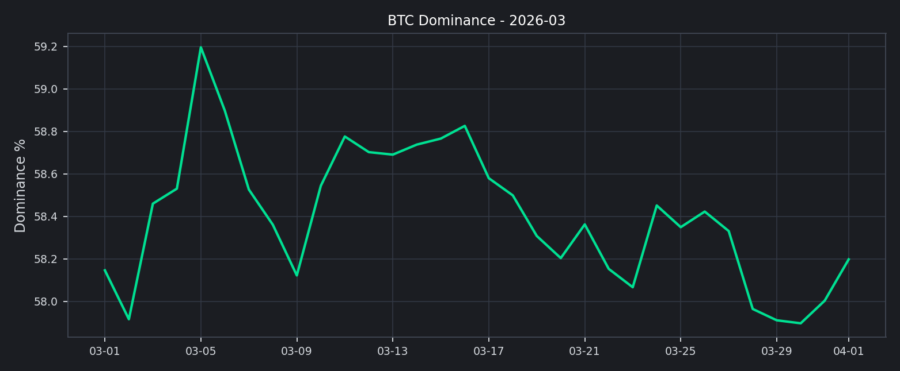
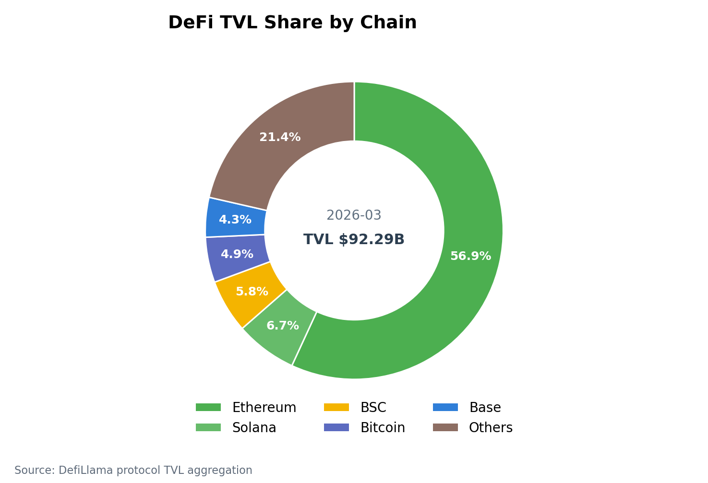
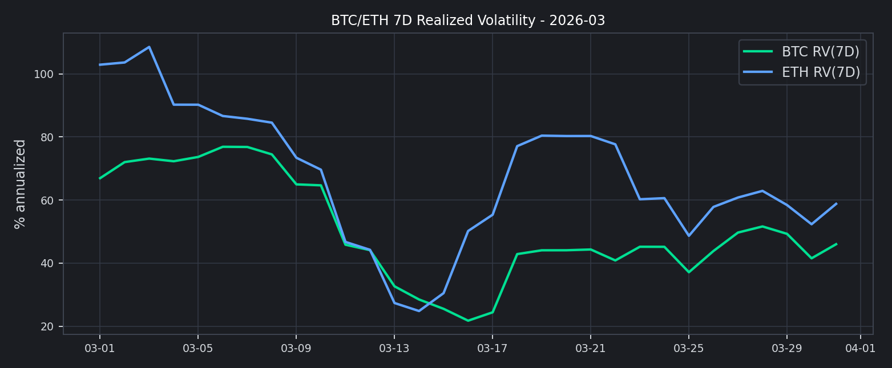

# 2026 年 3 月二级市场月报

3 月市场更像一次修复，而不是一轮全面风险偏好回归。总市值较月初回升，但资金仍主要集中在 BTC 与头部资产。

## 先看结论
- 全市场市值：$2.30T -> $2.35T，月内变化 +1.82%。
- 全市场日均成交额：$96.95B。
- BTC 主导率：58.15% -> 58.20%，变化 +0.05pct。
- Top 资产月度分化：涨幅最高 TRX +11.86%；跌幅最大 BNB -4.86%。
- 市场广度（Top10外占比，月末近端）：16.93%
- Deribit 资金费率（8h）：BTC=+0.000000，ETH=+0.000000。
- Deribit DVOL（月内）：BTC 51.04~60.45（月末 52.25）；ETH 72.37~79.33（月末 72.37）。

## 市场表现
总市值回升且 BTC 主导率维持高位，说明修复主要发生在核心资产，而不是全面风险扩散。

## 交易结构
前排样本 30d 成交额合计约 $4.62T，估算环比 -26.04%。
增幅靠前为 HTX（-10.48%），回落靠前为 KuCoin（-71.06%）。

## 主流资产与广度
头部资产中，表现最强的是 TRX（+11.86%），最弱的是 BNB（-4.86%）。
上涨资产 6 个、下跌资产 4 个，说明市场存在修复，但扩散并不充分。
Top10 外市值占比月末为 16.93%，长尾资产承接力度仍需继续观察。

## 衍生品与情绪
BTC 与 ETH 的资金费率都接近零轴，说明杠杆并不拥挤，仓位更偏中性博弈。

恐惧与贪婪指数月末为 11，仍处于Extreme Fear区间。价格若已修复而情绪仍偏弱，往往意味着这轮上行更像仓位修补，而不是新一轮全面风险偏好扩张。

## 接下来关注什么
1. 盘口与库存：主流币对维持深度优先，长尾币对库存上限与滑点阈值同步收紧。
2. 风控联动：将 Funding、DVOL、Top10 外占比纳入统一预警，触发阈值时自动提升保证金提示。
3. 用户沟通：若情绪修复慢于价格修复，应强化仓位管理和回撤预期，而不是放大单边乐观判断。
