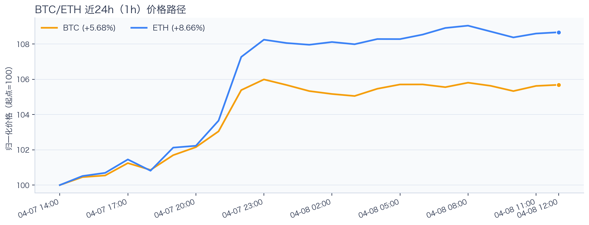
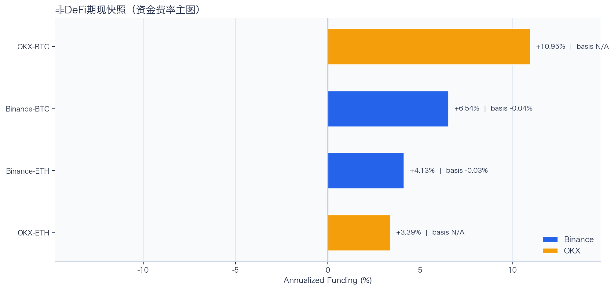
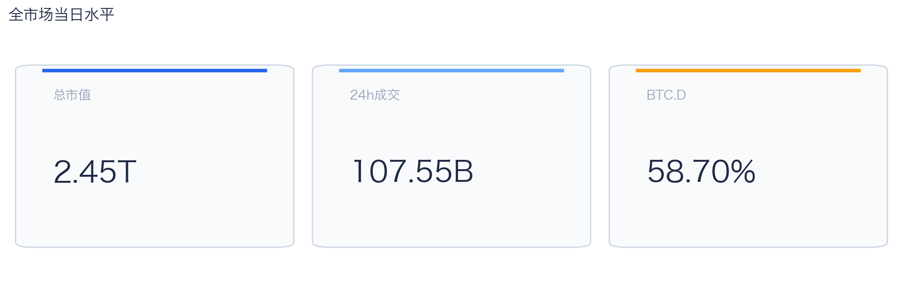
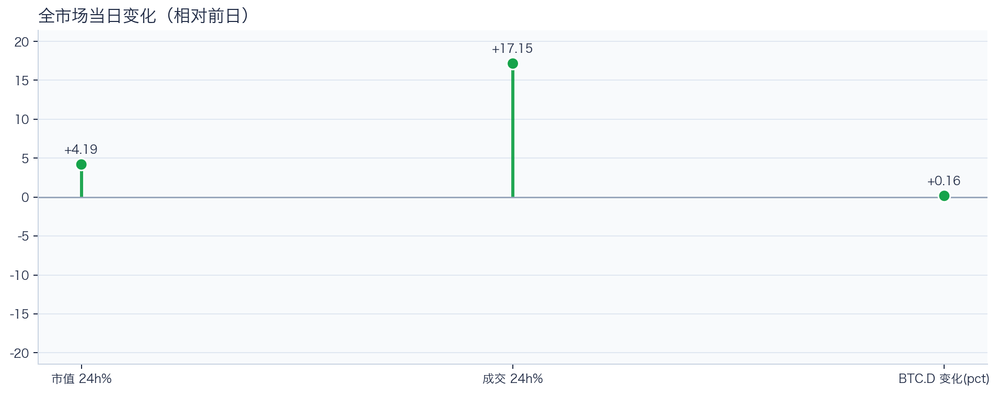
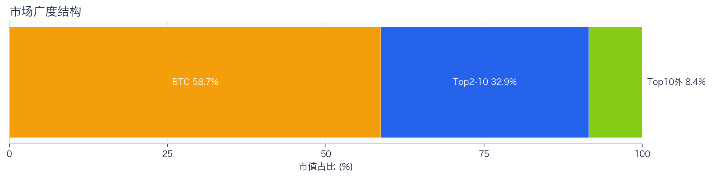
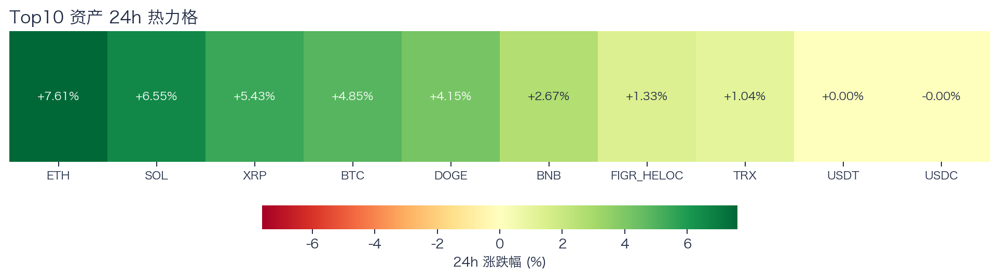
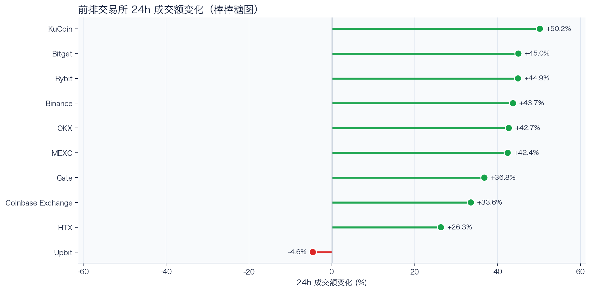
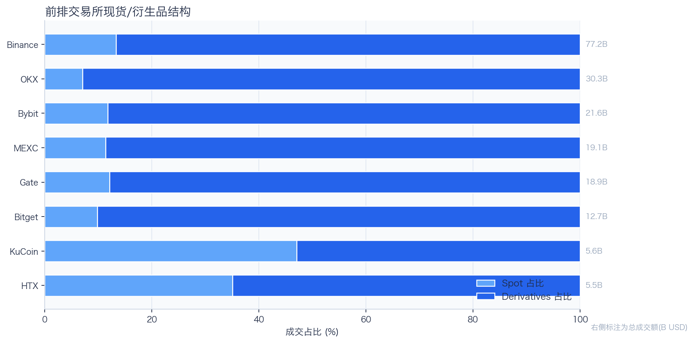
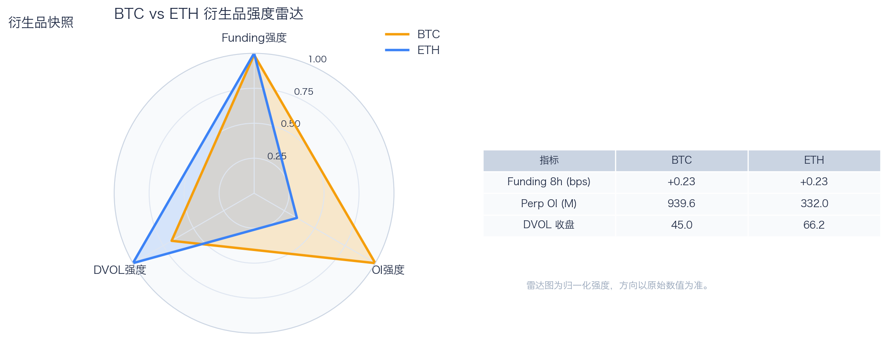
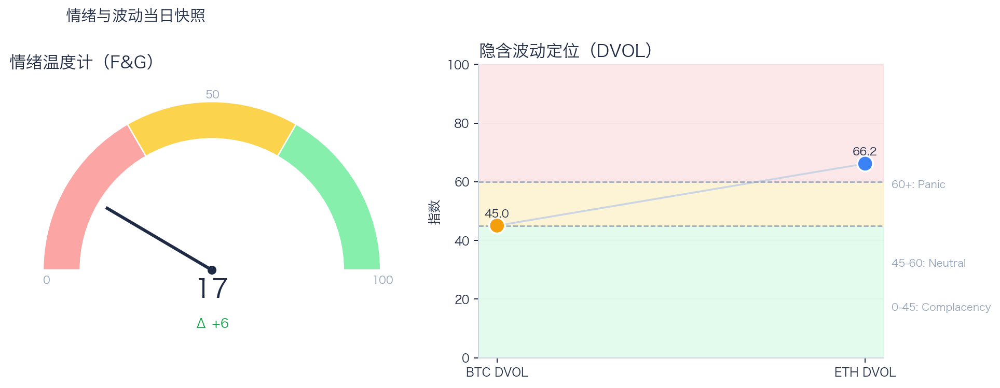

# 二级市场日报（2026-04-08）

## 关键结论
- 全市场市值 $2.45T（24h +4.19%），成交额 $107.55B（24h +17.15%）。
- BTC 主导率 58.70%（+0.16pct），Top10 外占比 8.42%。
- Top10 资产上涨 9 / 下跌 1，平均涨跌幅 +3.36%，首尾分化 7.61pct。
- 衍生品：BTC/ETH 资金费率分别为 +0.23bps / +0.23bps，DVOL 收盘 45.03 / 66.17。

## 今日盘面判断
如果只用一句话概括今天的市场，关键词是 `Tactical Rebound`。价格与成交共振上行，但广度仍集中于核心资产，当前更像交易性修复而非趋势反转。广度仍偏窄，增量风险偏好尚未形成持续外溢。这意味着短线虽然有可交易的弹性，但要把它理解成新一轮趋势启动，证据还不够。

## 核心驱动因素
从流动性结构看，多数平台成交回暖，短线流动性环境较前一日改善；从杠杆维度看，杠杆拥挤度整体可控；在风险定价层面，期权端对尾部波动的定价仍偏谨慎；再结合情绪仍在恐惧区，反弹更容易受到外部事件扰动。整体来看，盘面更像是修复中的高波动环境，而不是低波动顺趋势环境。

## BTC/ETH 24h 趋势判断

- BTC：$71,717.33（24h +4.92%，区间 $67,732.01 - $72,761.00，当前位于区间 79%）=> 偏强，上行主导。
- ETH：$2,248.74（24h +7.64%，区间 $2,060.24 - $2,273.87，当前位于区间 88%）=> 偏强，上行主导。
- 简评：BTC 与 ETH 同步偏强，短线仍有上行动能。

## 稳定币收益情况（链上协议）
按安全优先（协议成熟度、链层风险、是否依赖激励）筛选了 10 个主流池；原生供给利率均值约 +1.81%。
其中包含奖励补贴的池有 0 个，补贴收益已单列，不与原生利率混合。

核心观察
- 利率结构：Total APY 位于 0.00% 至 2.88% 区间。
- 资金集中：TVL 主要集中在 Aave-USDT（Ethereum，TVL $1.27B）、Spark-USDT（Ethereum，TVL $891.70M）。
- 收益领先：当前收益靠前样本包括 Spark-USDT（Ethereum，Total 2.88%）、Aave-USDC（Base，Total 2.76%）。

风险提示
- 利用率达到 70% 以上的池有 4 个，杠杆需求主要集中在头部池。
- 利用率最高样本：Aave-USDC（Ethereum） 81.30%，Borrow APY 3.60%。
- 奖励收益池数量：0 个。当前收益主体仍以原生利率为主。

数据覆盖：Aave API(8)，Compound API(7)，DefiLlama(21)，Morpho API(2)。

稳定币收益对照表（安全优先）
| 协议 | 链 | 币种 | Supply | Borrow | Rewards | Total | Utilization | TVL | 数据源 |
|---|---|---|---:|---:|---:|---:|---:|---:|---|
| Aave | Ethereum | USDT | 2.12% | 3.24% | N/A | 2.09% | 73.25% | $1.27B | DefiLlama+Aave API |
| Spark | Ethereum | USDT | 2.88% | N/A | N/A | 2.88% | N/A | $891.70M | DefiLlama |
| Compound | Ethereum | USDS | 1.77% | 2.86% | 0.00% | 1.77% | 49.09% | $3.90M | Compound API |
| Morpho | Ethereum | PYUSD | 0.00% | 0.00% | 0.00% | 0.00% | 0.00% | $7.93M | Morpho API |
| Aave | Ethereum | USDC | 2.62% | 3.60% | N/A | 2.57% | 81.30% | $629.55M | DefiLlama+Aave API |
| Aave | Ethereum | PYUSD | 1.55% | 3.35% | N/A | 1.53% | 51.74% | $107.30M | DefiLlama+Aave API |
| Aave | Ethereum | USDS | 0.08% | 5.67% | N/A | 0.08% | 1.94% | $54.74M | DefiLlama+Aave API |
| Aave | Ethereum | DAI | 2.69% | 4.48% | N/A | 2.66% | 80.71% | $27.87M | DefiLlama+Aave API |
| Aave | Arbitrum | USDC | 1.63% | 2.87% | N/A | 1.61% | 63.62% | $95.73M | DefiLlama+Aave API |
| Aave | Base | USDC | 2.80% | 3.99% | N/A | 2.76% | 78.28% | $76.78M | DefiLlama+Aave API |

稳定币收益对比（扩展样本，TVL≥$1M，共 24 条）
| 币种 | 协议 | 链 | Supply | Borrow | Rewards | Total | Utilization | TVL | 数据源 |
|---|---|---|---:|---:|---:|---:|---:|---:|---|
| USDC | Aave | Ethereum | 2.62% | 3.60% | N/A | 2.57% | 81.30% | $629.55M | DefiLlama+Aave API |
| USDC | Aave | Arbitrum | 1.63% | 2.87% | N/A | 1.61% | 63.62% | $95.73M | DefiLlama+Aave API |
| USDC | Aave | Base | 2.80% | 3.99% | N/A | 2.76% | 78.28% | $76.78M | DefiLlama+Aave API |
| USDC | Spark | Ethereum | 3.75% | N/A | N/A | 3.75% | N/A | $388.00M | DefiLlama |
| USDC | Compound | Ethereum | 2.53% | 3.45% | 0.10% | 2.63% | 70.31% | $370.94M | DefiLlama+Compound API |
| USDC | Compound | Arbitrum | 2.34% | 3.30% | 0.00% | 2.34% | 64.96% | $20.35M | DefiLlama+Compound API |
| USDC | Compound | Base | 3.08% | 3.87% | 0.00% | 3.08% | 85.48% | $10.26M | DefiLlama+Compound API |
| USDC | Morpho | Base | 7.37% | 7.37% | N/A | 7.37% | 100.00% | $1.24M | DefiLlama+Morpho API |
| USDT | Aave | Ethereum | 2.12% | 3.24% | N/A | 2.09% | 73.25% | $1.27B | DefiLlama+Aave API |
| USDT | Spark | Ethereum | 2.88% | N/A | N/A | 2.88% | N/A | $891.70M | DefiLlama |
| USDT | Compound | Ethereum | 2.52% | 3.45% | 0.10% | 2.62% | 70.06% | $203.04M | DefiLlama+Compound API |
| USDT | Compound | Arbitrum | 1.73% | 2.84% | 0.00% | 1.73% | 48.06% | $20.50M | DefiLlama+Compound API |
| DAI | Aave | Ethereum | 2.69% | 4.48% | N/A | 2.66% | 80.71% | $27.87M | DefiLlama+Aave API |
| DAI | Aave | Arbitrum | 1.90% | 3.81% | N/A | 1.88% | 67.24% | $1.52M | DefiLlama+Aave API |
| USDS | Aave | Ethereum | 0.08% | 5.67% | N/A | 0.08% | 1.94% | $54.74M | DefiLlama+Aave API |
| USDS | Spark | Ethereum | 2.55% | N/A | N/A | 2.55% | N/A | $30.74M | DefiLlama |
| USDS | Compound | Ethereum | 1.77% | 2.86% | 0.00% | 1.77% | 49.09% | $3.90M | Compound API |
| USDS | Compound | Base | 2.06% | 3.41% | 0.00% | 2.06% | 38.11% | $1.12M | Compound API |
| SUSDS | Spark | Ethereum | 0.00% | N/A | N/A | 0.00% | N/A | $3.44M | DefiLlama |
| SUSDS | Morpho | Ethereum | N/A | N/A | N/A | 0.00% | N/A | $210.13M | DefiLlama |
| SUSDS | Morpho | Arbitrum | N/A | N/A | N/A | 0.00% | N/A | $9.67M | DefiLlama |
| PYUSD | Aave | Ethereum | 1.55% | 3.35% | N/A | 1.53% | 51.74% | $107.30M | DefiLlama+Aave API |
| PYUSD | Spark | Ethereum | 0.72% | N/A | N/A | 0.72% | N/A | $80.45M | DefiLlama |
| PYUSD | Morpho | Ethereum | 0.00% | 0.00% | 0.00% | 0.00% | 0.00% | $7.93M | Morpho API |

跨源补充（比 taoli 更全）
- 新增对比源：DefiLlama 全量稳定币池（筛选口径）+ Bitcompare CeFi 利率，并与现有链上主流池快照交叉核对。
- 覆盖规模：原链上精表 24 条；DefiLlama 扩展样本 70 条（展示 Top20）；Bitcompare 稳定币利率样本 4 条。
- 覆盖维度：扩展样本覆盖 48 个协议、15 条链、47 类稳定币。
- 口径说明：Bitcompare 为平台展示 APY，taoli 为 Binance 借币年化，两者用于横向参考，不等价于无风险套利收益。

稳定币收益补充表（DefiLlama 扩展，TVL≥$30M，去重后 Top20）
| 币种 | 协议 | 链 | Base | Rewards | Total | TVL | 数据源 |
|---|---|---|---:|---:|---:|---:|---|
| SUSDS | sky-lending | Ethereum | N/A | N/A | 3.75% | $6.46B | DefiLlama API |
| USDC | maple | Ethereum | 4.31% | 0.00% | 4.31% | $3.61B | DefiLlama API |
| SUSDE | ethena-usde | Ethereum | 3.52% | N/A | 3.52% | $3.52B | DefiLlama API |
| USYC | circle-usyc | BSC | 3.35% | N/A | 3.35% | $2.55B | DefiLlama API |
| USDT | maple | Ethereum | 3.69% | 0.00% | 3.69% | $1.97B | DefiLlama API |
| BUIDL | blackrock-buidl | Ethereum | 3.55% | N/A | 3.55% | $993.12M | DefiLlama API |
| USDYC | ondo-yield-assets | Ethereum | 3.55% | N/A | 3.55% | $807.17M | DefiLlama API |
| USTB | superstate-ustb | Ethereum | 3.71% | N/A | 3.71% | $646.69M | DefiLlama API |
| BUIDL | blackrock-buidl | Aptos | 3.21% | N/A | 3.21% | $559.02M | DefiLlama API |
| USDY | ondo-yield-assets | Ethereum | 3.55% | N/A | 3.55% | $536.81M | DefiLlama API |
| BUIDL | blackrock-buidl | Solana | 3.52% | N/A | 3.52% | $525.65M | DefiLlama API |
| BUIDL | blackrock-buidl | BSC | 3.21% | N/A | 3.21% | $507.64M | DefiLlama API |
| BUSD0 | usual-usd0 | Ethereum | N/A | 2.80% | 2.80% | $505.79M | DefiLlama API |
| USDC | jupiter-lend | Solana | 2.55% | 1.27% | 3.82% | $465.18M | DefiLlama API |
| SUSDS | sky-lending | Arbitrum | N/A | N/A | 3.75% | $357.18M | DefiLlama API |
| USDD | justlend | Tron | 0.00% | 4.48% | 4.48% | $343.85M | DefiLlama API |
| DAI | sky-lending | Ethereum | N/A | N/A | 1.25% | $245.52M | DefiLlama API |
| USDX | stables-labs-usdx | BSC | 1.35% | N/A | 1.35% | $241.97M | DefiLlama API |
| SUSDAI | usd-ai | Arbitrum | 6.80% | N/A | 6.80% | $224.67M | DefiLlama API |
| USDC | fluid-lending | Ethereum | 2.60% | 0.96% | 3.56% | $211.55M | DefiLlama API |

CeFi 稳定币收益/成本对比（Bitcompare vs taoli）
| 币种 | Bitcompare 最高APY | 对应平台 | taoli(Binance借币年化) | 利差(APY-借币) |
|---|---:|---|---:|---:|
| DAI | 7.00% | EarnPark | N/A | N/A |
| TUSD | 1.43% | JustLend | N/A | N/A |
| USDC | 4.00% | EarnPark | 3.19% | 0.81% |
| USDT | 20.00% | EarnPark | 3.40% | 16.60% |

交易含义：当前稳定币收益更偏“头部池中等收益 + 局部高利用率”结构，策略上优先流动性与透明度，再考虑收益增强。
部分池的 Borrow 与 Utilization 暂未返回，表内仅展示已获取字段。

## 非 DeFi（交易所期现）

样本范围覆盖 Binance 与 OKX 的 BTC/ETH 现货与永续，用于观察 funding 与 basis 的当期结构。
- Funding 最高样本：OKX-BTC，年化约 10.95%。
- Funding 最低样本：OKX-ETH，年化约 3.39%。
- Basis 偏离最大：Binance-BTC，相对指数约 -0.04%。

借币成本多源对比表
| 资产 | Binance(日/年) | OKX(日/年) | Bybit(日/年) | Backpack(日/年) | KuCoin(日/年) | 最低日利率 |
|---|---:|---:|---:|---:|---:|---:|
| USDT | 0.01%/3.40% · 100k | 0.01%/2.51% · 5.0M | 0.01%/3.40% · 8.0M | 0.01%/2.46% · 50.0M | N/A | Backpack 0.01% |
| USDC | 0.01%/3.19% · 100k | 0.01%/2.51% · 1.0M | 0.01%/2.80% · 3.5M | 0.00%/1.53% · 300.0M | N/A | Backpack 0.00% |
| USDE | N/A | N/A | 0.01%/5.00% · 1.0M | N/A | N/A | Bybit 0.01% |
| BTC | 0.00%/0.39% · 60 | 0.00%/1.01% · 175 | 0.00%/0.39% · 300 | 0.00%/0.16% · 3k | N/A | Backpack 0.00% |
| ETH | 0.01%/2.44% · 400 | 0.01%/2.01% · 7k | 0.01%/2.38% · 2k | 0.00%/1.34% · 20k | N/A | Backpack 0.00% |
说明：统一按日利率/年化展示，单元格尾部为可借额度。
- 交易含义：当 funding 年化显著高于 basis 且持续为正，carry 交易更偏向收取 funding；若 basis 与 funding 同步回落，需降低杠杆并关注资金回流速度。
该部分与链上收益分开统计，便于比较两类策略的收益与风险结构。

## 市场脉冲

截至 2026-04-08，全市场市值 $2.45T，24h 成交额 $107.55B，BTC 主导率 58.70%。
价格与成交同步上行，属于健康修复结构；若次日成交不掉队，修复延续概率更高。在这种盘面下，成交能否继续跟上，是判断明天反弹延续还是回吐的第一道分水岭。

相对前日，市值 +4.19%、成交 +17.15%、BTC.D +0.16pct。
把这组变化拆开看，比看单一涨跌更有用：价格、成交、主导率三者同向时，行情更有连续性；一旦出现背离，走势往往会变得更短促、更反复。

## 主导率与市场广度

当前结构为 BTC 58.70% / Top2-10 32.88% / Top10 外 8.42%。长尾占比仍偏低，广度修复还未形成持续趋势。
Top10 外占比处于低位，风险偏好仍主要停留在 BTC 与头部资产。换句话说，资金目前更愿意在高流动性的核心资产里做仓位调整，而不是大面积扩散到长尾资产。

## 资产与交易所资金流

Top10 中领涨 ETH（+7.61%），尾部 USDC（-0.00%），均值 +3.36%。分化 7.61pct，结构性交易仍是主导。
上涨家数明显占优，但首尾分化仍大，表明反弹并非无差别普涨。对交易而言，这通常意味着“选币”比“全市场方向”更重要，错配带来的收益差会明显放大。

前排样本上涨 9 家、下跌 1 家，均值 +36.12%。KuCoin 最强（+50.21%），Upbit 最弱（-4.57%）。
最强与最弱平台的 24h 变化差达到 54.78pct，说明流动性仍在选择性回流，头部平台的价格发现能力更强。当平台间流量分化明显时，报价连续性和滑点表现会同步分化，执行层面要更关注成交质量。

样本内衍生品成交占比 85.15%。若该占比继续走高且 funding 不同步回落，短线波动脉冲通常会增强。
衍生品占比处于高位，行情更容易出现脉冲式放大，风控阈值建议偏保守。这也是为什么同样的消息面在当前阶段更容易被放大成大振幅走势。

## 衍生品与情绪

资金费率（Funding）仍在中性附近，BTC/ETH 分别 +0.23bps / +0.23bps；未平仓合约（OI）为 $939.56M / $331.98M；隐含波动率指数（DVOL）位于 Neutral（中性波动定价） / Panic（高波动溢价）。
Funding 与 DVOL 的组合显示，方向拥挤暂未极端，但尾部风险定价仍未完全回落。因此更合适的做法不是激进追单边，而是围绕波动管理仓位和节奏。

恐惧与贪婪指数（F&G）当日 17（较前日 +6）；配合 BTC/ETH DVOL 45.03/66.17，当前更像情绪修复中的高波动区。
恐惧区内出现边际改善，说明市场开始试探修复，但尚不足以支持激进风险暴露。只有当情绪、广度和成交三者同时改善，市场才更可能从“反弹交易”切换到“趋势交易”。

## 未来24小时观察
1. 若 Top10 外占比继续抬升且 BTC.D 回落，说明风险偏好开始从核心资产向外扩散。
2. 若衍生品占比继续上升而 funding 仍中性，盘面大概率维持高波动震荡而非顺滑上行。
3. 若 F&G 反弹但 DVOL 不降，代表情绪与风险定价背离，追涨胜率会明显下降。

## 交易与风控含义
- 仓位管理优先级高于方向押注，建议保持核心仓位稳定、战术仓位滚动。
- 若交易所衍生品占比继续上升，建议同步收紧杠杆和止损参数。
- 关注情绪改善与广度扩散是否同步发生，二者背离时避免追逐单边。

