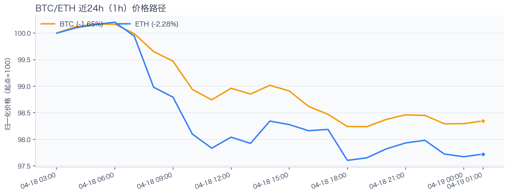
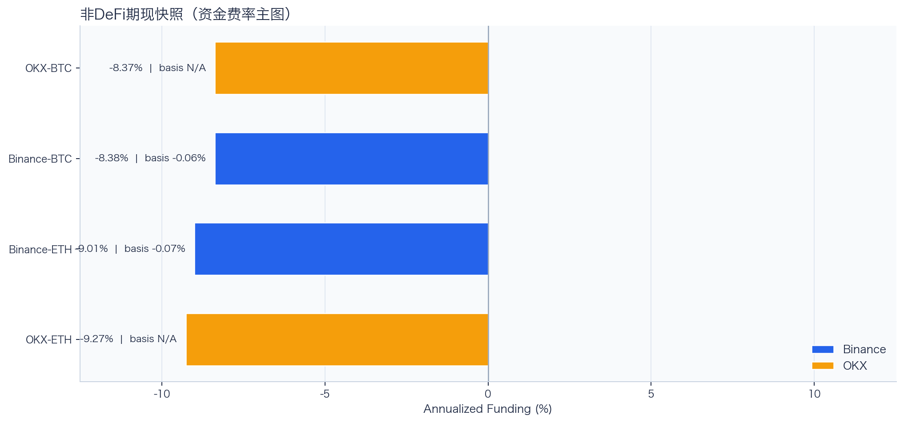
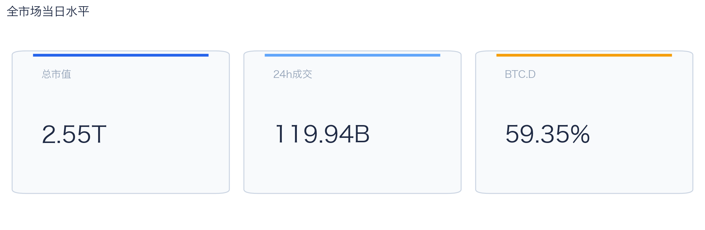
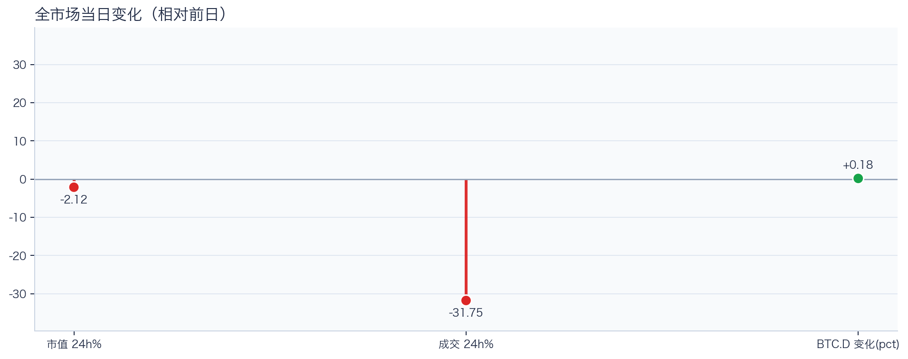
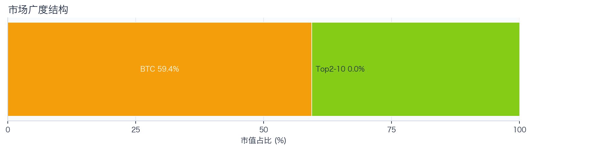
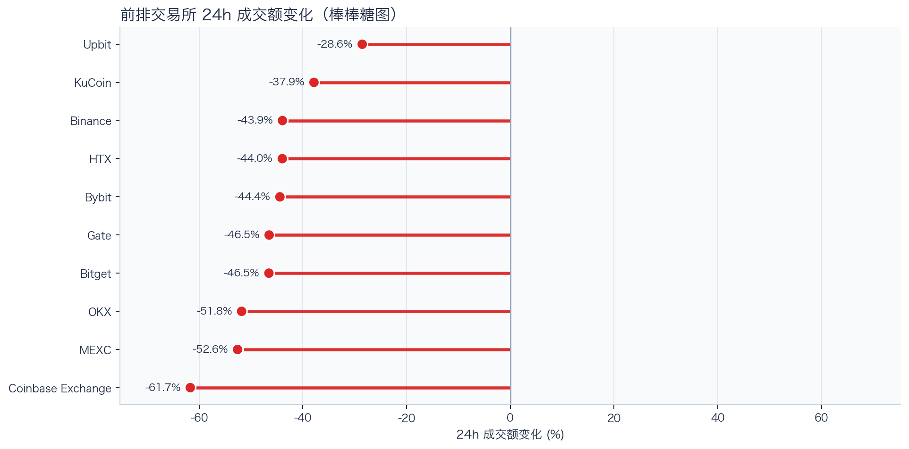
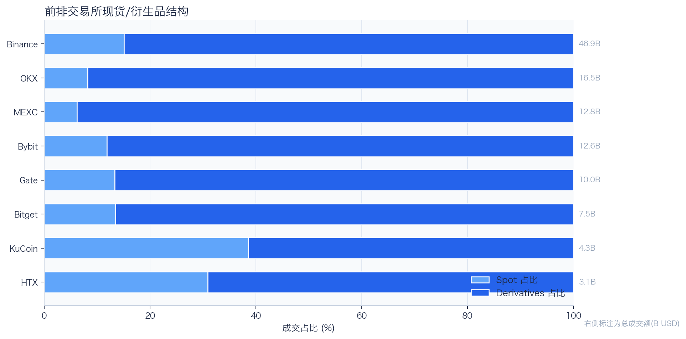
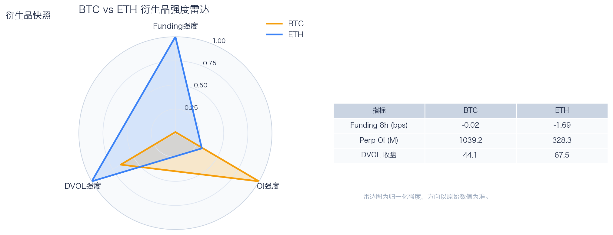
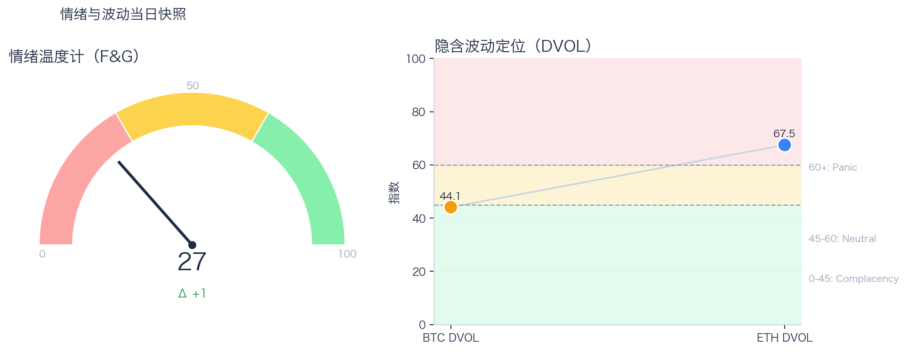

# 二级市场日报（2026-04-19）

## 关键结论
- 全市场市值 $2.55T（24h -2.12%），成交额 $119.94B（24h -31.75%）。
- BTC 主导率 59.35%（+0.18pct），Top10 外占比 100.00%。
- Top10 资产广度统计不完整。
- 衍生品：BTC/ETH 资金费率分别为 -0.02bps / -1.69bps，DVOL 收盘 44.11 / 67.49。

## 今日盘面判断
如果只用一句话概括今天的市场，关键词是 `Defensive Drift`。价格与成交同步走弱，属于防守型下移结构，短线以控制回撤为主。长尾占比已进入可观察扩散区间，若持续抬升，风格可能从核心资产外溢。这意味着短线虽然有可交易的弹性，但要把它理解成新一轮趋势启动，证据还不够。

## 核心驱动因素
从流动性结构看，多数平台成交走弱，流动性恢复仍依赖少数头部平台；从杠杆维度看，空头付费偏深，短线挤空风险上升，但趋势确认仍需成交配合；在风险定价层面，期权端对尾部波动的定价仍偏谨慎；再结合情绪与价格修复节奏尚未完全同步。整体来看，盘面更像是修复中的高波动环境，而不是低波动顺趋势环境。

## BTC/ETH 24h 趋势判断

- BTC：$75,733.87（24h -1.90%，区间 $75,445.16 - $77,420.08，当前位于区间 15%）=> 偏弱震荡。
- ETH：$2,350.27（24h -2.90%，区间 $2,339.92 - $2,427.64，当前位于区间 12%）=> 偏弱，下行主导。
- 简评：BTC 偏弱震荡下行，ETH 相对更弱。

## 稳定币收益情况（链上协议）
按安全优先（协议成熟度、链层风险、是否依赖激励）筛选了 10 个主流池；原生供给利率均值约 +3.58%。
其中包含奖励补贴的池有 0 个，补贴收益已单列，不与原生利率混合。

核心观察
- 利率结构：Total APY 位于 0.12% 至 12.94% 区间。
- 资金集中：TVL 主要集中在 Spark-USDT（Ethereum，TVL $854.58M）、Aave-USDC（Ethereum，TVL $489.79M）。
- 收益领先：当前收益靠前样本包括 Morpho-USDT（Ethereum，Total 12.94%）、Aave-USDT（Ethereum，Total 4.76%）。

风险提示
- 利用率达到 70% 以上的池有 3 个，杠杆需求主要集中在头部池。
- 利用率最高样本：Morpho-USDT（Ethereum） 94.07%，Borrow APY 13.80%。
- 奖励收益池数量：0 个。当前收益主体仍以原生利率为主。

数据覆盖：Aave API(3)，Compound API(7)，DefiLlama(21)，Morpho API(1)。

稳定币收益对照表（安全优先）
| 协议 | 链 | 币种 | Supply | Borrow | Rewards | Total | Utilization | TVL | 数据源 |
|---|---|---|---:|---:|---:|---:|---:|---:|---|
| Aave | Ethereum | USDC | 2.71% | N/A | N/A | 2.71% | N/A | $489.79M | DefiLlama |
| Spark | Ethereum | USDT | 3.00% | N/A | N/A | 3.00% | N/A | $854.58M | DefiLlama |
| Compound | Ethereum | USDS | 3.19% | 3.96% | 0.00% | 3.19% | 88.73% | $2.08M | Compound API |
| Morpho | Ethereum | USDT | 12.94% | 13.80% | 0.00% | 12.94% | 94.07% | $168,796 | Morpho API |
| Aave | Ethereum | USDT | 4.76% | N/A | N/A | 4.76% | N/A | $240.39M | DefiLlama |
| Aave | Ethereum | PYUSD | 1.28% | N/A | N/A | 1.28% | N/A | $60.57M | DefiLlama |
| Aave | Ethereum | USDS | 0.12% | N/A | N/A | 0.12% | N/A | $30.20M | DefiLlama |
| Aave | Ethereum | DAI | 2.75% | N/A | N/A | 2.75% | N/A | $25.41M | DefiLlama |
| Aave | Arbitrum | USDC | 1.79% | 3.00% | N/A | 1.74% | 66.60% | $85.11M | DefiLlama+Aave API |
| Aave | Base | USDC | 3.29% | 4.33% | N/A | 3.22% | 84.87% | $49.07M | DefiLlama+Aave API |

稳定币收益对比（扩展样本，TVL≥$1M，共 23 条）
| 币种 | 协议 | 链 | Supply | Borrow | Rewards | Total | Utilization | TVL | 数据源 |
|---|---|---|---:|---:|---:|---:|---:|---:|---|
| USDC | Aave | Ethereum | 2.71% | N/A | N/A | 2.71% | N/A | $489.79M | DefiLlama |
| USDC | Aave | Arbitrum | 1.79% | 3.00% | N/A | 1.74% | 66.60% | $85.11M | DefiLlama+Aave API |
| USDC | Aave | Base | 3.29% | 4.33% | N/A | 3.22% | 84.87% | $49.07M | DefiLlama+Aave API |
| USDC | Spark | Ethereum | 3.75% | N/A | N/A | 3.75% | N/A | $387.35M | DefiLlama |
| USDC | Compound | Ethereum | 2.52% | 3.45% | 0.13% | 2.66% | 70.14% | $379.84M | DefiLlama+Compound API |
| USDC | Compound | Arbitrum | 2.22% | 3.22% | 0.00% | 2.22% | 61.78% | $21.23M | DefiLlama+Compound API |
| USDC | Compound | Base | 3.09% | 3.88% | 0.00% | 3.09% | 85.79% | $9.88M | DefiLlama+Compound API |
| USDC | Morpho | Base | 18.98% | 18.98% | N/A | 18.98% | 100.00% | $1.25M | DefiLlama+Morpho API |
| USDT | Aave | Ethereum | 4.76% | N/A | N/A | 4.76% | N/A | $240.39M | DefiLlama |
| USDT | Spark | Ethereum | 3.00% | N/A | N/A | 3.00% | N/A | $854.58M | DefiLlama |
| USDT | Compound | Ethereum | 2.57% | 3.48% | 0.14% | 2.71% | 71.43% | $200.46M | DefiLlama+Compound API |
| USDT | Compound | Arbitrum | 1.89% | 2.96% | 0.00% | 1.89% | 52.50% | $20.13M | DefiLlama+Compound API |
| DAI | Aave | Ethereum | 2.75% | N/A | N/A | 2.75% | N/A | $25.41M | DefiLlama |
| DAI | Aave | Arbitrum | 1.98% | 3.88% | N/A | 1.96% | 68.58% | $1.43M | DefiLlama+Aave API |
| USDS | Aave | Ethereum | 0.12% | N/A | N/A | 0.12% | N/A | $30.20M | DefiLlama |
| USDS | Spark | Ethereum | 2.55% | N/A | N/A | 2.55% | N/A | $30.60M | DefiLlama |
| USDS | Compound | Ethereum | 3.19% | 3.96% | 0.00% | 3.19% | 88.73% | $2.08M | Compound API |
| USDS | Compound | Base | 2.06% | 3.41% | 0.00% | 2.06% | 38.15% | $1.12M | Compound API |
| SUSDS | Spark | Ethereum | 0.00% | N/A | N/A | 0.00% | N/A | $3.44M | DefiLlama |
| SUSDS | Morpho | Ethereum | N/A | N/A | N/A | 0.00% | N/A | $243.19M | DefiLlama |
| SUSDS | Morpho | Arbitrum | N/A | N/A | N/A | 0.00% | N/A | $4.93M | DefiLlama |
| PYUSD | Aave | Ethereum | 1.28% | N/A | N/A | 1.28% | N/A | $60.57M | DefiLlama |
| PYUSD | Spark | Ethereum | 0.46% | N/A | N/A | 0.46% | N/A | $87.08M | DefiLlama |

跨源补充（比 taoli 更全）
- 新增对比源：DefiLlama 全量稳定币池（筛选口径）+ Bitcompare CeFi 利率，并与现有链上主流池快照交叉核对。
- 覆盖规模：原链上精表 23 条；DefiLlama 扩展样本 69 条（展示 Top20）；Bitcompare 稳定币利率样本 5 条。
- 覆盖维度：扩展样本覆盖 46 个协议、15 条链、48 类稳定币。
- 口径说明：Bitcompare 为平台展示 APY，taoli 为 Binance 借币年化，两者用于横向参考，不等价于无风险套利收益。

稳定币收益补充表（DefiLlama 扩展，TVL≥$30M，去重后 Top20）
| 币种 | 协议 | 链 | Base | Rewards | Total | TVL | 数据源 |
|---|---|---|---:|---:|---:|---:|---|
| SUSDS | sky-lending | Ethereum | N/A | N/A | 3.75% | $5.93B | DefiLlama API |
| SUSDE | ethena-usde | Ethereum | 3.67% | N/A | 3.67% | $3.53B | DefiLlama API |
| USDC | maple | Ethereum | 4.42% | 0.00% | 4.42% | $3.27B | DefiLlama API |
| USYC | circle-usyc | BSC | 3.03% | N/A | 3.03% | $2.79B | DefiLlama API |
| USDT | maple | Ethereum | 3.78% | 0.00% | 3.78% | $1.99B | DefiLlama API |
| BUIDL | blackrock-buidl | Ethereum | 3.56% | N/A | 3.56% | $1.12B | DefiLlama API |
| USDYC | ondo-yield-assets | Ethereum | 3.55% | N/A | 3.55% | $808.02M | DefiLlama API |
| USTB | superstate-ustb | Ethereum | 3.32% | N/A | 3.32% | $731.21M | DefiLlama API |
| BUIDL | blackrock-buidl | Aptos | 3.22% | N/A | 3.22% | $559.04M | DefiLlama API |
| USDY | ondo-yield-assets | Ethereum | 3.55% | N/A | 3.55% | $533.11M | DefiLlama API |
| BUIDL | blackrock-buidl | Solana | 3.53% | N/A | 3.53% | $527.14M | DefiLlama API |
| BUIDL | blackrock-buidl | BSC | 3.22% | N/A | 3.22% | $508.12M | DefiLlama API |
| BUSD0 | usual-usd0 | Ethereum | N/A | 3.04% | 3.04% | $506.37M | DefiLlama API |
| USDC | jupiter-lend | Solana | 10.09% | 1.26% | 11.34% | $373.81M | DefiLlama API |
| SUSDS | sky-lending | Arbitrum | N/A | N/A | 3.75% | $357.50M | DefiLlama API |
| USDD | justlend | Tron | 0.00% | 4.28% | 4.28% | $333.86M | DefiLlama API |
| SUSDAI | usd-ai | Arbitrum | 7.18% | N/A | 7.18% | $259.19M | DefiLlama API |
| DAI | sky-lending | Ethereum | N/A | N/A | 1.25% | $240.35M | DefiLlama API |
| REUSD | re | Ethereum | 6.08% | N/A | 6.08% | $187.97M | DefiLlama API |
| WSRUSD | reservoir-protocol | Ethereum | N/A | N/A | 4.65% | $187.48M | DefiLlama API |

CeFi 稳定币收益/成本对比（Bitcompare vs taoli）
| 币种 | Bitcompare 最高APY | 对应平台 | taoli(Binance借币年化) | 利差(APY-借币) |
|---|---:|---|---:|---:|
| DAI | 7.00% | EarnPark | N/A | N/A |
| TUSD | 1.46% | JustLend | N/A | N/A |
| USDC | 4.00% | EarnPark | 2.70% | 1.30% |
| USDP | 10.50% | Nexo | N/A | N/A |
| USDT | 20.00% | EarnPark | 3.00% | 17.00% |

交易含义：当前稳定币收益更偏“头部池中等收益 + 局部高利用率”结构，策略上优先流动性与透明度，再考虑收益增强。
部分池的 Borrow 与 Utilization 暂未返回，表内仅展示已获取字段。

## 非 DeFi（交易所期现）

样本范围覆盖 Binance 与 OKX 的 BTC/ETH 现货与永续，用于观察 funding 与 basis 的当期结构。
- Funding 最高样本：OKX-BTC，年化约 -8.37%。
- Funding 最低样本：OKX-ETH，年化约 -9.27%。
- Basis 偏离最大：Binance-ETH，相对指数约 -0.07%。

借币成本多源对比表
| 资产 | Binance(日/年) | OKX(日/年) | Bybit(日/年) | Backpack(日/年) | KuCoin(日/年) | 最低日利率 |
|---|---:|---:|---:|---:|---:|---:|
| USDT | 0.01%/3.00% · 100k | 0.01%/2.51% · 5.0M | 0.01%/3.00% · 8.0M | 0.01%/2.91% · 50.0M | N/A | OKX 0.01% |
| USDC | 0.01%/2.70% · 100k | 0.01%/2.51% · 1.0M | 0.01%/2.61% · 3.5M | 0.00%/1.64% · 300.0M | N/A | Backpack 0.00% |
| USDE | N/A | N/A | 0.01%/5.00% · 1.0M | N/A | N/A | Bybit 0.01% |
| BTC | 0.00%/0.41% · 60 | 0.00%/1.01% · 175 | 0.00%/0.41% · 300 | 0.00%/0.16% · 3k | N/A | Backpack 0.00% |
| ETH | 0.01%/2.35% · 400 | 0.01%/2.01% · 7k | 0.01%/2.35% · 2k | 0.00%/1.46% · 20k | N/A | Backpack 0.00% |
说明：统一按日利率/年化展示，单元格尾部为可借额度。
- 交易含义：当 funding 年化显著高于 basis 且持续为正，carry 交易更偏向收取 funding；若 basis 与 funding 同步回落，需降低杠杆并关注资金回流速度。
该部分与链上收益分开统计，便于比较两类策略的收益与风险结构。

## 市场脉冲

截至 2026-04-19，全市场市值 $2.55T，24h 成交额 $119.94B，BTC 主导率 59.35%。
价格与成交同步走弱，风险偏好仍在收缩，盘面更偏防守。在这种盘面下，成交能否继续跟上，是判断明天反弹延续还是回吐的第一道分水岭。

相对前日，市值 -2.12%、成交 -31.75%、BTC.D +0.18pct。
把这组变化拆开看，比看单一涨跌更有用：价格、成交、主导率三者同向时，行情更有连续性；一旦出现背离，走势往往会变得更短促、更反复。

## 主导率与市场广度

当前结构为 BTC 59.35% / Top2-10 0.00% / Top10 外 100.00%。长尾占比仍偏低，广度修复还未形成持续趋势。
Top10 外占比已进入扩散区，若继续抬升，市场风格可能向高 Beta 资产切换。换句话说，资金目前更愿意在高流动性的核心资产里做仓位调整，而不是大面积扩散到长尾资产。

## 资产与交易所资金流

Top10 涨跌数据不完整。
头部资产分化仍在，当前更像结构行情。对交易而言，这通常意味着“选币”比“全市场方向”更重要，错配带来的收益差会明显放大。

前排样本上涨 0 家、下跌 10 家，均值 -45.79%。Upbit 最强（-28.55%），Coinbase Exchange 最弱（-61.71%）。
最强与最弱平台的 24h 变化差达到 33.15pct，说明流动性仍在选择性回流，头部平台的价格发现能力更强。当平台间流量分化明显时，报价连续性和滑点表现会同步分化，执行层面要更关注成交质量。

样本内衍生品成交占比 84.61%。若该占比继续走高且 funding 不同步回落，短线波动脉冲通常会增强。
衍生品仍是主导成交形态，价格连续性更多由杠杆侧情绪决定。这也是为什么同样的消息面在当前阶段更容易被放大成大振幅走势。

## 衍生品与情绪

资金费率（Funding）仍在中性附近，BTC/ETH 分别 -0.02bps / -1.69bps；未平仓合约（OI）为 $1.04B / $328.33M；隐含波动率指数（DVOL）位于 Complacency（低波动定价） / Panic（高波动溢价）。
空头付费偏深，若成交继续回暖，短线有挤空触发条件。因此更合适的做法不是激进追单边，而是围绕波动管理仓位和节奏。

恐惧与贪婪指数（F&G）当日 27（较前日 +1）；配合 BTC/ETH DVOL 44.11/67.49，当前更像情绪修复中的高波动区。
情绪回到中性区，若后续成交和广度同步改善，趋势性机会会明显增多。只有当情绪、广度和成交三者同时改善，市场才更可能从“反弹交易”切换到“趋势交易”。

## 未来24小时观察
1. 若 Top10 外占比继续抬升且 BTC.D 回落，说明风险偏好开始从核心资产向外扩散。
2. 若衍生品占比继续上升而 funding 仍中性，盘面大概率维持高波动震荡而非顺滑上行。
3. 若 F&G 反弹但 DVOL 不降，代表情绪与风险定价背离，追涨胜率会明显下降。

## 交易与风控含义
- 仓位管理优先级高于方向押注，建议保持核心仓位稳定、战术仓位滚动。
- 若交易所衍生品占比继续上升，建议同步收紧杠杆和止损参数。
- 关注情绪改善与广度扩散是否同步发生，二者背离时避免追逐单边。

## 数据缺口（Data Gaps）
- CoinGecko Top资产数据获取失败（已按 key 尝试 demo）: demo: <urlopen error EOF occurred in violation of protocol (_ssl.c:1129)>
- Aave API reserves 获取失败 chain_id=1: <urlopen error EOF occurred in violation of protocol (_ssl.c:1129)>

