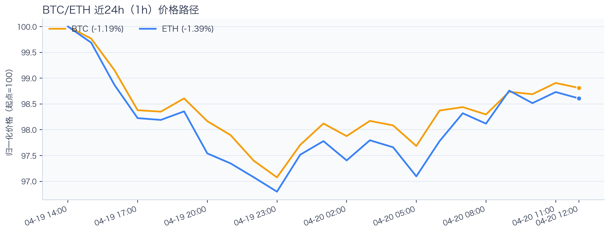
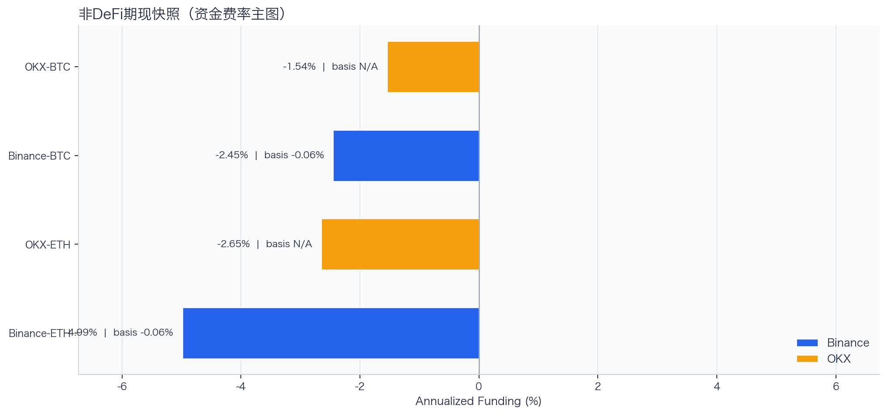
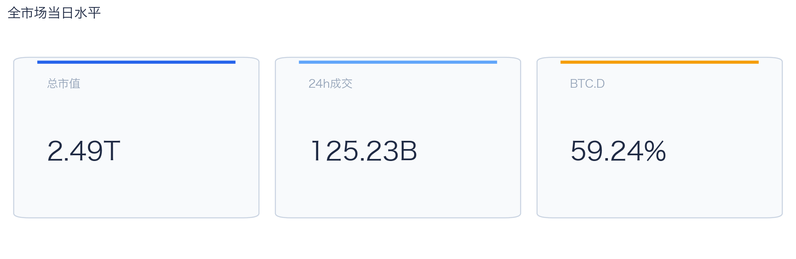
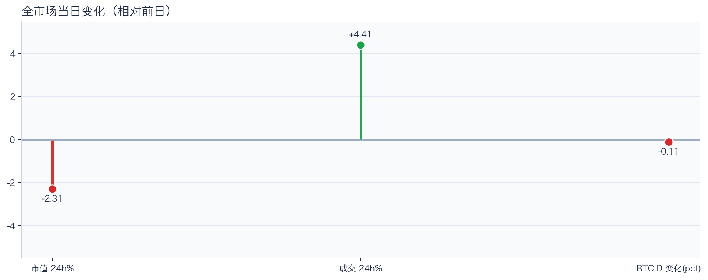
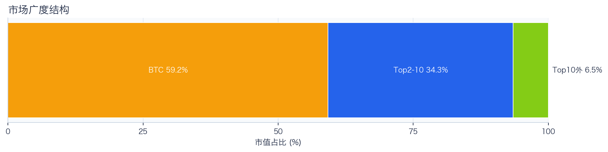
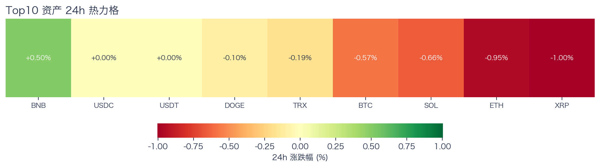
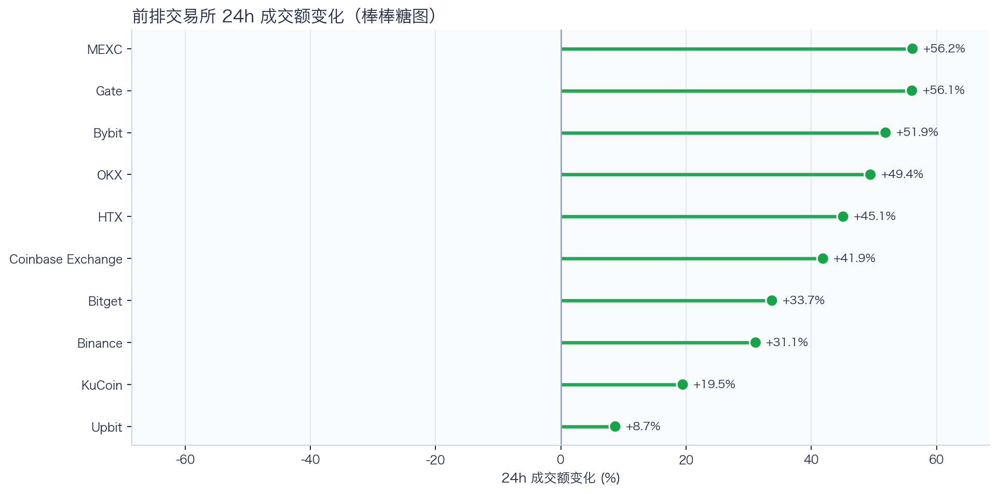
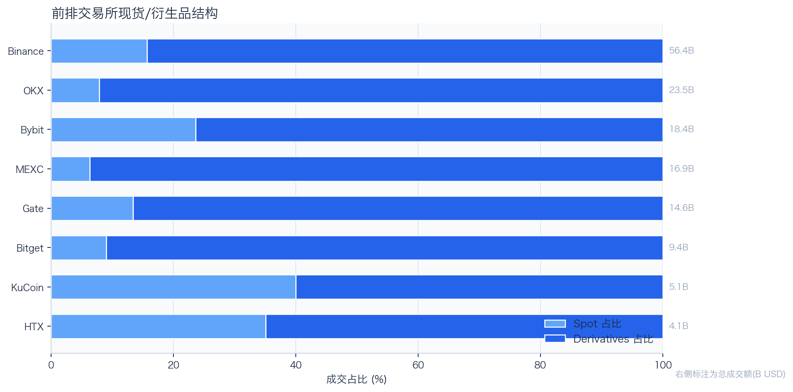
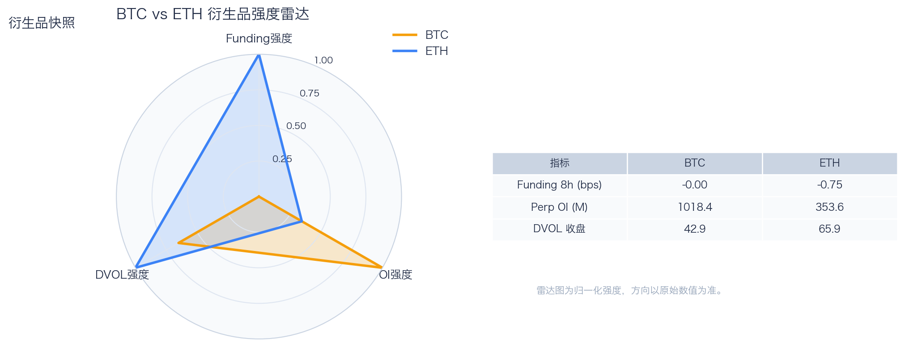
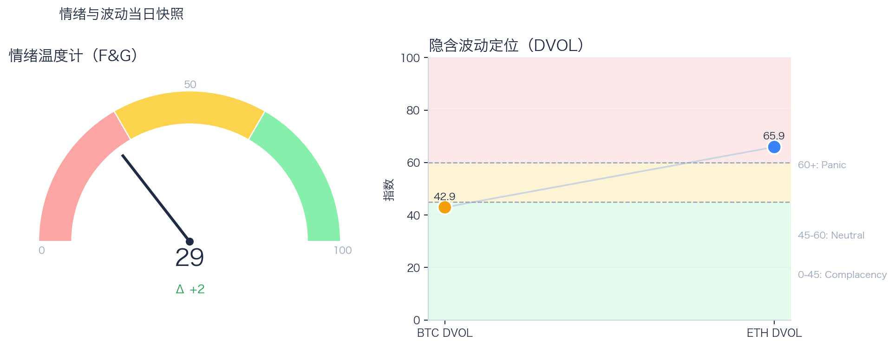

# 二级市场日报（2026-04-20）

## 关键结论
- 全市场市值 $2.49T（24h -2.31%），成交额 $125.23B（24h +4.41%）。
- BTC 主导率 59.24%（-0.11pct），Top10 外占比 6.50%。
- Top10 资产上涨 3 / 下跌 6，平均涨跌幅 -0.33%，首尾分化 1.51pct。
- 衍生品：BTC/ETH 资金费率分别为 -0.00bps / -0.75bps，DVOL 收盘 42.93 / 65.92。

## 今日盘面判断
如果只用一句话概括今天的市场，关键词是 `Stress Repricing`。价格回撤但换手抬升，说明市场在高分歧下重估风险，波动脉冲概率偏高。广度仍偏窄，增量风险偏好尚未形成持续外溢。这意味着短线虽然有可交易的弹性，但要把它理解成新一轮趋势启动，证据还不够。

## 核心驱动因素
从流动性结构看，多数平台成交回暖，短线流动性环境较前一日改善；从杠杆维度看，杠杆拥挤度整体可控；在风险定价层面，期权端对尾部波动的定价仍偏谨慎；再结合情绪与价格修复节奏尚未完全同步。整体来看，盘面更像是修复中的高波动环境，而不是低波动顺趋势环境。

## BTC/ETH 24h 趋势判断

- BTC：$75,120.07（24h -0.61%，区间 $73,724.31 - $76,240.66，当前位于区间 55%）=> 区间震荡。
- ETH：$2,305.53（24h -1.04%，区间 $2,252.72 - $2,350.24，当前位于区间 54%）=> 偏弱震荡。
- 简评：BTC 与 ETH 出现分化，短线以结构性机会为主。

## 稳定币收益情况（链上协议）
按安全优先（协议成熟度、链层风险、是否依赖激励）筛选了 10 个主流池；原生供给利率均值约 +9.34%。
其中包含奖励补贴的池有 0 个，补贴收益已单列，不与原生利率混合。

核心观察
- 利率结构：Total APY 位于 1.82% 至 12.60% 区间。
- 资金集中：TVL 主要集中在 Spark-USDT（Ethereum，TVL $793.23M）、Aave-USDC（Base，TVL $24.07M）。
- 收益领先：当前收益靠前样本包括 Aave-USDT（Ethereum，Total 12.60%）、Aave-DAI（Ethereum，Total 10.65%）。

风险提示
- 利用率达到 70% 以上的池有 8 个，杠杆需求主要集中在头部池。
- 利用率最高样本：Aave-USDC（Ethereum） 100.00%，Borrow APY 15.03%。
- 奖励收益池数量：0 个。当前收益主体仍以原生利率为主。

数据覆盖：Aave API(6)，Compound API(6)，DefiLlama(19)，Morpho API(1)。

稳定币收益对照表（安全优先）
| 协议 | 链 | 币种 | Supply | Borrow | Rewards | Total | Utilization | TVL | 数据源 |
|---|---|---|---:|---:|---:|---:|---:|---:|---|
| Aave | Ethereum | USDS | 1.83% | 6.01% | N/A | 1.82% | 41.46% | $18.70M | DefiLlama+Aave API |
| Spark | Ethereum | USDT | 3.00% | N/A | N/A | 3.00% | N/A | $793.23M | DefiLlama |
| Compound | Ethereum | USDS | 7.05% | 8.29% | 0.00% | 7.05% | 91.19% | $2.03M | Compound API |
| Morpho | Ethereum | USDC | 7.52% | 8.49% | 0.00% | 7.52% | 89.02% | $161,237 | Morpho API |
| Aave | Ethereum | DAI | 33.94% | 47.77% | N/A | 10.65% | 99.78% | $7.13M | DefiLlama+Aave API |
| Aave | Ethereum | USDC | 13.43% | 15.03% | N/A | 2.78% | 100.00% | $3.98M | DefiLlama+Aave API |
| Aave | Ethereum | PYUSD | 6.42% | 7.94% | N/A | 6.22% | 90.53% | $3.28M | DefiLlama+Aave API |
| Aave | Ethereum | USDT | 13.42% | 15.02% | N/A | 12.60% | 100.00% | $26,469 | DefiLlama+Aave API |
| Aave | Base | USDC | 3.55% | 4.50% | N/A | 3.47% | 88.03% | $24.07M | DefiLlama+Aave API |
| Aave | Arbitrum | USDC | 3.24% | 4.05% | N/A | 3.18% | 89.25% | $19.67M | DefiLlama+Aave API |

稳定币收益对比（扩展样本，TVL≥$1M，共 20 条）
| 币种 | 协议 | 链 | Supply | Borrow | Rewards | Total | Utilization | TVL | 数据源 |
|---|---|---|---:|---:|---:|---:|---:|---:|---|
| USDC | Aave | Ethereum | 13.43% | 15.03% | N/A | 2.78% | 100.00% | $3.98M | DefiLlama+Aave API |
| USDC | Aave | Arbitrum | 3.24% | 4.05% | N/A | 3.18% | 89.25% | $19.67M | DefiLlama+Aave API |
| USDC | Aave | Base | 3.55% | 4.50% | N/A | 3.47% | 88.03% | $24.07M | DefiLlama+Aave API |
| USDC | Spark | Ethereum | 3.75% | N/A | N/A | 3.75% | N/A | $367.81M | DefiLlama |
| USDC | Compound | Ethereum | 2.52% | 3.44% | 0.13% | 2.65% | 69.93% | $380.62M | DefiLlama+Compound API |
| USDC | Compound | Arbitrum | 2.42% | 3.37% | 0.00% | 2.42% | 67.34% | $19.82M | DefiLlama+Compound API |
| USDC | Compound | Base | 3.23% | 3.99% | 0.00% | 3.23% | 89.79% | $9.44M | DefiLlama+Compound API |
| USDC | Morpho | Base | 21.89% | 21.89% | N/A | 21.89% | 100.00% | $1.25M | DefiLlama+Morpho API |
| USDT | Spark | Ethereum | 3.00% | N/A | N/A | 3.00% | N/A | $793.23M | DefiLlama |
| USDT | Compound | Ethereum | 3.12% | 3.91% | 0.15% | 3.26% | 86.62% | $184.02M | DefiLlama+Compound API |
| USDT | Compound | Arbitrum | 1.93% | 2.99% | 0.00% | 1.93% | 53.58% | $19.89M | DefiLlama+Compound API |
| DAI | Aave | Ethereum | 33.94% | 47.77% | N/A | 10.65% | 99.78% | $7.13M | DefiLlama+Aave API |
| USDS | Aave | Ethereum | 1.83% | 6.01% | N/A | 1.82% | 41.46% | $18.70M | DefiLlama+Aave API |
| USDS | Spark | Ethereum | 2.55% | N/A | N/A | 2.55% | N/A | $61.09M | DefiLlama |
| USDS | Compound | Ethereum | 7.05% | 8.29% | 0.00% | 7.05% | 91.19% | $2.03M | Compound API |
| SUSDS | Spark | Ethereum | 0.00% | N/A | N/A | 0.00% | N/A | $3.44M | DefiLlama |
| SUSDS | Morpho | Ethereum | N/A | N/A | N/A | 0.00% | N/A | $191.11M | DefiLlama |
| SUSDS | Morpho | Arbitrum | N/A | N/A | N/A | 0.00% | N/A | $5.57M | DefiLlama |
| PYUSD | Aave | Ethereum | 6.42% | 7.94% | N/A | 6.22% | 90.53% | $3.28M | DefiLlama+Aave API |
| PYUSD | Spark | Ethereum | 0.89% | N/A | N/A | 0.89% | N/A | $79.36M | DefiLlama |

跨源补充（比 taoli 更全）
- 新增对比源：DefiLlama 全量稳定币池（筛选口径）+ Bitcompare CeFi 利率，并与现有链上主流池快照交叉核对。
- 覆盖规模：原链上精表 20 条；DefiLlama 扩展样本 65 条（展示 Top20）；Bitcompare 稳定币利率样本 5 条。
- 覆盖维度：扩展样本覆盖 45 个协议、14 条链、46 类稳定币。
- 口径说明：Bitcompare 为平台展示 APY，taoli 为 Binance 借币年化，两者用于横向参考，不等价于无风险套利收益。

稳定币收益补充表（DefiLlama 扩展，TVL≥$30M，去重后 Top20）
| 币种 | 协议 | 链 | Base | Rewards | Total | TVL | 数据源 |
|---|---|---|---:|---:|---:|---:|---|
| SUSDS | sky-lending | Ethereum | N/A | N/A | 3.75% | $5.74B | DefiLlama API |
| SUSDE | ethena-usde | Ethereum | 4.10% | N/A | 4.10% | $3.17B | DefiLlama API |
| USDC | maple | Ethereum | 4.80% | 0.00% | 4.80% | $2.97B | DefiLlama API |
| USYC | circle-usyc | BSC | 2.92% | N/A | 2.92% | $2.79B | DefiLlama API |
| USDT | maple | Ethereum | 4.66% | 0.00% | 4.66% | $1.99B | DefiLlama API |
| BUIDL | blackrock-buidl | Ethereum | 3.56% | N/A | 3.56% | $1.12B | DefiLlama API |
| USDYC | ondo-yield-assets | Ethereum | 3.55% | N/A | 3.55% | $808.09M | DefiLlama API |
| USTB | superstate-ustb | Ethereum | 3.20% | N/A | 3.20% | $732.16M | DefiLlama API |
| BUIDL | blackrock-buidl | Aptos | 3.22% | N/A | 3.22% | $559.04M | DefiLlama API |
| USDY | ondo-yield-assets | Ethereum | 3.55% | N/A | 3.55% | $534.38M | DefiLlama API |
| BUIDL | blackrock-buidl | Solana | 3.53% | N/A | 3.53% | $527.14M | DefiLlama API |
| BUIDL | blackrock-buidl | BSC | 3.22% | N/A | 3.22% | $508.12M | DefiLlama API |
| BUSD0 | usual-usd0 | Ethereum | N/A | 3.25% | 3.25% | $504.49M | DefiLlama API |
| USDC | jupiter-lend | Solana | 3.37% | 1.16% | 4.52% | $406.57M | DefiLlama API |
| SUSDS | sky-lending | Arbitrum | N/A | N/A | 3.75% | $357.54M | DefiLlama API |
| USDD | justlend | Tron | 0.00% | 4.61% | 4.61% | $308.00M | DefiLlama API |
| SUSDAI | usd-ai | Arbitrum | 7.15% | N/A | 7.15% | $259.25M | DefiLlama API |
| DAI | sky-lending | Ethereum | N/A | N/A | 1.25% | $243.89M | DefiLlama API |
| USDY | ondo-yield-assets | Solana | 3.55% | N/A | 3.55% | $180.13M | DefiLlama API |
| REUSD | re | Ethereum | 6.08% | N/A | 6.08% | $177.39M | DefiLlama API |

CeFi 稳定币收益/成本对比（Bitcompare vs taoli）
| 币种 | Bitcompare 最高APY | 对应平台 | taoli(Binance借币年化) | 利差(APY-借币) |
|---|---:|---|---:|---:|
| DAI | 7.00% | EarnPark | N/A | N/A |
| TUSD | 1.46% | JustLend | N/A | N/A |
| USDC | 4.00% | EarnPark | 2.56% | 1.44% |
| USDP | 10.50% | Nexo | N/A | N/A |
| USDT | 20.00% | EarnPark | 3.00% | 17.00% |

交易含义：当前稳定币收益更偏“头部池中等收益 + 局部高利用率”结构，策略上优先流动性与透明度，再考虑收益增强。
部分池的 Borrow 与 Utilization 暂未返回，表内仅展示已获取字段。

## 非 DeFi（交易所期现）

样本范围覆盖 Binance 与 OKX 的 BTC/ETH 现货与永续，用于观察 funding 与 basis 的当期结构。
- Funding 最高样本：OKX-BTC，年化约 -1.54%。
- Funding 最低样本：Binance-ETH，年化约 -4.99%。
- Basis 偏离最大：Binance-ETH，相对指数约 -0.06%。

借币成本多源对比表
| 资产 | Binance(日/年) | OKX(日/年) | Bybit(日/年) | Backpack(日/年) | KuCoin(日/年) | 最低日利率 |
|---|---:|---:|---:|---:|---:|---:|
| USDT | 0.01%/3.00% · 100k | 0.01%/2.51% · 5.0M | 0.01%/3.00% · 8.0M | 0.01%/4.85% · 50.0M | N/A | OKX 0.01% |
| USDC | 0.01%/2.56% · 100k | 0.01%/2.51% · 1.0M | 0.01%/2.63% · 3.5M | 0.00%/1.65% · 300.0M | N/A | Backpack 0.00% |
| USDE | N/A | N/A | 0.01%/5.00% · 1.0M | N/A | N/A | Bybit 0.01% |
| BTC | 0.00%/0.43% · 60 | 0.00%/1.01% · 175 | 0.00%/0.43% · 300 | 0.00%/0.16% · 3k | N/A | Backpack 0.00% |
| ETH | 0.01%/2.22% · 400 | 0.01%/2.01% · 7k | 0.01%/2.22% · 2k | 0.00%/1.22% · 20k | N/A | Backpack 0.00% |
说明：统一按日利率/年化展示，单元格尾部为可借额度。
- 交易含义：当 funding 年化显著高于 basis 且持续为正，carry 交易更偏向收取 funding；若 basis 与 funding 同步回落，需降低杠杆并关注资金回流速度。
该部分与链上收益分开统计，便于比较两类策略的收益与风险结构。

## 市场脉冲

截至 2026-04-20，全市场市值 $2.49T，24h 成交额 $125.23B，BTC 主导率 59.24%。
价格下行但换手放大，反映分歧加剧，通常伴随更高的日内波动。在这种盘面下，成交能否继续跟上，是判断明天反弹延续还是回吐的第一道分水岭。

相对前日，市值 -2.31%、成交 +4.41%、BTC.D -0.11pct。
把这组变化拆开看，比看单一涨跌更有用：价格、成交、主导率三者同向时，行情更有连续性；一旦出现背离，走势往往会变得更短促、更反复。

## 主导率与市场广度

当前结构为 BTC 59.24% / Top2-10 34.26% / Top10 外 6.50%。长尾占比仍偏低，广度修复还未形成持续趋势。
Top10 外占比处于低位，风险偏好仍主要停留在 BTC 与头部资产。换句话说，资金目前更愿意在高流动性的核心资产里做仓位调整，而不是大面积扩散到长尾资产。

## 资产与交易所资金流

Top10 中领涨 BNB（+0.50%），尾部 XRP（-1.00%），均值 -0.33%。分化 1.51pct，结构性交易仍是主导。
下跌家数占优，风险偏好修复仍较脆弱，短线追高性价比一般。对交易而言，这通常意味着“选币”比“全市场方向”更重要，错配带来的收益差会明显放大。

前排样本上涨 10 家、下跌 0 家，均值 +39.34%。MEXC 最强（+56.16%），Upbit 最弱（+8.69%）。
最强与最弱平台的 24h 变化差达到 47.47pct，说明流动性仍在选择性回流，头部平台的价格发现能力更强。当平台间流量分化明显时，报价连续性和滑点表现会同步分化，执行层面要更关注成交质量。

样本内衍生品成交占比 83.50%。若该占比继续走高且 funding 不同步回落，短线波动脉冲通常会增强。
衍生品仍是主导成交形态，价格连续性更多由杠杆侧情绪决定。这也是为什么同样的消息面在当前阶段更容易被放大成大振幅走势。

## 衍生品与情绪

资金费率（Funding）仍在中性附近，BTC/ETH 分别 -0.00bps / -0.75bps；未平仓合约（OI）为 $1.02B / $353.56M；隐含波动率指数（DVOL）位于 Complacency（低波动定价） / Panic（高波动溢价）。
Funding 与 DVOL 的组合显示，方向拥挤暂未极端，但尾部风险定价仍未完全回落。因此更合适的做法不是激进追单边，而是围绕波动管理仓位和节奏。

恐惧与贪婪指数（F&G）当日 29（较前日 +2）；配合 BTC/ETH DVOL 42.93/65.92，当前更像情绪修复中的高波动区。
情绪回到中性区，若后续成交和广度同步改善，趋势性机会会明显增多。只有当情绪、广度和成交三者同时改善，市场才更可能从“反弹交易”切换到“趋势交易”。

## 未来24小时观察
1. 若 Top10 外占比继续抬升且 BTC.D 回落，说明风险偏好开始从核心资产向外扩散。
2. 若衍生品占比继续上升而 funding 仍中性，盘面大概率维持高波动震荡而非顺滑上行。
3. 若 F&G 反弹但 DVOL 不降，代表情绪与风险定价背离，追涨胜率会明显下降。

## 交易与风控含义
- 仓位管理优先级高于方向押注，建议保持核心仓位稳定、战术仓位滚动。
- 若交易所衍生品占比继续上升，建议同步收紧杠杆和止损参数。
- 关注情绪改善与广度扩散是否同步发生，二者背离时避免追逐单边。

