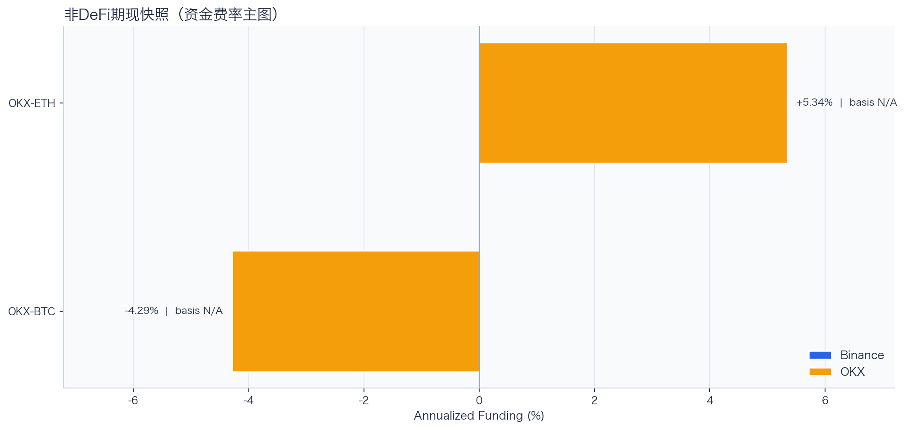
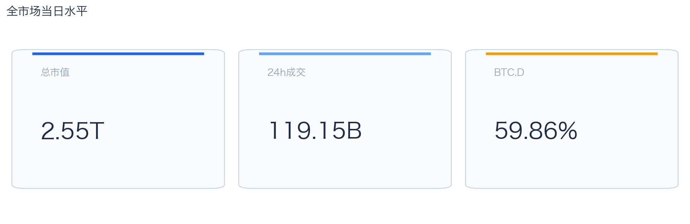
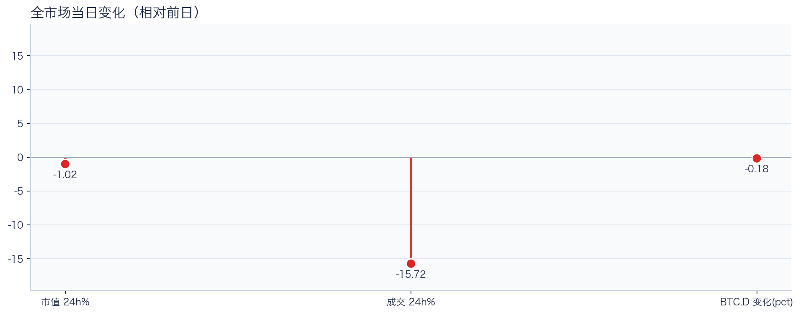
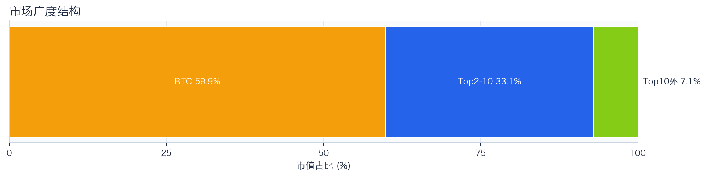
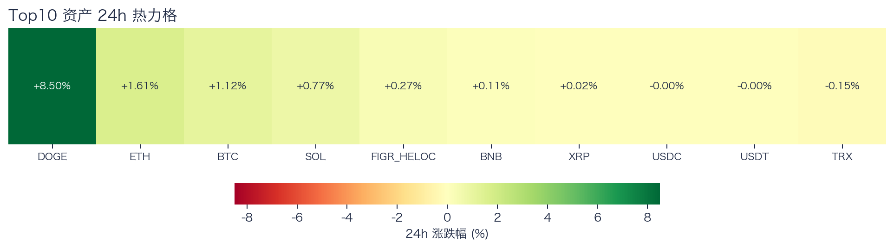
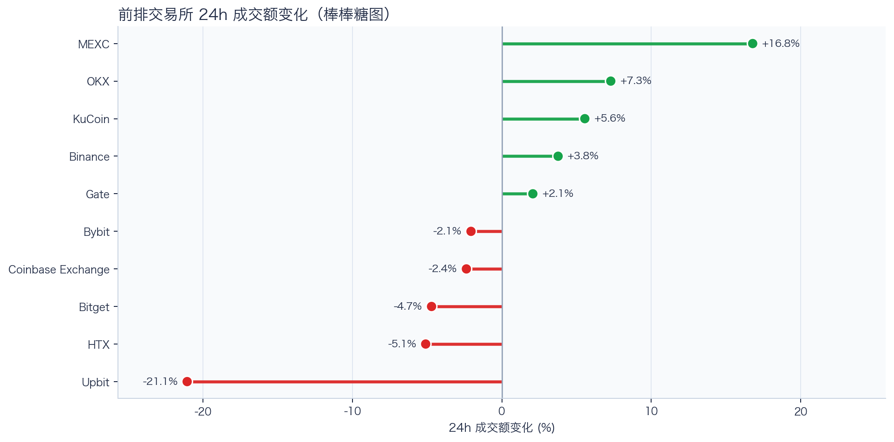
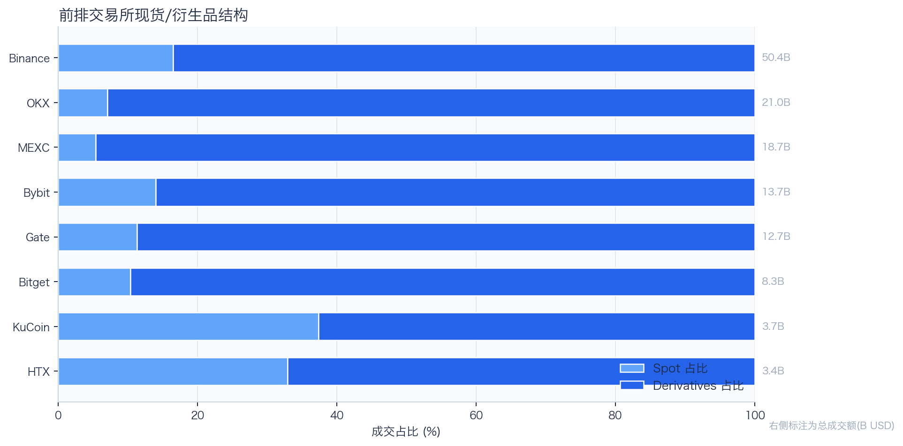
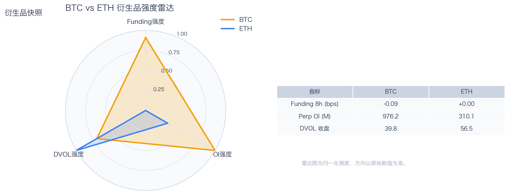
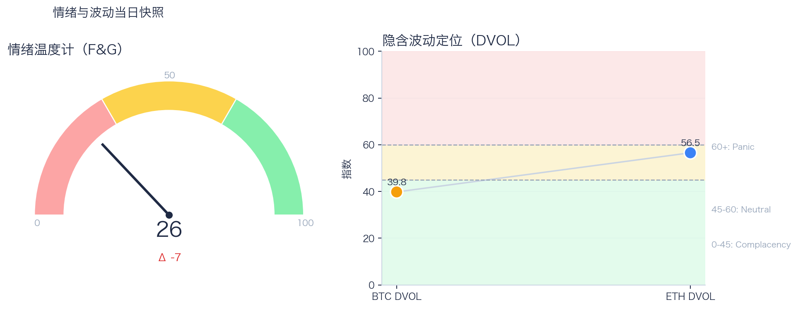

# 二级市场日报（2026-04-29）

## 关键结论
- 全市场市值 $2.55T（24h -1.02%），成交额 $119.15B（24h -15.72%）。
- BTC 主导率 59.86%（-0.18pct），Top10 外占比 7.06%。
- Top10 资产上涨 7 / 下跌 3，平均涨跌幅 +1.23%，首尾分化 8.65pct。
- 衍生品：BTC/ETH 资金费率分别为 -0.09bps / +0.00bps，DVOL 收盘 39.79 / 56.55。

## 今日盘面判断
如果只用一句话概括今天的市场，关键词是 `Defensive Drift`。价格与成交同步走弱，属于防守型下移结构，短线以控制回撤为主。广度仍偏窄，增量风险偏好尚未形成持续外溢。这意味着短线虽然有可交易的弹性，但要把它理解成新一轮趋势启动，证据还不够。

## 核心驱动因素
从流动性结构看，平台流量呈分化状态，头部与非头部恢复节奏不一致；从杠杆维度看，杠杆拥挤度整体可控；在风险定价层面，隐含波动率回落至相对低位，事件冲击前的保护成本下降；再结合情绪与价格修复节奏尚未完全同步。整体来看，盘面更像是修复中的高波动环境，而不是低波动顺趋势环境。

## BTC/ETH 24h 趋势判断

- BTC/ETH 24h 趋势数据暂不可用。

## 稳定币收益情况（链上协议）
按安全优先（协议成熟度、链层风险、是否依赖激励）筛选了 10 个主流池；原生供给利率均值约 +4.39%。
其中包含奖励补贴的池有 0 个，补贴收益已单列，不与原生利率混合。

核心观察
- 利率结构：Total APY 位于 0.59% 至 7.10% 区间。
- 资金集中：TVL 主要集中在 Spark-USDT（Ethereum，TVL $989.53M）、Aave-USDC（Ethereum，TVL $143.70M）。
- 收益领先：当前收益靠前样本包括 Morpho-USDC（Ethereum，Total 7.10%）、Compound-USDS（Ethereum，Total 6.98%）。

风险提示
- 利用率达到 70% 以上的池有 8 个，杠杆需求主要集中在头部池。
- 利用率最高样本：Aave-USDT（Ethereum） 93.35%，Borrow APY 5.85%。
- 奖励收益池数量：0 个。当前收益主体仍以原生利率为主。

数据覆盖：Aave API(7)，Compound API(6)，DefiLlama(17)。

稳定币收益对照表（安全优先）
| 协议 | 链 | 币种 | Supply | Borrow | Rewards | Total | Utilization | TVL | 数据源 |
|---|---|---|---:|---:|---:|---:|---:|---:|---|
| Aave | Ethereum | USDC | 4.23% | 5.09% | N/A | 3.78% | 92.77% | $143.70M | DefiLlama+Aave API |
| Spark | Ethereum | USDT | 3.00% | N/A | N/A | 3.00% | N/A | $989.53M | DefiLlama |
| Compound | Ethereum | USDS | 6.98% | 8.22% | 0.00% | 6.98% | 91.17% | $2.00M | Compound API |
| Morpho | Ethereum | USDC | 7.10% | 8.16% | 0.00% | 7.10% | 87.42% | $164,508 | Morpho API |
| Aave | Ethereum | USDT | 4.89% | 5.85% | N/A | 4.77% | 93.35% | $127.90M | DefiLlama+Aave API |
| Aave | Ethereum | USDS | 0.60% | 5.78% | N/A | 0.59% | 14.11% | $31.10M | DefiLlama+Aave API |
| Aave | Ethereum | DAI | 5.55% | 8.09% | N/A | 5.40% | 92.64% | $8.31M | DefiLlama+Aave API |
| Aave | Ethereum | PYUSD | 3.83% | 4.95% | N/A | 3.76% | 86.30% | $3.80M | DefiLlama+Aave API |
| Aave | Base | USDC | 3.50% | 4.47% | N/A | 3.44% | 87.49% | $21.85M | DefiLlama+Aave API |
| Aave | Arbitrum | USDC | 4.23% | 5.19% | N/A | 4.22% | 91.06% | $14.18M | DefiLlama+Aave API |

稳定币收益对比（扩展样本，TVL≥$1M，共 18 条）
| 币种 | 协议 | 链 | Supply | Borrow | Rewards | Total | Utilization | TVL | 数据源 |
|---|---|---|---:|---:|---:|---:|---:|---:|---|
| USDC | Aave | Ethereum | 4.23% | 5.09% | N/A | 3.78% | 92.77% | $143.70M | DefiLlama+Aave API |
| USDC | Aave | Arbitrum | 4.23% | 5.19% | N/A | 4.22% | 91.06% | $14.18M | DefiLlama+Aave API |
| USDC | Aave | Base | 3.50% | 4.47% | N/A | 3.44% | 87.49% | $21.85M | DefiLlama+Aave API |
| USDC | Spark | Ethereum | 3.65% | N/A | N/A | 3.65% | N/A | $565.14M | DefiLlama |
| USDC | Compound | Ethereum | 2.76% | 3.63% | 0.14% | 2.90% | 76.78% | $348.89M | DefiLlama+Compound API |
| USDC | Compound | Arbitrum | 2.94% | 3.76% | 0.00% | 2.94% | 81.54% | $18.37M | DefiLlama+Compound API |
| USDC | Compound | Base | 6.16% | 7.29% | 0.00% | 6.16% | 90.91% | $9.45M | DefiLlama+Compound API |
| USDT | Aave | Ethereum | 4.89% | 5.85% | N/A | 4.77% | 93.35% | $127.90M | DefiLlama+Aave API |
| USDT | Spark | Ethereum | 3.00% | N/A | N/A | 3.00% | N/A | $989.53M | DefiLlama |
| USDT | Compound | Ethereum | 2.87% | 3.71% | 0.13% | 3.00% | 79.63% | $193.72M | DefiLlama+Compound API |
| USDT | Compound | Arbitrum | 2.27% | 3.25% | 0.00% | 2.27% | 63.10% | $19.82M | DefiLlama+Compound API |
| DAI | Aave | Ethereum | 5.55% | 8.09% | N/A | 5.40% | 92.64% | $8.31M | DefiLlama+Aave API |
| USDS | Aave | Ethereum | 0.60% | 5.78% | N/A | 0.59% | 14.11% | $31.10M | DefiLlama+Aave API |
| USDS | Spark | Ethereum | 2.49% | N/A | N/A | 2.49% | N/A | $51.81M | DefiLlama |
| USDS | Compound | Ethereum | 6.98% | 8.22% | 0.00% | 6.98% | 91.17% | $2.00M | Compound API |
| SUSDS | Spark | Ethereum | 0.00% | N/A | N/A | 0.00% | N/A | $3.43M | DefiLlama |
| PYUSD | Aave | Ethereum | 3.83% | 4.95% | N/A | 3.76% | 86.30% | $3.80M | DefiLlama+Aave API |
| PYUSD | Spark | Ethereum | 0.47% | N/A | N/A | 0.47% | N/A | $86.49M | DefiLlama |

跨源补充（比 taoli 更全）
- 新增对比源：DefiLlama 全量稳定币池（筛选口径）+ Bitcompare CeFi 利率，并与现有链上主流池快照交叉核对。
- 覆盖规模：原链上精表 18 条；DefiLlama 扩展样本 83 条（展示 Top20）；Bitcompare 稳定币利率样本 7 条。
- 覆盖维度：扩展样本覆盖 41 个协议、14 条链、57 类稳定币。
- 口径说明：Bitcompare 为平台展示 APY，taoli 为 Binance 借币年化，两者用于横向参考，不等价于无风险套利收益。

稳定币收益补充表（DefiLlama 扩展，TVL≥$30M，去重后 Top20）
| 币种 | 协议 | 链 | Base | Rewards | Total | TVL | 数据源 |
|---|---|---|---:|---:|---:|---:|---|
| SUSDS | sky-lending | Ethereum | N/A | N/A | 3.65% | $5.43B | DefiLlama API |
| USYC | circle-usyc | BSC | 3.35% | N/A | 3.35% | $2.79B | DefiLlama API |
| USDC | maple | Ethereum | 4.95% | 0.00% | 4.95% | $2.67B | DefiLlama API |
| SUSDE | ethena-usde | Ethereum | 5.37% | N/A | 5.37% | $2.14B | DefiLlama API |
| BUIDL | blackrock-buidl | Ethereum | 3.56% | N/A | 3.56% | $1.12B | DefiLlama API |
| USDT | maple | Ethereum | 4.61% | 0.00% | 4.61% | $954.66M | DefiLlama API |
| USTB | superstate-ustb | Ethereum | 3.54% | N/A | 3.54% | $810.78M | DefiLlama API |
| USDYC | ondo-yield-assets | Ethereum | 3.55% | N/A | 3.55% | $808.79M | DefiLlama API |
| BUIDL | blackrock-buidl | Aptos | 3.22% | N/A | 3.22% | $559.05M | DefiLlama API |
| USDY | ondo-yield-assets | Ethereum | 3.55% | N/A | 3.55% | $532.43M | DefiLlama API |
| BUIDL | blackrock-buidl | BSC | 3.22% | N/A | 3.22% | $508.66M | DefiLlama API |
| BUSD0 | usual-usd0 | Ethereum | N/A | 3.22% | 3.22% | $505.77M | DefiLlama API |
| STEAKUSDC | morpho-blue | Base | 4.03% | 0.00% | 4.03% | $471.91M | DefiLlama API |
| USDC | jupiter-lend | Solana | 3.05% | 1.11% | 4.15% | $425.37M | DefiLlama API |
| SUSDS | sky-lending | Arbitrum | N/A | N/A | 3.65% | $357.92M | DefiLlama API |
| GTUSDCP | morpho-blue | Base | 4.03% | 0.00% | 4.03% | $354.56M | DefiLlama API |
| USDD | justlend | Tron | 0.00% | 4.00% | 4.00% | $321.52M | DefiLlama API |
| SUSDAI | usd-ai | Arbitrum | 7.09% | N/A | 7.09% | $266.64M | DefiLlama API |
| DAI | sky-lending | Ethereum | N/A | N/A | 1.25% | $241.75M | DefiLlama API |
| SENPYUSDMAIN | morpho-blue | Ethereum | 1.46% | 4.48% | 5.95% | $232.73M | DefiLlama API |

CeFi 稳定币收益/成本对比（Bitcompare vs taoli）
| 币种 | Bitcompare 最高APY | 对应平台 | taoli(Binance借币年化) | 利差(APY-借币) |
|---|---:|---|---:|---:|
| DAI | 7.00% | EarnPark | N/A | N/A |
| PYUSD | 6.48% | Euler Finance | N/A | N/A |
| TUSD | 1.38% | JustLend | N/A | N/A |
| USDC | 4.00% | EarnPark | 2.90% | 1.10% |
| USDE | 5.44% | Pendle | N/A | N/A |
| USDP | 10.50% | Nexo | N/A | N/A |
| USDT | 20.00% | EarnPark | 3.04% | 16.96% |

交易含义：当前稳定币收益更偏“头部池中等收益 + 局部高利用率”结构，策略上优先流动性与透明度，再考虑收益增强。
部分池的 Borrow 与 Utilization 暂未返回，表内仅展示已获取字段。

## 非 DeFi（交易所期现）

样本范围覆盖 Binance 与 OKX 的 BTC/ETH 现货与永续，用于观察 funding 与 basis 的当期结构。
- Funding 最高样本：OKX-ETH，年化约 5.34%。
- Funding 最低样本：OKX-BTC，年化约 -4.29%。

借币成本多源对比表
| 资产 | Binance(日/年) | OKX(日/年) | Bybit(日/年) | Backpack(日/年) | KuCoin(日/年) | 最低日利率 |
|---|---:|---:|---:|---:|---:|---:|
| USDT | 0.01%/3.04% · 100k | 0.01%/2.51% · 5.0M | N/A | 0.01%/2.95% · 50.0M | N/A | OKX 0.01% |
| USDC | 0.01%/2.90% · 100k | 0.00%/1.01% · 1.0M | N/A | 0.01%/1.92% · 300.0M | N/A | OKX 0.00% |
| BTC | 0.00%/0.42% · 60 | 0.00%/1.01% · 175 | N/A | 0.00%/0.37% · 3k | N/A | Backpack 0.00% |
| ETH | 0.01%/2.63% · 400 | 0.01%/2.01% · 7k | N/A | 0.00%/1.63% · 20k | N/A | Backpack 0.00% |
说明：统一按日利率/年化展示，单元格尾部为可借额度。
- 交易含义：当 funding 年化显著高于 basis 且持续为正，carry 交易更偏向收取 funding；若 basis 与 funding 同步回落，需降低杠杆并关注资金回流速度。
该部分与链上收益分开统计，便于比较两类策略的收益与风险结构。

## 市场脉冲

截至 2026-04-29，全市场市值 $2.55T，24h 成交额 $119.15B，BTC 主导率 59.86%。
价格与成交同步走弱，风险偏好仍在收缩，盘面更偏防守。在这种盘面下，成交能否继续跟上，是判断明天反弹延续还是回吐的第一道分水岭。

相对前日，市值 -1.02%、成交 -15.72%、BTC.D -0.18pct。
把这组变化拆开看，比看单一涨跌更有用：价格、成交、主导率三者同向时，行情更有连续性；一旦出现背离，走势往往会变得更短促、更反复。

## 主导率与市场广度

当前结构为 BTC 59.86% / Top2-10 33.08% / Top10 外 7.06%。长尾占比仍偏低，广度修复还未形成持续趋势。
Top10 外占比处于低位，风险偏好仍主要停留在 BTC 与头部资产。换句话说，资金目前更愿意在高流动性的核心资产里做仓位调整，而不是大面积扩散到长尾资产。

## 资产与交易所资金流

Top10 中领涨 DOGE（+8.50%），尾部 TRX（-0.15%），均值 +1.23%。分化 8.65pct，结构性交易仍是主导。
上涨家数明显占优，但首尾分化仍大，表明反弹并非无差别普涨。对交易而言，这通常意味着“选币”比“全市场方向”更重要，错配带来的收益差会明显放大。

前排样本上涨 5 家、下跌 5 家，均值 +0.02%。MEXC 最强（+16.79%），Upbit 最弱（-21.07%）。
最强与最弱平台的 24h 变化差达到 37.86pct，说明流动性仍在选择性回流，头部平台的价格发现能力更强。当平台间流量分化明显时，报价连续性和滑点表现会同步分化，执行层面要更关注成交质量。

样本内衍生品成交占比 85.05%。若该占比继续走高且 funding 不同步回落，短线波动脉冲通常会增强。
衍生品占比处于高位，行情更容易出现脉冲式放大，风控阈值建议偏保守。这也是为什么同样的消息面在当前阶段更容易被放大成大振幅走势。

## 衍生品与情绪

资金费率（Funding）仍在中性附近，BTC/ETH 分别 -0.09bps / +0.00bps；未平仓合约（OI）为 $976.22M / $310.09M；隐含波动率指数（DVOL）位于 Complacency（低波动定价） / Neutral（中性波动定价）。
Funding 与 DVOL 的组合显示，方向拥挤暂未极端，但尾部风险定价仍未完全回落。因此更合适的做法不是激进追单边，而是围绕波动管理仓位和节奏。

恐惧与贪婪指数（F&G）当日 26（较前日 -7）；配合 BTC/ETH DVOL 39.79/56.55，当前更像情绪修复中的高波动区。
情绪回到中性区，若后续成交和广度同步改善，趋势性机会会明显增多。只有当情绪、广度和成交三者同时改善，市场才更可能从“反弹交易”切换到“趋势交易”。

## 未来24小时观察
1. 若 Top10 外占比继续抬升且 BTC.D 回落，说明风险偏好开始从核心资产向外扩散。
2. 若衍生品占比继续上升而 funding 仍中性，盘面大概率维持高波动震荡而非顺滑上行。
3. 若 F&G 反弹但 DVOL 不降，代表情绪与风险定价背离，追涨胜率会明显下降。

## 交易与风控含义
- 仓位管理优先级高于方向押注，建议保持核心仓位稳定、战术仓位滚动。
- 若交易所衍生品占比继续上升，建议同步收紧杠杆和止损参数。
- 关注情绪改善与广度扩散是否同步发生，二者背离时避免追逐单边。

## 数据缺口（Data Gaps）
- Binance BTC/ETH 24h 批量数据获取失败，转单币重试: HTTP Error 451: 
- Binance 24h 单币数据获取失败 BTCUSDT: HTTP Error 451: 
- Binance 24h 未返回 BTCUSDT 数据。
- Binance 24h 单币数据获取失败 ETHUSDT: HTTP Error 451: 
- Binance 24h 未返回 ETHUSDT 数据。
- Binance BTCUSDT 1h K线获取失败: HTTP Error 451: 
- Binance ETHUSDT 1h K线获取失败: HTTP Error 451: 
- Binance 非DeFi期现数据获取失败 BTC: HTTP Error 451: 
- Binance 非DeFi期现数据获取失败 ETH: HTTP Error 451: 
- 借币成本部分数据源不可用: Bybit: HTTP Error 403: Forbidden

