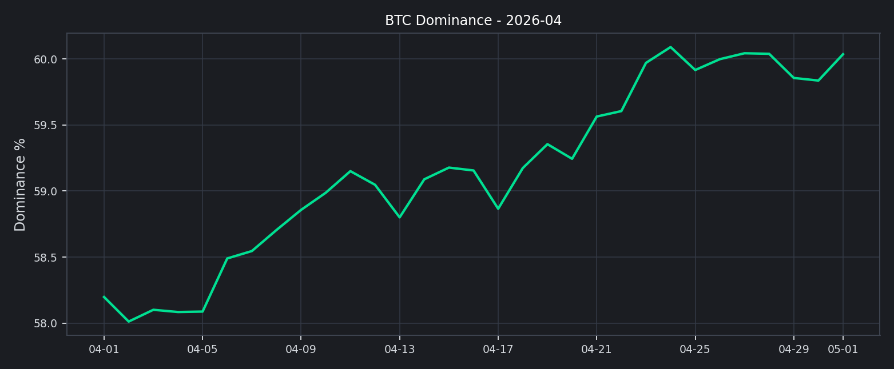
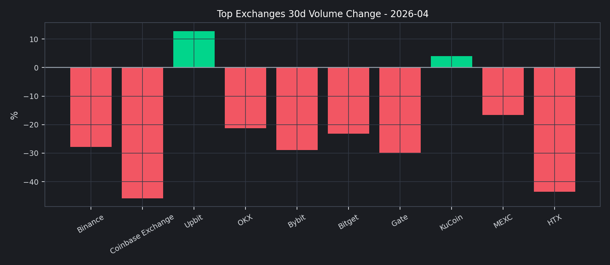

# 202604

## 2026 年 04 月核心市场洞察

- 市值与主导率分析
- 前排交易所成交结构分析
- 市场情绪：恐惧贪婪指数
- 风险与运营建议

本月市场呈现“去杠杆回落、结构分化”的特征，前排交易所整体成交额较前一观察窗口收缩，但头部内部出现分化。

### 2026 年 04 月核心结论
- 总成交额与流动性：前排样本滚动 30 天成交额为 $3.64T，估算环比 -26.56%。
- 全市场总市值：$2.35T -> $2.54T，月内变化 +8.49%。
- 全市场日均 24h 成交额：$113.07B。
- BTC 主导率：+58.20% -> +60.04%。
- 恐惧贪婪指数：29（Fear）。
- 稳定币资金面：市值 $292.16B，24h 成交量 $112.02B。

值得注意的是，本期市值下行与主导率回落并存，说明市场风险偏好没有简单回归，仍处于结构性再定价阶段。

## 市值与主导率分析
根据 CMC 全市场历史数据，2 月份总市值整体下移；BTC 主导率虽有回落，但仍维持在高位区间。

这意味着交易量仍倾向集中在核心资产交易对，长尾资产流动性修复较慢。

## 前排交易所成交结构分析
我们以 CMC 前排样本进行横向对比，重点观察 `30d 成交额变化` 与 `24h 现货/衍生品结构`。

关键观察：
1. 增幅靠前：Upbit (+12.79%), KuCoin (+4.05%)。
2. 回落靠前：Coinbase Exchange (-45.84%), HTX (-43.51%)。
3. 结构上，衍生品成交占比在样本内依旧偏高，波动放大风险需持续跟踪。

## 资金费率与波动率观察
参考交易所衍生品月报口径，本节给出资金费率快照与波动率代理指标。
- Deribit BTC-PERP funding: +0.00%
- Deribit ETH-PERP funding: N/A
- 全市场衍生品 24h 成交量（CMC）：$397.69B

该图使用 BTC/ETH 7 日已实现波动率（年化）作为期权隐波的替代温度计：上行通常对应风险对冲需求抬升。

## 市场情绪：恐惧贪婪指数
恐惧贪婪指数在本月维持低位震荡，零售情绪修复缓慢。

关键时点分析：
1. 若指数持续低于 25，通常意味着风险偏好尚未恢复。
2. 若指数快速回升并突破 50，往往对应短期交易活跃度提升。

## 社媒与搜索热度（Trending）
以 CoinGecko Trending 作为公开可得的搜索热度代理。
| Symbol | Name | MCap Rank | Price (BTC) |
| --- | --- | --- | --- |
| LAB | LAB | 273 | 0.00001828 |
| MEGA | MegaETH | 233 | 0.00000158 |
| TAO | Bittensor | 36 | 0.00365054 |
| TAC | TAC | 351 | 0.00000034 |
| LUNC | Terra Luna Classic | 109 | 0.00000000 |
| PENGU | Pudgy Penguins | 88 | 0.00000012 |
| MON | Monad | 130 | 0.00000038 |
| AKT | Akash Network | 184 | 0.00000848 |
| OCT | Octra | 894 | 0.00000039 |
| BTC | Bitcoin | 1 | 1.00000000 |

## 稳定币与资金面观察
- 稳定币市值：$292.16B
- 稳定币 24h 成交量：$112.02B
- DeFi 市值：$60.69B
- DeFi 24h 成交量：$7.34B

## 风险与运营建议
1. 风险监控：将“衍生品占比 + 30d 量能变化 + F&G”纳入统一预警面板。
2. 业务策略：在主流币对维持深度，同时控制长尾币对库存与做市风险。
3. 对外披露：参考 PoR 风格，补充负债口径与地址级储备说明，增强用户信任。

## 附录：前排交易所明细
| Rank | Exchange | 30d Volume | 30d Change | 7d Change | 24h Spot | 24h Deriv |
| --- | --- | --- | --- | --- | --- | --- |
| 1 | Binance | $2.04T | -27.89% | +5.55% | $3.87B | $26.30B |
| 2 | Coinbase Exchange | $56.45B | -45.84% | -14.93% | $612.02M | $0 |
| 3 | Upbit | $28.68B | +12.79% | -46.62% | $880.60M | $0 |
| 6 | OKX | $600.69B | -21.21% | +0.77% | $916.27M | $10.90B |
| 7 | Bybit | $237.40B | -28.89% | -2.08% | $952.68M | $7.06B |
| 8 | Bitget | $129.34B | -23.22% | +15.57% | $741.02M | $4.48B |
| 10 | Gate | $268.95B | -29.89% | +7.99% | $835.73M | $5.71B |
| 13 | KuCoin | $106.80B | +4.05% | +35.59% | $1.39B | $2.07B |
| 16 | MEXC | $97.77B | -16.66% | +51.77% | $587.38M | $11.67B |
| 25 | HTX | $70.52B | -43.51% | +5.37% | $856.27M | $1.29B |

## 数据源
- CMC Exchange Quotes: `https://api.coinmarketcap.com/data-api/v3/exchange/quotes/latest`
- CMC Global Historical: `https://api.coinmarketcap.com/data-api/v3/global-metrics/quotes/historical`
- CMC Global Latest: `https://api.coinmarketcap.com/data-api/v3/global-metrics/quotes/latest`
- CoinGecko Trending: `https://api.coingecko.com/api/v3/search/trending`
- CoinGecko Market Chart: `https://api.coingecko.com/api/v3/coins/{id}/market_chart`
- CoinMetrics (State of the Network #348): `https://coinmetrics.substack.com/p/state-of-the-network-issue-348`
- Deribit Ticker: `https://www.deribit.com/api/v2/public/ticker`
- Alternative.me F&G: `https://api.alternative.me/fng/`
- CMC 快照时间：`2026-05-03T15:00:11.650Z`
- 明细数据：`yuque_style_exchange_data.csv`