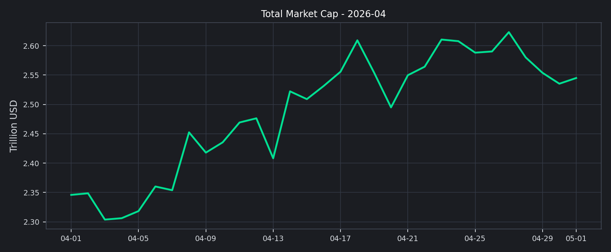
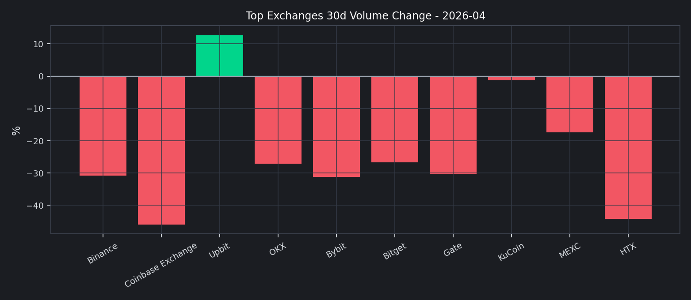
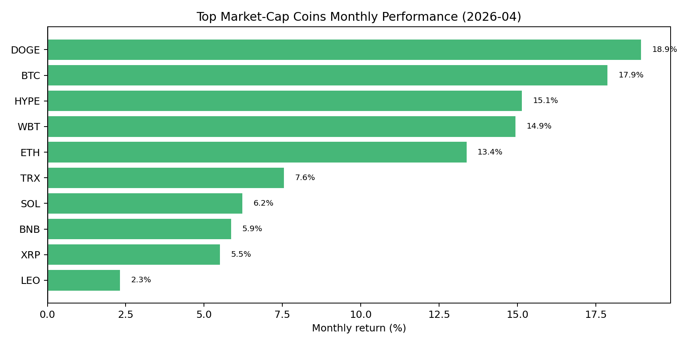
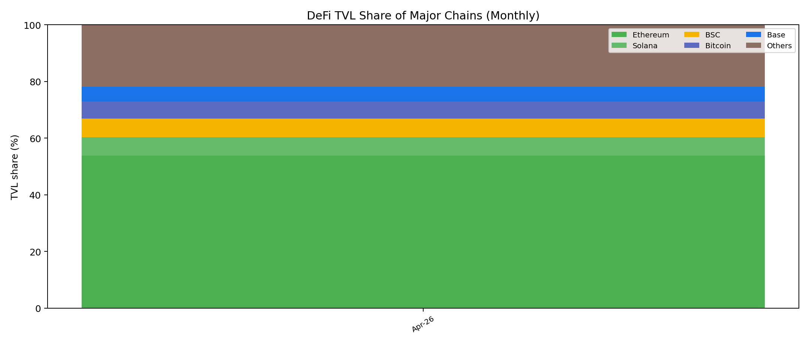
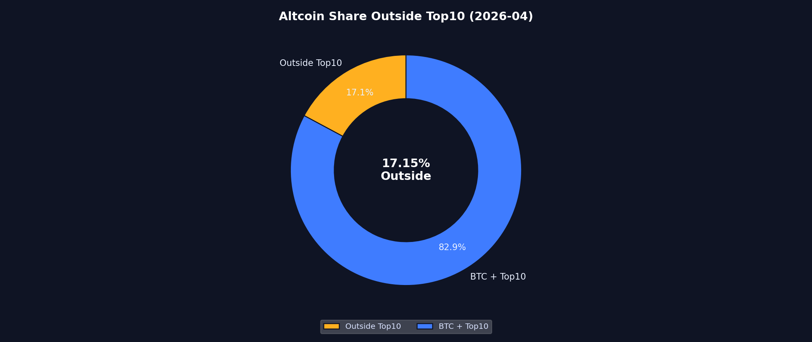
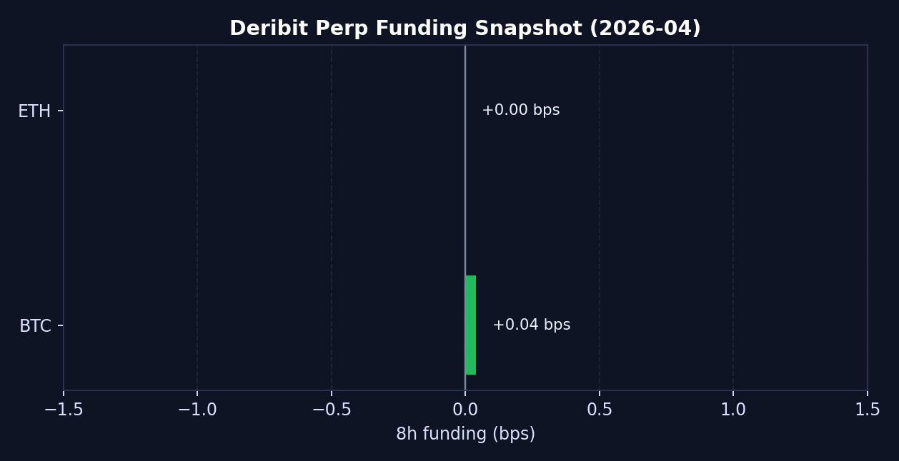
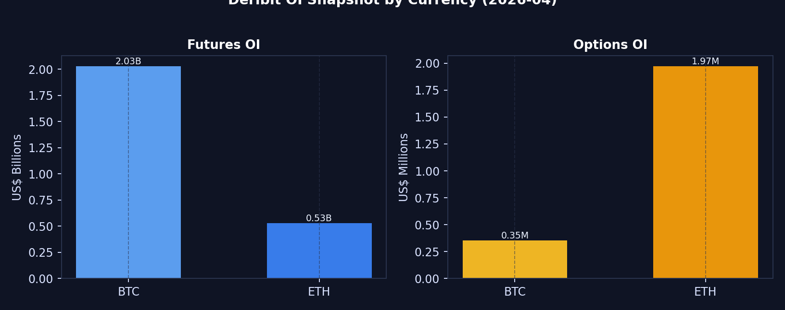
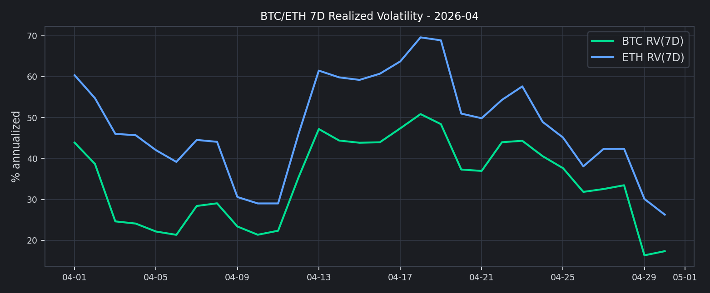

# 2026 年 4 月二级市场月报

4 月市场更像一次修复，而不是一轮全面风险偏好回归。总市值较月初回升，但资金仍主要集中在 BTC 与头部资产。

## Key Takeaways
- 全市场市值：$2.35T -> $2.54T，月内变化 +8.49%。
- 全市场日均成交额：$113.07B。
- BTC 主导率：58.20% -> 60.04%，变化 +1.84pct。
- Top 资产月度分化：涨幅最高 DOGE +18.94%；跌幅最大 LEO +2.32%。
- 市场广度（Top10外占比，月末近端）：17.15%
- Deribit 资金费率（8h）：BTC=+0.000004，ETH=+0.000000。
- Deribit DVOL（月内）：BTC 38.88~51.49（月末 38.88）；ETH 56.02~72.02（月末 56.02）。

## 宏观代理与市场状态
总市值回升且 BTC 主导率维持高位，说明修复主要发生在核心资产，而不是全面风险扩散。

## 交易所流量与资金活跃度
前排样本 30d 成交额合计约 $3.63T，估算环比 -29.52%。
增幅靠前为 Upbit（+12.67%），回落靠前为 Coinbase Exchange（-45.92%）。

## 主流资产表现与市场广度
头部资产中，表现最强的是 DOGE（+18.94%），最弱的是 LEO（+2.32%）。
上涨资产 10 个、下跌资产 0 个，说明市场存在修复，但扩散并不充分。
Top10 外市值占比月末为 17.15%，长尾资产承接力度仍需继续观察。

## 衍生品仓位温度
BTC 与 ETH 的资金费率都接近零轴，说明杠杆并不拥挤，仓位更偏中性博弈。

## 情绪与波动定价
恐惧与贪婪指数月末为 29，仍处于Fear区间。价格若已修复而情绪仍偏弱，往往意味着这轮上行更像仓位修补，而不是新一轮全面风险偏好扩张。

## 下月交易框架（基准情景）
1. 仓位：维持核心资产优先，长尾暴露与流动性阈值联动管理。
2. 触发：若 Funding 上行且 DVOL 回落，同时 Top10 外占比抬升，再逐步提高风险预算。
3. 风控：若情绪修复继续落后于价格修复，优先执行止盈与回撤控制，而非追逐单边扩张。
