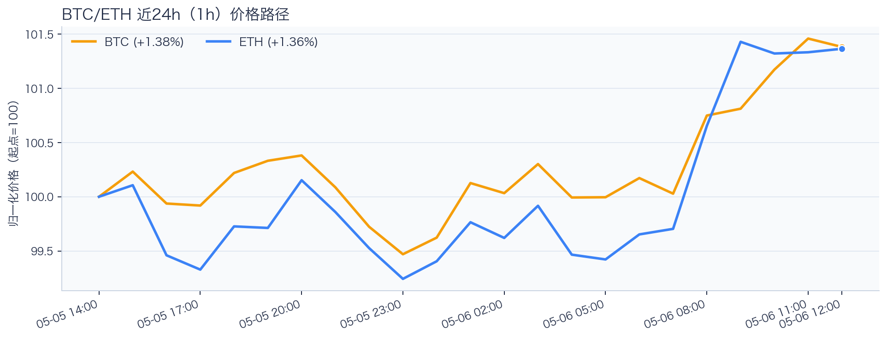
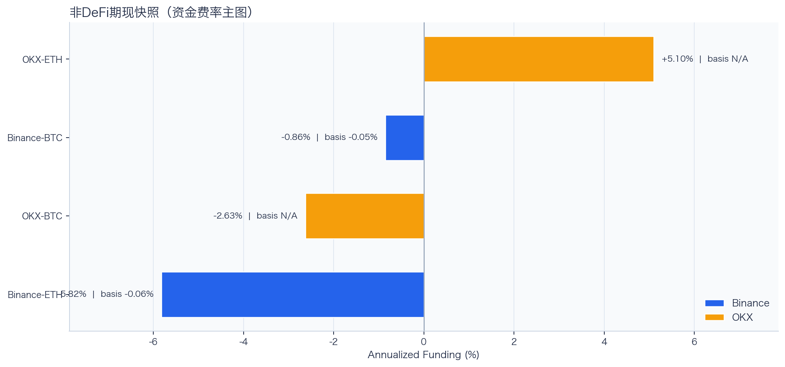
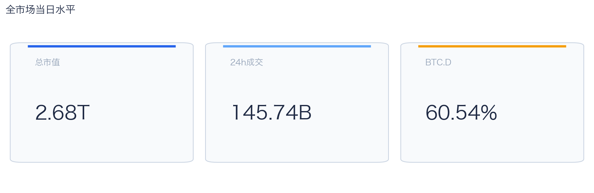
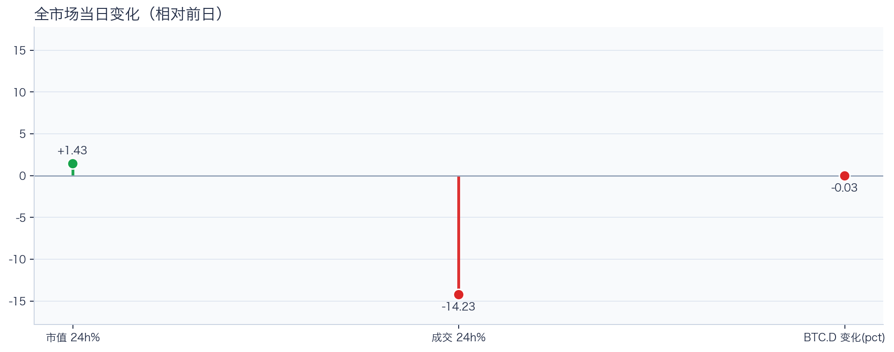
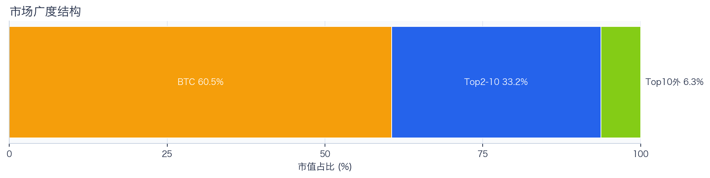
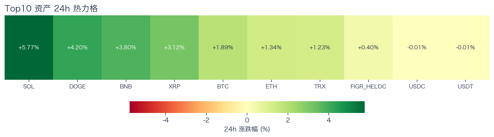
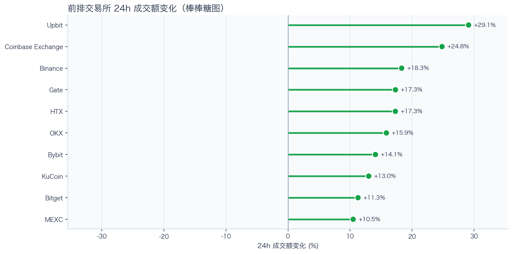
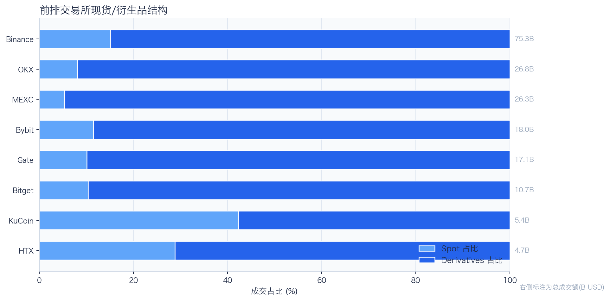
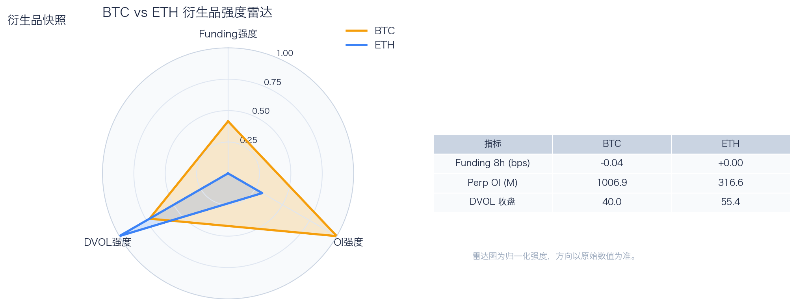
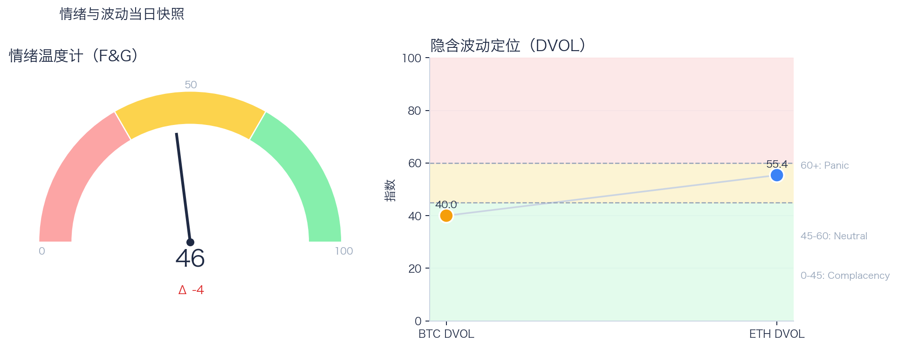

# 二级市场日报（2026-05-06）

## 关键结论
- 全市场市值 $2.68T（24h +1.43%），成交额 $145.74B（24h -14.23%）。
- BTC 主导率 60.54%（-0.03pct），Top10 外占比 6.29%。
- Top10 资产上涨 8 / 下跌 2，平均涨跌幅 +2.17%，首尾分化 5.78pct。
- 衍生品：BTC/ETH 资金费率分别为 -0.04bps / +0.00bps，DVOL 收盘 39.98 / 55.38。

## 今日盘面判断
如果只用一句话概括今天的市场，关键词是 `Range Trading`。价格与成交未形成同向趋势，市场仍在区间内进行结构轮动。广度仍偏窄，增量风险偏好尚未形成持续外溢。这意味着短线虽然有可交易的弹性，但要把它理解成新一轮趋势启动，证据还不够。

## 核心驱动因素
从流动性结构看，多数平台成交回暖，短线流动性环境较前一日改善；从杠杆维度看，杠杆拥挤度整体可控；在风险定价层面，隐含波动率回落至相对低位，事件冲击前的保护成本下降；再结合情绪与价格修复节奏尚未完全同步。整体来看，盘面更像是修复中的高波动环境，而不是低波动顺趋势环境。

## BTC/ETH 24h 趋势判断

- BTC：$82,460.00（24h +1.89%，区间 $80,731.14 - $82,850.00，当前位于区间 82%）=> 偏强震荡。
- ETH：$2,411.23（24h +1.47%，区间 $2,354.34 - $2,423.74，当前位于区间 82%）=> 偏强震荡。
- 简评：BTC 与 ETH 同步偏强，短线仍有上行动能。

## 稳定币收益情况（链上协议）
按安全优先（协议成熟度、链层风险、是否依赖激励）筛选了 10 个主流池；原生供给利率均值约 +3.58%。
其中包含奖励补贴的池有 0 个，补贴收益已单列，不与原生利率混合。

核心观察
- 利率结构：Total APY 位于 0.92% 至 7.18% 区间。
- 资金集中：TVL 主要集中在 Spark-USDT（Ethereum，TVL $1.18B）、Aave-USDC（Ethereum，TVL $149.97M）。
- 收益领先：当前收益靠前样本包括 Morpho-USDC（Ethereum，Total 7.18%）、Compound-USDS（Ethereum，Total 4.89%）。

风险提示
- 利用率达到 70% 以上的池有 8 个，杠杆需求主要集中在头部池。
- 利用率最高样本：Aave-USDT（Ethereum） 92.55%，Borrow APY 4.79%。
- 奖励收益池数量：0 个。当前收益主体仍以原生利率为主。

数据覆盖：Aave API(7)，Compound API(6)，DefiLlama(17)，Morpho API(1)。

稳定币收益对照表（安全优先）
| 协议 | 链 | 币种 | Supply | Borrow | Rewards | Total | Utilization | TVL | 数据源 |
|---|---|---|---:|---:|---:|---:|---:|---:|---|
| Aave | Ethereum | USDC | 3.62% | 4.38% | N/A | 3.52% | 92.23% | $149.97M | DefiLlama+Aave API |
| Spark | Ethereum | USDT | 2.50% | N/A | N/A | 2.50% | N/A | $1.18B | DefiLlama |
| Compound | Ethereum | USDS | 4.89% | 5.85% | 0.00% | 4.89% | 90.51% | $2.02M | Compound API |
| Morpho | Ethereum | USDC | 7.18% | 8.10% | N/A | 7.18% | 89.06% | $161,745 | Morpho API |
| Aave | Ethereum | USDT | 3.98% | 4.79% | N/A | 3.83% | 92.55% | $146.87M | DefiLlama+Aave API |
| Aave | Ethereum | DAI | 2.98% | 4.72% | N/A | 2.93% | 84.81% | $18.80M | DefiLlama+Aave API |
| Aave | Ethereum | USDS | 0.93% | 5.84% | N/A | 0.92% | 21.68% | $16.12M | DefiLlama+Aave API |
| Aave | Ethereum | PYUSD | 3.04% | 4.48% | N/A | 2.87% | 76.04% | $6.66M | DefiLlama+Aave API |
| Aave | Base | USDC | 3.47% | 4.45% | N/A | 3.40% | 87.04% | $22.80M | DefiLlama+Aave API |
| Aave | Arbitrum | USDC | 3.22% | 4.04% | N/A | 3.19% | 89.08% | $17.91M | DefiLlama+Aave API |

稳定币收益对比（扩展样本，TVL≥$1M，共 19 条）
| 币种 | 协议 | 链 | Supply | Borrow | Rewards | Total | Utilization | TVL | 数据源 |
|---|---|---|---:|---:|---:|---:|---:|---:|---|
| USDC | Aave | Ethereum | 3.62% | 4.38% | N/A | 3.52% | 92.23% | $149.97M | DefiLlama+Aave API |
| USDC | Aave | Arbitrum | 3.22% | 4.04% | N/A | 3.19% | 89.08% | $17.91M | DefiLlama+Aave API |
| USDC | Aave | Base | 3.47% | 4.45% | N/A | 3.40% | 87.04% | $22.80M | DefiLlama+Aave API |
| USDC | Spark | Ethereum | 3.65% | N/A | N/A | 3.65% | N/A | $920.39M | DefiLlama |
| USDC | Compound | Ethereum | 2.86% | 3.71% | 0.14% | 3.01% | 79.56% | $340.66M | DefiLlama+Compound API |
| USDC | Compound | Arbitrum | 2.48% | 3.42% | 0.00% | 2.48% | 68.98% | $18.67M | DefiLlama+Compound API |
| USDC | Compound | Base | 5.00% | 5.99% | 0.00% | 5.00% | 90.55% | $9.49M | DefiLlama+Compound API |
| USDC | Morpho | Base | 17.77% | 17.78% | N/A | 17.77% | 99.99% | $1.34M | Morpho API |
| USDT | Aave | Ethereum | 3.98% | 4.79% | N/A | 3.83% | 92.55% | $146.87M | DefiLlama+Aave API |
| USDT | Spark | Ethereum | 2.50% | N/A | N/A | 2.50% | N/A | $1.18B | DefiLlama |
| USDT | Compound | Ethereum | 2.91% | 3.74% | 0.14% | 3.05% | 80.70% | $189.30M | DefiLlama+Compound API |
| USDT | Compound | Arbitrum | 2.32% | 3.29% | 0.00% | 2.32% | 64.32% | $19.83M | DefiLlama+Compound API |
| DAI | Aave | Ethereum | 2.98% | 4.72% | N/A | 2.93% | 84.81% | $18.80M | DefiLlama+Aave API |
| USDS | Aave | Ethereum | 0.93% | 5.84% | N/A | 0.92% | 21.68% | $16.12M | DefiLlama+Aave API |
| USDS | Spark | Ethereum | 2.48% | N/A | N/A | 2.48% | N/A | $52.59M | DefiLlama |
| USDS | Compound | Ethereum | 4.89% | 5.85% | 0.00% | 4.89% | 90.51% | $2.02M | Compound API |
| SUSDS | Spark | Ethereum | 0.00% | N/A | N/A | 0.00% | N/A | $3.44M | DefiLlama |
| PYUSD | Aave | Ethereum | 3.04% | 4.48% | N/A | 2.87% | 76.04% | $6.66M | DefiLlama+Aave API |
| PYUSD | Spark | Ethereum | 0.37% | N/A | N/A | 0.37% | N/A | $89.27M | DefiLlama |

跨源补充（比 taoli 更全）
- 新增对比源：DefiLlama 全量稳定币池（筛选口径）+ Bitcompare CeFi 利率，并与现有链上主流池快照交叉核对。
- 覆盖规模：原链上精表 19 条；DefiLlama 扩展样本 87 条（展示 Top20）；Bitcompare 稳定币利率样本 7 条。
- 覆盖维度：扩展样本覆盖 44 个协议、14 条链、59 类稳定币。
- 口径说明：Bitcompare 为平台展示 APY，taoli 为 Binance 借币年化，两者用于横向参考，不等价于无风险套利收益。

稳定币收益补充表（DefiLlama 扩展，TVL≥$30M，去重后 Top20）
| 币种 | 协议 | 链 | Base | Rewards | Total | TVL | 数据源 |
|---|---|---|---:|---:|---:|---:|---|
| SUSDS | sky-lending | Ethereum | 3.65% | N/A | 3.65% | $5.83B | DefiLlama API |
| USDC | maple | Ethereum | 4.91% | 0.00% | 4.91% | $3.11B | DefiLlama API |
| USYC | circle-usyc | BSC | 3.39% | N/A | 3.39% | $2.79B | DefiLlama API |
| SUSDE | ethena-usde | Ethereum | 3.30% | N/A | 3.30% | $1.98B | DefiLlama API |
| BUIDL | blackrock-buidl | Ethereum | 3.55% | N/A | 3.55% | $1.12B | DefiLlama API |
| USDT | maple | Ethereum | 4.46% | 0.00% | 4.46% | $1.06B | DefiLlama API |
| USTB | superstate-ustb | Ethereum | 3.64% | N/A | 3.64% | $840.22M | DefiLlama API |
| USDYC | ondo-yield-assets | Ethereum | 3.55% | N/A | 3.55% | $809.33M | DefiLlama API |
| BUIDL | blackrock-buidl | Aptos | 3.21% | N/A | 3.21% | $559.07M | DefiLlama API |
| BUIDL | blackrock-buidl | BSC | 3.21% | N/A | 3.21% | $509.00M | DefiLlama API |
| BUSD0 | usual-usd0 | Ethereum | N/A | 3.73% | 3.73% | $506.42M | DefiLlama API |
| STEAKUSDC | morpho-blue | Base | 3.99% | 0.00% | 3.99% | $469.98M | DefiLlama API |
| USDC | jupiter-lend | Solana | 3.38% | 1.13% | 4.50% | $417.19M | DefiLlama API |
| SUSDS | sky-lending | Arbitrum | 3.65% | N/A | 3.65% | $358.17M | DefiLlama API |
| GTUSDCP | morpho-blue | Base | 3.99% | 0.00% | 3.99% | $353.55M | DefiLlama API |
| USDD | justlend | Tron | 0.00% | 4.18% | 4.18% | $292.39M | DefiLlama API |
| BUIDL | blackrock-buidl | Solana | 3.52% | N/A | 3.52% | $279.71M | DefiLlama API |
| USDY | ondo-yield-assets | Sei | 3.55% | N/A | 3.55% | $263.59M | DefiLlama API |
| SUSDAI | usd-ai | Arbitrum | 7.59% | N/A | 7.59% | $255.58M | DefiLlama API |
| SENPYUSD | morpho-blue | Ethereum | 2.25% | 0.00% | 2.25% | $246.54M | DefiLlama API |

CeFi 稳定币收益/成本对比（Bitcompare vs taoli）
| 币种 | Bitcompare 最高APY | 对应平台 | taoli(Binance借币年化) | 利差(APY-借币) |
|---|---:|---|---:|---:|
| DAI | 7.00% | EarnPark | N/A | N/A |
| PYUSD | 5.73% | Euler Finance | N/A | N/A |
| TUSD | 1.41% | JustLend | N/A | N/A |
| USDC | 4.00% | EarnPark | 2.97% | 1.03% |
| USDE | 5.53% | Pendle | N/A | N/A |
| USDP | 10.50% | Nexo | N/A | N/A |
| USDT | 20.00% | EarnPark | 3.00% | 17.00% |

交易含义：当前稳定币收益更偏“头部池中等收益 + 局部高利用率”结构，策略上优先流动性与透明度，再考虑收益增强。
部分池的 Borrow 与 Utilization 暂未返回，表内仅展示已获取字段。

## 非 DeFi（交易所期现）

样本范围覆盖 Binance 与 OKX 的 BTC/ETH 现货与永续，用于观察 funding 与 basis 的当期结构。
- Funding 最高样本：OKX-ETH，年化约 5.10%。
- Funding 最低样本：Binance-ETH，年化约 -5.82%。
- Basis 偏离最大：Binance-ETH，相对指数约 -0.06%。

借币成本多源对比表
| 资产 | Binance(日/年) | OKX(日/年) | Bybit(日/年) | Backpack(日/年) | KuCoin(日/年) | 最低日利率 |
|---|---:|---:|---:|---:|---:|---:|
| USDT | 0.01%/3.00% · 100k | 0.01%/2.51% · 5.0M | 0.01%/3.00% · 8.0M | 0.01%/3.57% · 50.0M | N/A | OKX 0.01% |
| USDC | 0.01%/2.97% · 100k | 0.01%/2.51% · 1.0M | 0.01%/2.53% · 3.5M | 0.01%/2.01% · 300.0M | N/A | Backpack 0.01% |
| USDE | N/A | N/A | 0.01%/5.00% · 1.0M | N/A | N/A | Bybit 0.01% |
| BTC | 0.00%/0.42% · 60 | 0.00%/0.51% · 175 | 0.00%/0.41% · 300 | 0.00%/0.56% · 3k | N/A | Bybit 0.00% |
| ETH | 0.01%/2.09% · 400 | 0.01%/2.01% · 7k | 0.01%/2.09% · 2k | 0.00%/1.35% · 20k | N/A | Backpack 0.00% |
说明：统一按日利率/年化展示，单元格尾部为可借额度。
- 交易含义：当 funding 年化显著高于 basis 且持续为正，carry 交易更偏向收取 funding；若 basis 与 funding 同步回落，需降低杠杆并关注资金回流速度。
该部分与链上收益分开统计，便于比较两类策略的收益与风险结构。

## 市场脉冲

截至 2026-05-06，全市场市值 $2.68T，24h 成交额 $145.74B，BTC 主导率 60.54%。
价格上涨但成交回落，反弹质量偏弱，需警惕高位回吐。在这种盘面下，成交能否继续跟上，是判断明天反弹延续还是回吐的第一道分水岭。

相对前日，市值 +1.43%、成交 -14.23%、BTC.D -0.03pct。
把这组变化拆开看，比看单一涨跌更有用：价格、成交、主导率三者同向时，行情更有连续性；一旦出现背离，走势往往会变得更短促、更反复。

## 主导率与市场广度

当前结构为 BTC 60.54% / Top2-10 33.17% / Top10 外 6.29%。长尾占比仍偏低，广度修复还未形成持续趋势。
Top10 外占比处于低位，风险偏好仍主要停留在 BTC 与头部资产。换句话说，资金目前更愿意在高流动性的核心资产里做仓位调整，而不是大面积扩散到长尾资产。

## 资产与交易所资金流

Top10 中领涨 SOL（+5.77%），尾部 USDT（-0.01%），均值 +2.17%。分化 5.78pct，结构性交易仍是主导。
上涨家数明显占优，但首尾分化仍大，表明反弹并非无差别普涨。对交易而言，这通常意味着“选币”比“全市场方向”更重要，错配带来的收益差会明显放大。

前排样本上涨 10 家、下跌 0 家，均值 +17.17%。Upbit 最强（+29.12%），MEXC 最弱（+10.51%）。
最强与最弱平台的 24h 变化差达到 18.61pct，说明流动性仍在选择性回流，头部平台的价格发现能力更强。当平台间流量分化明显时，报价连续性和滑点表现会同步分化，执行层面要更关注成交质量。

样本内衍生品成交占比 85.63%。若该占比继续走高且 funding 不同步回落，短线波动脉冲通常会增强。
衍生品占比处于高位，行情更容易出现脉冲式放大，风控阈值建议偏保守。这也是为什么同样的消息面在当前阶段更容易被放大成大振幅走势。

## 衍生品与情绪

资金费率（Funding）仍在中性附近，BTC/ETH 分别 -0.04bps / +0.00bps；未平仓合约（OI）为 $1.01B / $316.60M；隐含波动率指数（DVOL）位于 Complacency（低波动定价） / Neutral（中性波动定价）。
Funding 与 DVOL 的组合显示，方向拥挤暂未极端，但尾部风险定价仍未完全回落。因此更合适的做法不是激进追单边，而是围绕波动管理仓位和节奏。

恐惧与贪婪指数（F&G）当日 46（较前日 -4）；配合 BTC/ETH DVOL 39.98/55.38，当前更像情绪修复中的高波动区。
情绪回到中性区，若后续成交和广度同步改善，趋势性机会会明显增多。只有当情绪、广度和成交三者同时改善，市场才更可能从“反弹交易”切换到“趋势交易”。

## OKX 聪明钱仓位结构（Top10交易员）
当日抓取到 OKX 聪明钱榜单 Top10（30d 按 PnL 排序）。
| # | 昵称 | Author ID | 30d PnL | 收益率 | 胜率 | 最大回撤 | 资产 |
|---|---|---|---:|---:|---:|---:|---:|
| 1 | tal***@proton.me | 872836768625012736 | $10.57M | +58.28% | 59.93% | -27.31% | $22.04M |
| 2 | 查理斯，你给我跪下，哼 | 872838143249428480 | $1.79M | +12.85% | 48.62% | -57.22% | $15.73M |
| 3 | 墙头草 | 872876787821654016 | $1.51M | +159.95% | 63.08% | -21.93% | $2.45M |
| 4 | DamiStone | 872835122113150976 | $908,451 | +235.89% | 69.19% | -99.60% | $1.24M |
| 5 | kimi大林 | 872865277548376064 | $886,035 | +2421.62% | 61.65% | -98.93% | $872,983 |
| 6 | crypto游鱼 | 872860490396205057 | $828,297 | +2.71% | 33.33% | -2.35% | $4.34M |
| 7 | 十一的私房钱 | 872898006700732416 | $665,604 | +362.05% | 83.33% | -32.29% | $849,364 |
| 8 | Kunpeng Plan | 872834655484325888 | $614,940 | +24.03% | 78.34% | -70.57% | $2.63M |
| 9 | 火麒麟火 | 872872077928562690 | $507,698 | +17.10% | 76.55% | -42.50% | $3.06M |
| 10 | 炒币韭菜 | 872859482328870913 | $505,072 | +38.62% | 47.33% | -43.45% | $1.34M |

基于可用交易员详情成功解析 9 位交易员仓位，按净名义仓位（USDT）排序：
| 合约 | 多头名义 | 空头名义 | 净敞口 | 多头人数 | 空头人数 |
|---|---:|---:|---:|---:|---:|
| BTC-USDT-SWAP | $32.95M | $0 | $32.95M | 6 | 0 |
| BTC-USD-260626 | $22.50M | $0 | $22.50M | 1 | 0 |
| BTC-USD-SWAP | $16.11M | $0 | $16.11M | 4 | 0 |
| ETH-USDT-SWAP | $9.00M | $0 | $9.00M | 4 | 0 |
| XRP-USDT-SWAP | $5.09M | $0 | $5.09M | 3 | 0 |
| SOL-USDT-SWAP | $3.86M | $0 | $3.86M | 4 | 0 |
| BTC-USD-260925 | $2.61M | $0 | $2.61M | 1 | 0 |
| ETH-USD-260626 | $402,940 | $0 | $402,940 | 1 | 0 |

动向：仓位主要集中在 BTC-USDT-SWAP（净敞口 $32.95M) 与 BTC-USD-260626（净敞口 $22.50M)。
含义：若净多持续集中于 BTC/ETH 主合约，通常代表风险偏好偏向核心资产，而非全面扩散。
观察点：重点跟踪净敞口是否由单边转向对冲，以及空头人数是否开始抬升。

BTC/ETH 聪明钱聚合信号未启用（设置 `OKX_SMARTMONEY_FETCH_SIGNAL=1` 可尝试拉取）。

交易含义：聪明钱仓位更适合做方向与拥挤度监控，不应单独作为开仓触发。

## OKX 新闻情绪快照
OKX 新闻情绪快照暂不可用（见 Data Gaps）。

## 未来24小时观察
1. 若 Top10 外占比继续抬升且 BTC.D 回落，说明风险偏好开始从核心资产向外扩散。
2. 若衍生品占比继续上升而 funding 仍中性，盘面大概率维持高波动震荡而非顺滑上行。
3. 若 F&G 反弹但 DVOL 不降，代表情绪与风险定价背离，追涨胜率会明显下降。

## 交易与风控含义
- 仓位管理优先级高于方向押注，建议保持核心仓位稳定、战术仓位滚动。
- 若交易所衍生品占比继续上升，建议同步收紧杠杆和止损参数。
- 关注情绪改善与广度扩散是否同步发生，二者背离时避免追逐单边。

## 数据缺口（Data Gaps）
- OKX 聪明钱数据获取失败（trader:872865277548376064）: Error: No data matches the current filter conditions, please adjust the filters.
Version: @okx_ai/okx-trade-cli@1.3.2
- OKX 新闻情绪快照为空：coin-sentiment 未返回有效样本。

