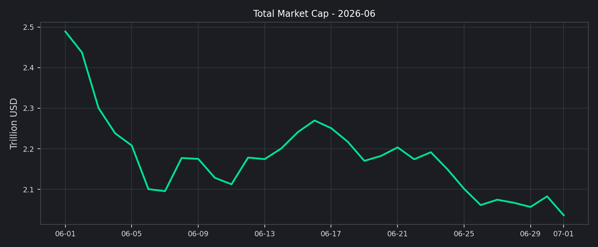
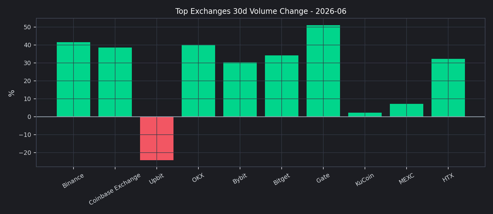
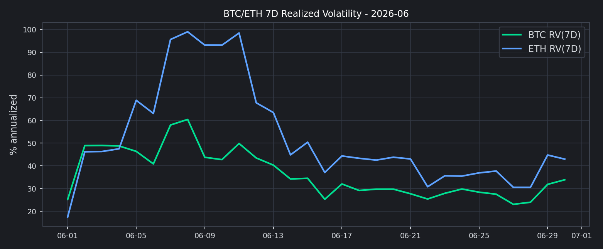

# 202606

## 2026 年 06 月核心市场洞察

- 市值与主导率分析
- 前排交易所成交结构分析
- 市场情绪：恐惧贪婪指数
- 风险与运营建议

本月市场呈现“去杠杆回落、结构分化”的特征，前排交易所整体成交额较前一观察窗口收缩，但头部内部出现分化。

### 2026 年 06 月核心结论
- 总成交额与流动性：前排样本滚动 30 天成交额为 $3.31T，估算环比 +35.18%。
- 全市场总市值：$2.49T -> $2.04T，月内变化 -18.19%。
- 全市场日均 24h 成交额：$83.00B。
- BTC 主导率：+59.23% -> +57.66%。
- 恐惧贪婪指数：15（Extreme Fear）。
- 稳定币资金面：市值 $283.27B，24h 成交量 $83.49B。

值得注意的是，本期市值下行与主导率回落并存，说明市场风险偏好没有简单回归，仍处于结构性再定价阶段。

## 市值与主导率分析
根据 CMC 全市场历史数据，2 月份总市值整体下移；BTC 主导率虽有回落，但仍维持在高位区间。

这意味着交易量仍倾向集中在核心资产交易对，长尾资产流动性修复较慢。

## 前排交易所成交结构分析
我们以 CMC 前排样本进行横向对比，重点观察 `30d 成交额变化` 与 `24h 现货/衍生品结构`。

关键观察：
1. 增幅靠前：Gate (+51.06%), Binance (+41.60%)。
2. 回落靠前：Upbit (-24.22%), KuCoin (+2.30%)。
3. 结构上，衍生品成交占比在样本内依旧偏高，波动放大风险需持续跟踪。

## 资金费率与波动率观察
参考交易所衍生品月报口径，本节给出资金费率快照与波动率代理指标。
- Deribit BTC-PERP funding: +0.00%
- Deribit ETH-PERP funding: +0.00%
- 全市场衍生品 24h 成交量（CMC）：$686.00B

该图使用 BTC/ETH 7 日已实现波动率（年化）作为期权隐波的替代温度计：上行通常对应风险对冲需求抬升。

## 市场情绪：恐惧贪婪指数
恐惧贪婪指数在本月维持低位震荡，零售情绪修复缓慢。

关键时点分析：
1. 若指数持续低于 25，通常意味着风险偏好尚未恢复。
2. 若指数快速回升并突破 50，往往对应短期交易活跃度提升。

## 社媒与搜索热度（Trending）
以 CoinGecko Trending 作为公开可得的搜索热度代理。
| Symbol | Name | MCap Rank | Price (BTC) |
| --- | --- | --- | --- |
| ANSEM | The Black Bull | 413 | 0.00000219 |
| DYDX | dYdX | 178 | 0.00000364 |
| XRP | XRP | 6 | 0.00001774 |
| SYN | Synapse | 250 | 0.00000834 |
| BASED | Based | 674 | 0.00000196 |
| PENGU | Pudgy Penguins | 118 | 0.00000010 |
| ONDO | Ondo | 47 | 0.00000527 |
| BTC | Bitcoin | 1 | 1.00000000 |
| TAO | Bittensor | 41 | 0.00339076 |
| DOGE | Dogecoin | 11 | 0.00000122 |

## 稳定币与资金面观察
- 稳定币市值：$283.27B
- 稳定币 24h 成交量：$83.49B
- DeFi 市值：$64.03B
- DeFi 24h 成交量：$10.03B

## 风险与运营建议
1. 风险监控：将“衍生品占比 + 30d 量能变化 + F&G”纳入统一预警面板。
2. 业务策略：在主流币对维持深度，同时控制长尾币对库存与做市风险。
3. 对外披露：参考 PoR 风格，补充负债口径与地址级储备说明，增强用户信任。

## 附录：前排交易所明细
| Rank | Exchange | 30d Volume | 30d Change | 7d Change | 24h Spot | 24h Deriv |
| --- | --- | --- | --- | --- | --- | --- |
| 1 | Binance | $1.21T | +41.60% | +15.70% | $8.19B | $51.77B |
| 2 | Coinbase Exchange | $23.91B | +38.59% | +35.18% | $1.51B | $0 |
| 3 | Upbit | $38.60B | -24.22% | +28.94% | $828.56M | $0 |
| 6 | OKX | $838.71B | +40.12% | +15.55% | $2.00B | $23.13B |
| 7 | Bybit | $424.63B | +30.24% | +12.98% | $2.08B | $12.57B |
| 8 | Bitget | $234.26B | +34.24% | +9.98% | $738.36M | $8.14B |
| 9 | Gate | $264.56B | +51.06% | +21.06% | $1.68B | $11.88B |
| 10 | KuCoin | $100.28B | +2.30% | +13.55% | $1.18B | $2.00B |
| 17 | MEXC | $118.98B | +7.22% | -14.99% | $1.55B | $10.85B |
| 22 | HTX | $61.09B | +32.26% | -7.20% | $1.28B | $1.51B |

## 数据源
- CMC Exchange Quotes: `https://api.coinmarketcap.com/data-api/v3/exchange/quotes/latest`
- CMC Global Historical: `https://api.coinmarketcap.com/data-api/v3/global-metrics/quotes/historical`
- CMC Global Latest: `https://api.coinmarketcap.com/data-api/v3/global-metrics/quotes/latest`
- CoinGecko Trending: `https://api.coingecko.com/api/v3/search/trending`
- CoinGecko Market Chart: `https://api.coingecko.com/api/v3/coins/{id}/market_chart`
- CoinMetrics (State of the Network #348): `https://coinmetrics.substack.com/p/state-of-the-network-issue-348`
- Deribit Ticker: `https://www.deribit.com/api/v2/public/ticker`
- Alternative.me F&G: `https://api.alternative.me/fng/`
- CMC 快照时间：`2026-07-01T07:12:41.753Z`
- 明细数据：`yuque_style_exchange_data.csv`