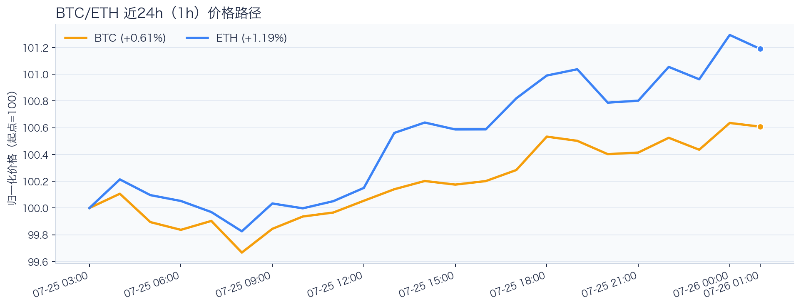
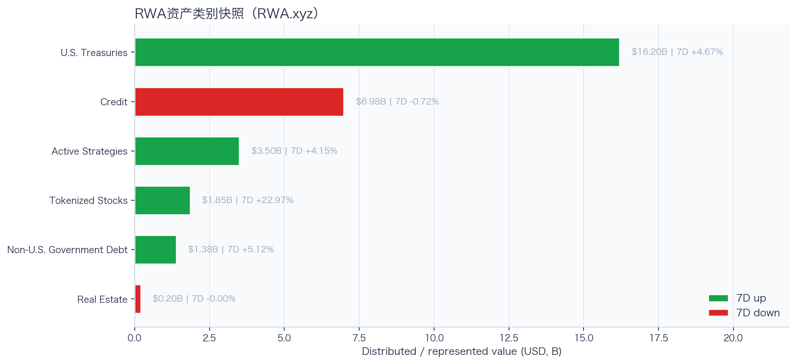
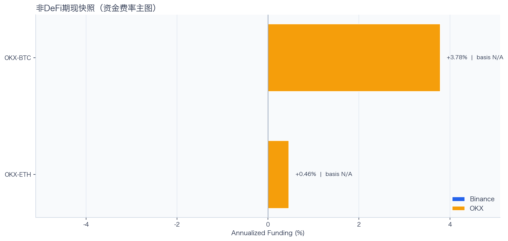
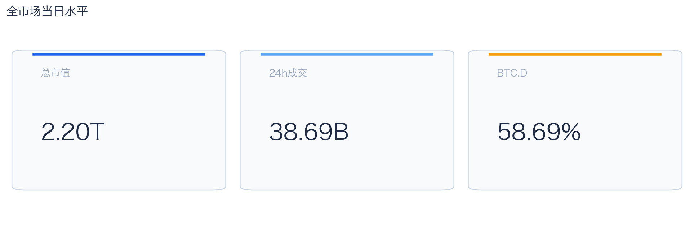
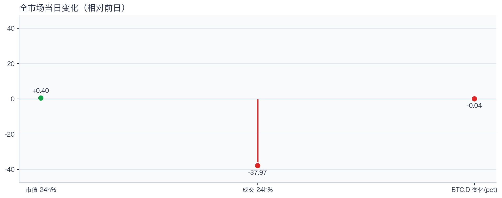
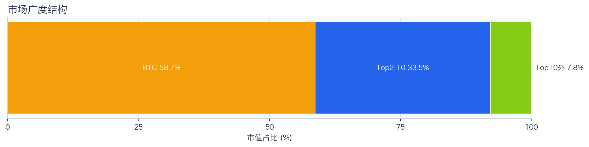
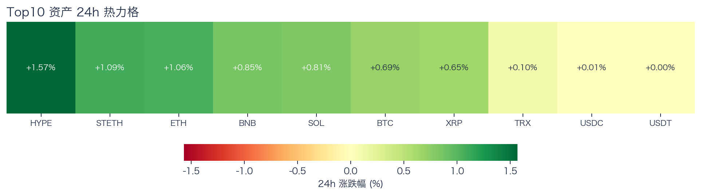
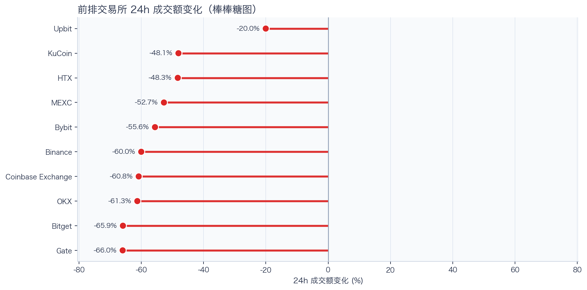
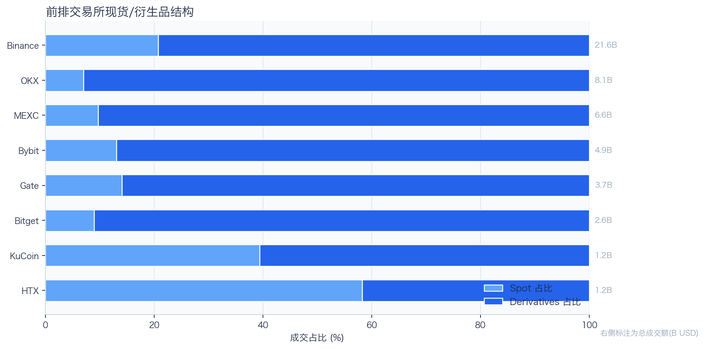
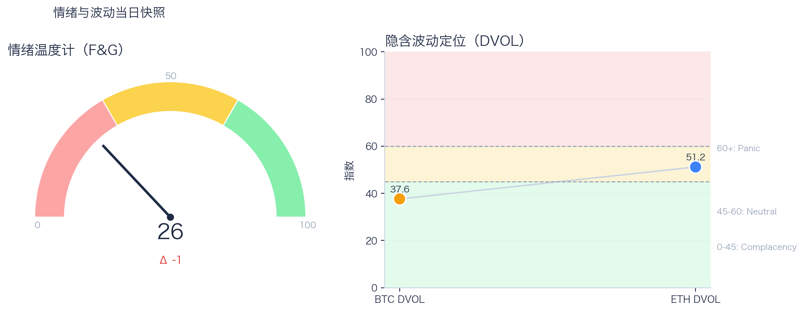

# 二级市场日报（2026-07-26）

## 今日亮点
- 前排交易所样本成交普遍收缩：上涨 0 家、下跌 10 家，24h 变化均值 -53.88%。
- Tokenized Stocks 类别规模 $1.85B，7D +22.97%（截至 2026-07-25）。
- RWA 映射异动居前：HOOD -6.73%、RIOT -6.17%、MARA -4.55%；底层市场休市时仅作为链上价格变化观察，不作溢折价结论。

## 数据时点与口径
- 采集完成时间：2026-07-26T09:28:33.811366+08:00（Asia/Shanghai）；全市场指标：当日；F&G：截至 2026-07-26；RWA 类别：截至 2026-07-25。
- Top10 来源：coinpaprika；BTC/ETH rolling 24h：Binance.US fallback；永续与 DVOL：Deribit public/ticker / Deribit public/get_volatility_index_data。
- fallback 只替换等价指标并保留真实来源和截止时间；来源失败详情仅记录在 manifest 后台字段。
- 覆盖限制：OKX 聪明钱聚合与新闻情绪模块暂不可用，本期不作相关归因；具体错误仅保留在后台。

## 关键结论
- 全市场指标当日：市值 $2.20T（24h +0.40%），成交额 $38.69B（24h -37.97%）。
- BTC 主导率 58.69%（-0.04pct），Top10 外占比 7.82%。
- Top10 资产上涨 9 / 下跌 0 / 平盘 1，平均涨跌幅 +0.68%，首尾分化 1.57pct。
- 衍生品：BTC/ETH 资金费率分别为 +0.28bps / +0.01bps，DVOL 收盘 37.62 / 51.16。

## 今日盘面判断
今日市场状态为“缩量修复”。市值上升但成交下降，价格修复尚未得到交易活跃度确认。广度仍偏窄，增量风险偏好尚未形成持续外溢。当前证据尚不足以确认新一轮趋势启动。

## 核心驱动因素
从交易所成交看，多数平台成交走弱，样本只支持成交收缩及降幅分化，不支持资金回流判断；从杠杆维度看，杠杆拥挤度整体可控；从期权定价看，隐含波动率处于相对低位，期权保护成本当前不高；情绪方面，情绪与价格修复节奏尚未完全同步。以上是并列观察，不把同步变化直接解释为事件因果。

## BTC/ETH 24h 趋势判断

口径：文字涨跌来自交易所 rolling 24h ticker；图内路径为当前可得 23 个小时点，首尾变化 BTC +0.61%、ETH +1.19%，两者窗口不可混用。
- BTC：$64,473.36（24h +0.68%，区间 $63,813.18 - $64,535.93，当前位于区间 91%）=> 区间震荡。
- ETH：$1,879.18（24h +0.98%，区间 $1,851.93 - $1,881.18，当前位于区间 93%）=> 区间震荡。
- 简评：BTC 与 ETH 均温和上涨，ETH 相对更强，但幅度尚未达到强趋势阈值。

## 稳定币收益情况（链上协议）
按安全优先（协议成熟度、链层风险、是否依赖激励）筛选了 10 个主流池；原生供给利率均值约 +2.92%。
其中包含奖励补贴的池有 3 个，补贴收益已单列，不与原生利率混合。

核心观察
- 利率结构：Total APY 位于 2.03% 至 7.07% 区间。
- 资金集中：TVL 主要集中在 Spark-USDT（Ethereum，TVL $410.40M）、Aave-USDT（Ethereum，TVL $80.66M）。
- 收益领先：当前收益靠前样本包括 Aave-USDT（Ethereum，Total 7.07%）、Aave-USDC（Ethereum，Total 6.71%）。

风险提示
- 利用率达到 70% 以上的池有 7 个，杠杆需求主要集中在头部池。
- 利用率最高样本：Compound-USDS（Ethereum） 90.80%，Borrow APY 6.88%。
- 奖励收益池数量：3 个。当前收益主体仍以原生利率为主。

数据覆盖：Aave API(8)，Compound API(6)，DefiLlama(21)。

稳定币收益对照表（安全优先）
| 协议 | 链 | 币种 | Supply | Borrow | Rewards | Total | Utilization | TVL | 数据源 |
|---|---|---|---:|---:|---:|---:|---:|---:|---|
| Aave | Ethereum | DAI | 3.37% | 5.03% | N/A | 3.37% | 90.24% | $10.92M | DefiLlama+Aave API |
| Spark | Ethereum | USDT | 2.75% | N/A | N/A | 2.75% | N/A | $410.40M | DefiLlama |
| Compound | Ethereum | USDS | 5.80% | 6.88% | 0.00% | 5.80% | 90.80% | $1.82M | Compound API |
| Aave | Ethereum | PYUSD | 2.86% | 4.36% | N/A | 2.86% | 73.45% | $2.89M | DefiLlama+Aave API |
| Aave | Ethereum | USDT | 2.82% | 3.73% | 4.25% | 7.07% | 84.29% | $80.66M | DefiLlama+Aave API |
| Aave | Ethereum | USDC | 3.18% | 3.97% | 3.53% | 6.71% | 89.49% | $65.81M | DefiLlama+Aave API |
| Aave | Ethereum | USDS | 0.14% | 5.68% | 3.36% | 3.50% | 3.40% | $11.88M | DefiLlama+Aave API |
| Aave | Arbitrum | USDC | 2.66% | 3.67% | N/A | 2.66% | 81.01% | $32.32M | DefiLlama+Aave API |
| Aave | Base | USDC | 3.58% | 4.52% | N/A | 3.58% | 88.37% | $20.05M | DefiLlama+Aave API |
| Aave | Arbitrum | DAI | 2.03% | 3.93% | N/A | 2.03% | 69.40% | $1.09M | DefiLlama+Aave API |

稳定币收益对比（扩展样本共 22 条，展示 Top10）
| 币种 | 协议 | 链 | Supply | Borrow | Rewards | Total | Utilization | TVL | 数据源 |
|---|---|---|---:|---:|---:|---:|---:|---:|---|
| USDC | Aave | Ethereum | 3.18% | 3.97% | 3.53% | 6.71% | 89.49% | $65.81M | DefiLlama+Aave API |
| USDC | Aave | Arbitrum | 2.66% | 3.67% | N/A | 2.66% | 81.01% | $32.32M | DefiLlama+Aave API |
| USDC | Aave | Base | 3.58% | 4.52% | N/A | 3.58% | 88.37% | $20.05M | DefiLlama+Aave API |
| USDC | Spark | Ethereum | 3.60% | N/A | N/A | 3.60% | N/A | $273.30M | DefiLlama |
| USDC | Compound | Ethereum | 3.11% | 3.90% | 0.10% | 3.21% | 86.30% | $345.76M | DefiLlama+Compound API |
| USDC | Compound | Arbitrum | 2.67% | 3.56% | 0.00% | 2.67% | 74.15% | $15.60M | DefiLlama+Compound API |
| USDC | Compound | Base | 6.32% | 7.46% | 0.00% | 6.32% | 90.96% | $8.36M | DefiLlama+Compound API |
| USDT | Aave | Ethereum | 2.82% | 3.73% | 4.25% | 7.07% | 84.29% | $80.66M | DefiLlama+Aave API |
| USDT | Spark | Ethereum | 2.75% | N/A | N/A | 2.75% | N/A | $410.40M | DefiLlama |
| USDT | Compound | Ethereum | 2.99% | 3.81% | 0.11% | 3.10% | 83.05% | $178.66M | DefiLlama+Compound API |

跨源补充（比 taoli 更全）
- 新增对比源：DefiLlama 全量稳定币池（筛选口径）+ Bitcompare 平台 APY（CeFi/DeFi/Hybrid），并与现有链上主流池快照交叉核对。
- 覆盖规模：原链上精表 22 条；DefiLlama 扩展样本 94 条（展示 Top10）；Bitcompare 稳定币利率样本 10 条。
- 覆盖维度：扩展样本覆盖 48 个协议、14 条链、61 类稳定币。
- 口径说明：Bitcompare 混合 CeFi、DeFi 与 Hybrid 平台展示 APY；taoli 为 Binance 借币年化。两者用于横向参考，不等价于无风险套利收益。

稳定币收益补充表（DefiLlama 扩展，TVL≥$30M，展示 Top10）
| 币种 | 协议 | 链 | Base | Rewards | Total | TVL | 数据源 |
|---|---|---|---:|---:|---:|---:|---|
| SUSDS | sky-lending | Ethereum | 3.52% | N/A | 3.52% | $4.69B | DefiLlama API |
| USYC | circle-usyc | BSC | 3.05% | N/A | 3.05% | $2.91B | DefiLlama API |
| USDC | maple | Ethereum | 4.86% | 0.00% | 4.86% | $2.55B | DefiLlama API |
| SUSDE | ethena-usde | Ethereum | 4.13% | N/A | 4.13% | $1.54B | DefiLlama API |
| USDY | ondo-yield-assets | Ethereum | 3.55% | N/A | 3.55% | $1.11B | DefiLlama API |
| BUIDL | blackrock-buidl | Ethereum | 3.57% | N/A | 3.57% | $963.10M | DefiLlama API |
| USDS | centrifuge-protocol | Ethereum | 2.80% | N/A | 2.80% | $870.12M | DefiLlama API |
| USDT | maple | Ethereum | 4.37% | 0.00% | 4.37% | $869.84M | DefiLlama API |
| BUIDL | blackrock-buidl | Aptos | 3.23% | N/A | 3.23% | $821.88M | DefiLlama API |
| USTB | invesco-ustb | Ethereum | 3.32% | N/A | 3.32% | $717.74M | DefiLlama API |

稳定币平台聚合报价与借币成本（不可直接计算套利利差）
| 币种 | Bitcompare 平台最高APY | 对应平台 | taoli(Binance借币年化) | 可执行性 |
|---|---:|---|---:|---|
| DAI | 10.50% | Nexo | N/A | 未验证期限、额度、锁仓、奖励构成与地区准入 |
| PYUSD | 6.24% | Kamino | N/A | 未验证期限、额度、锁仓、奖励构成与地区准入 |
| SUSDS | 5.35% | Pendle | N/A | 未验证期限、额度、锁仓、奖励构成与地区准入 |
| TUSD | 11.00% | YouHodler | N/A | 未验证期限、额度、锁仓、奖励构成与地区准入 |
| USD0 | 0.91% | Euler Finance | N/A | 未验证期限、额度、锁仓、奖励构成与地区准入 |
| USDC | 29.50% | Lune.fi | 4.45% | 高收益聚合报价；未验证期限、容量、奖励构成与地区准入 |
| USDD | 0.00% | JustLend | N/A | 未验证期限、额度、锁仓、奖励构成与地区准入 |
| USDE | 6.41% | Pendle | N/A | 未验证期限、额度、锁仓、奖励构成与地区准入 |
| USDS | 5.80% | Compound V3 | N/A | 未验证期限、额度、锁仓、奖励构成与地区准入 |
| USDT | 29.50% | Lune.fi | 3.83% | 高收益聚合报价；未验证期限、容量、奖励构成与地区准入 |
说明：平台 APY 与保证金借币成本的产品期限、风险、准入和容量不同，不计算或宣称可执行套利利差。

交易含义：当前稳定币收益更偏“头部池中等收益 + 局部高利用率”结构，策略上优先流动性与透明度，再考虑收益增强。
部分池的 Borrow 与 Utilization 暂未返回，表内仅展示已获取字段。

## RWA 结构观察
### 今日 tokenized stocks 异动雷达
筛选口径：核心美股/ETF 映射观察池按链上代币 24h 绝对涨跌选出前 5，再结合 1h K 线、技术指标、链上买卖流、持仓集中度和底层美股交易状态解释。
| 标的 | 24h | RSI14 | SMA6/24 | 链上净买入 | 映射溢折价 | 状态/事件 |
|---|---:|---:|---|---:|---:|---|
| HOOD | -6.73% | 17.6 | 空头 | $0 | 不可计算（参考价冻结） | Weekend or Holiday |
| RIOT | -6.17% | 26.4 | 空头 | $0 | 不可计算（参考价冻结） | Weekend or Holiday |
| MARA | -4.55% | 27.4 | 空头 | $0 | 不可计算（参考价冻结） | Weekend or Holiday |
| COIN | -2.71% | 29.6 | 空头 | $0 | 不可计算（参考价冻结） | Weekend or Holiday |
| MSTR | -2.64% | 28.9 | 空头 | $0 | 不可计算（参考价冻结） | Weekend or Holiday |

- **HOOD**：24h -6.73%，RSI14 17.6，短周期均线未站上长周期均线；未观测到可用买卖流；未观测到聪明钱持有地址或活跃信号。映射溢折价 不可计算（参考价冻结）。资产状态显示 `Weekend or Holiday`，这是可验证的事件线索。
- **RIOT**：24h -6.17%，RSI14 26.4，短周期均线未站上长周期均线；未观测到可用买卖流；聪明钱持有地址与活跃信号不可用。映射溢折价 不可计算（参考价冻结）。资产状态显示 `Weekend or Holiday`，这是可验证的事件线索。
- **MARA**：24h -4.55%，RSI14 27.4，短周期均线未站上长周期均线；未观测到可用买卖流；聪明钱持有地址与活跃信号不可用。映射溢折价 不可计算（参考价冻结）。资产状态显示 `Weekend or Holiday`，这是可验证的事件线索。

24×7 交易含义：美股休市期间，tokenized stock 的变化更像对新闻、指数期货和加密风险偏好的提前定价；但底层现货缺少连续套利锚、链上流动性通常更薄，溢折价可能放大。美股开盘后若底层价格不确认，夜间涨跌可能快速回归。
归因纪律：公司行动/财报限制、K 线和链上流向属于事实；只有事件时间、价格方向和资金方向一致时才写成高置信归因，其余仅标记为相关性或待验证假设。

### RWA 资产类别背景

RWA.xyz 公开页快照显示，样本资产类别合计约 $30.12B；最大类别为 U.S. Treasuries（$16.20B，7D +4.67%）。7D 上升类别 4 个、下降类别 2 个，说明 RWA 当前更适合当作结构变量，而不是日内方向信号。
其中股票、主动策略和非美债这类交易属性更强的类别合计约 $6.73B，占样本 22.36%。这部分更接近 CEX 新品类、Perps 和跨资产成交额的观察入口。

RWA 资产类别对照表
| 类别 | 规模 | 7D变化 | as of |
|---|---:|---:|---|
| U.S. Treasuries | $16.20B | +4.67% | 2026-07-25 |
| Credit | $6.98B | -0.72% | 2026-07-25 |
| Active Strategies | $3.50B | +4.15% | 2026-07-25 |
| Tokenized Stocks | $1.85B | +22.97% | 2026-07-25 |
| Non-U.S. Government Debt | $1.38B | +5.12% | 2026-07-25 |
| Real Estate | $202.63M | -0.00% | 2026-07-25 |

交易含义：RWA 放在日报里可以，但应定位为二级市场的产品线与风险偏好背景；只有 tokenized stocks、RWA perps、可交易收益资产扩容时，才更直接影响交易所成交结构。
数据源：RWA.xyz 公开资产类别页；正式 API 可在设置 RWA_API_KEY 后替换为更稳定口径。

## 非 DeFi（交易所期现）

本期可用样本仅覆盖 OKX 的 BTC/ETH 现货与永续。Funding 可用，但 basis 缺少有效记录，不作基差策略判断。
- Funding 最高样本：OKX-BTC，年化约 3.78%。
- Funding 最低样本：OKX-ETH，年化约 0.46%。

借币成本多源对比表
| 资产 | Binance(日/年) | OKX(日/年) | Bybit(日/年) | Backpack(日/年) | KuCoin(日/年) | 最低日利率 |
|---|---:|---:|---:|---:|---:|---:|
| USDT | 0.01%/3.83% · 500k | 0.01%/2.51% · 5.0M | N/A | 0.01%/4.54% · 50.0M | N/A | OKX 0.01% |
| USDC | 0.01%/4.45% · 500k | 0.01%/2.51% · 1.0M | N/A | 0.01%/2.19% · 300.0M | N/A | Backpack 0.01% |
| BTC | 0.00%/0.38% · 100 | 0.00%/0.51% · 175 | N/A | 0.00%/0.45% · 3k | N/A | Binance 0.00% |
| ETH | 0.01%/2.23% · 2k | 0.00%/1.51% · 7k | N/A | 0.00%/0.56% · 20k | N/A | Backpack 0.00% |
说明：统一按日利率/年化展示，单元格尾部为可借额度。
- 交易含义：当前只能观察 funding，缺少 basis 时不评估 carry 利差或套利空间。
该部分与链上收益分开统计，便于比较两类策略的收益与风险结构。

## 市场脉冲

当日，全市场市值 $2.20T，24h 成交额 $38.69B，BTC 主导率 58.69%。
价格上涨但成交回落，反弹质量偏弱，需警惕高位回吐。

相对前一观测日，市值 +0.40%、成交 -37.97%、BTC.D -0.04pct。
该段仅描述同步变化；没有事件时间与资金路径证据时，不将量价共振写成事件因果。

## 主导率与市场广度

当前结构为 BTC 58.69% / Top2-10 33.49% / Top10 外 7.82%。长尾占比仍偏低，广度修复还未形成持续趋势。
Top10 外占比处于低位，风险偏好仍主要停留在 BTC 与头部资产。

## 资产表现与交易所成交

Top10 中领涨 HYPE（+1.57%），尾部 USDT（+0.00%），均值 +0.68%。分化 1.57pct，结构性交易仍是主导。
上涨家数明显占优，但首尾分化仍大，表明反弹并非无差别普涨。对交易而言，这通常意味着“选币”比“全市场方向”更重要，错配带来的收益差会明显放大。

前排样本上涨 0 家、下跌 10 家，均值 -53.88%。Upbit 最强（-20.04%），Gate 最弱（-65.99%）。
样本平台成交普遍收缩，最小与最大降幅相差 45.95pct；这只说明收缩幅度不同，不构成流动性回流或价格发现能力增强的证据。报价连续性和滑点是否同步变化仍需盘口数据验证，执行层面应继续监控成交质量。

样本内衍生品成交占比 82.16%。该比例描述成交结构，不单独用于判断后续波动方向或幅度。
衍生品仍是主导成交形态，但该占比不能单独证明价格由杠杆情绪驱动。后续需用盘口深度、强平和事件窗口数据验证具体传导机制。

## 衍生品与情绪
资金费率（Funding）仍在中性附近，BTC/ETH 分别 +0.28bps / +0.01bps；未平仓合约（OI）为 $741.27M / $277.39M；隐含波动率指数（DVOL）位于 Complacency（低波动定价） / Neutral（中性波动定价）。
Funding 与 DVOL 的组合显示，方向拥挤暂未极端，但尾部风险定价仍未完全回落。因此更合适的做法不是激进追单边，而是围绕波动管理仓位和节奏。

恐惧与贪婪指数（F&G）当日 26（较前一观测日 -1）；BTC/ETH DVOL 为 37.62/51.16，对应 Complacency（低波动定价） / Neutral（中性波动定价）。
情绪仍在恐惧区但已脱离极端恐惧，是否修复仍需成交和广度确认。只有当情绪、广度和成交三者同时改善，市场才更可能从“反弹交易”切换到“趋势交易”。

## 未来24小时观察
1. 若 Top10 外占比继续抬升且 BTC.D 回落，可视为风险偏好扩散的待验证信号。
2. 若衍生品占比继续上升而 funding 仍中性，只能确认交易向杠杆侧集中；是否放大波动仍需结合 DVOL 与成交验证。
3. 若 F&G 反弹但 DVOL 不降，代表情绪与风险定价背离，追涨胜率会明显下降。

## 交易与风控含义
- 仓位管理优先级高于方向押注，建议保持核心仓位稳定、战术仓位滚动。
- 若交易所衍生品占比继续上升，建议同步收紧杠杆和止损参数。
- 关注情绪改善与广度扩散是否同步发生，二者背离时避免追逐单边。

