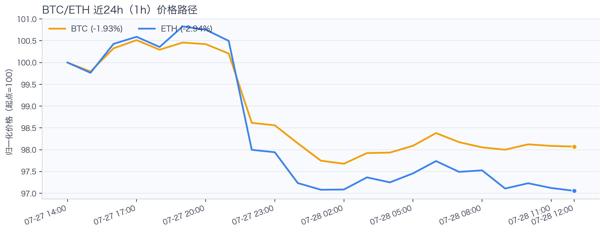
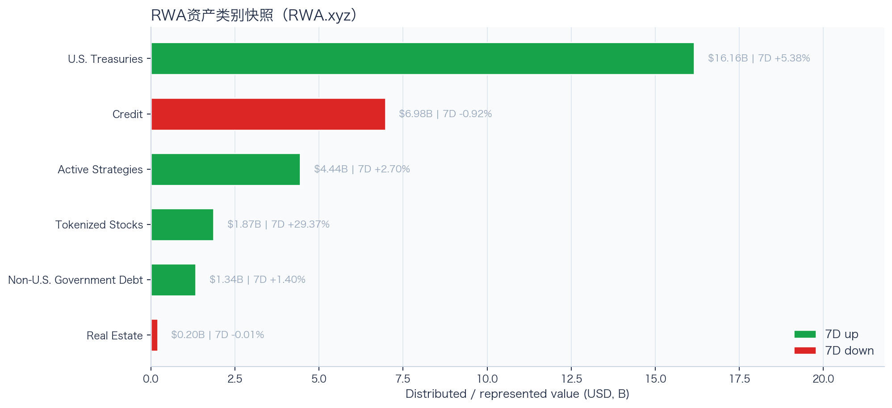
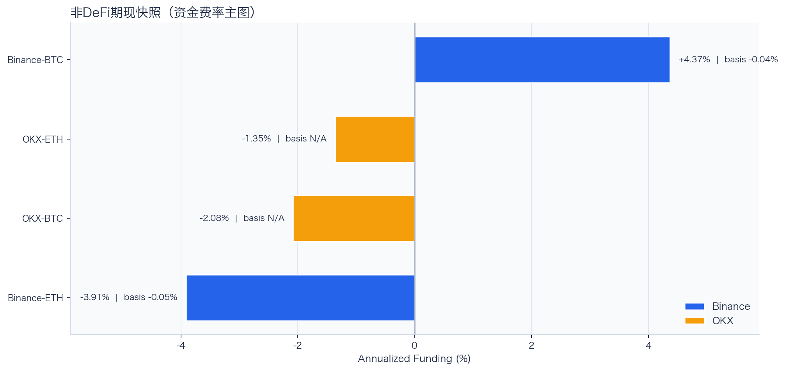
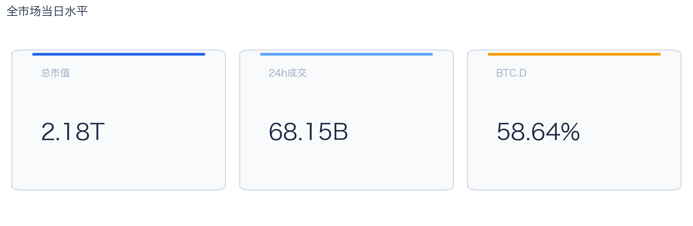
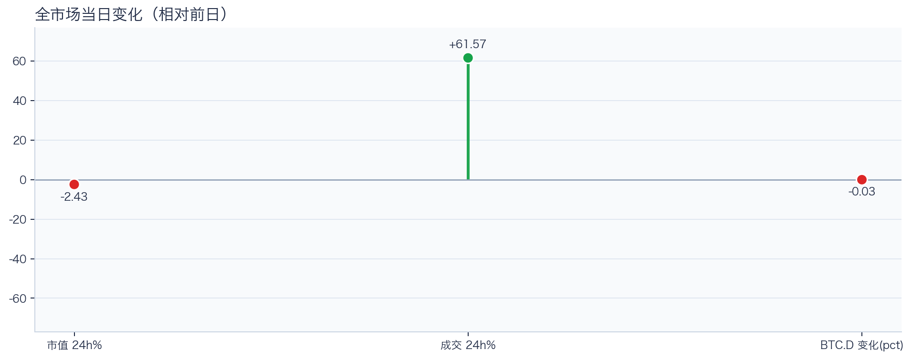
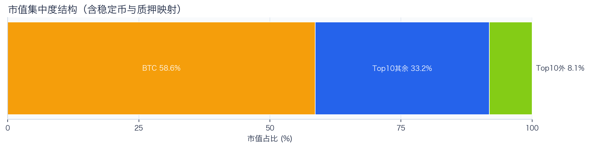
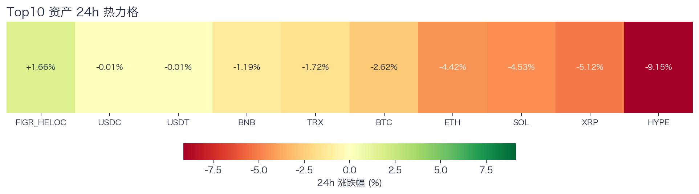
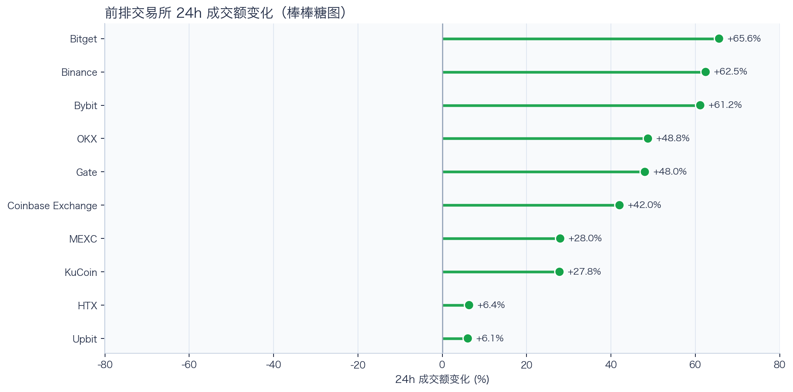
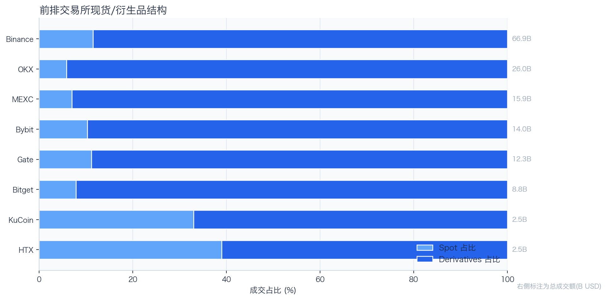
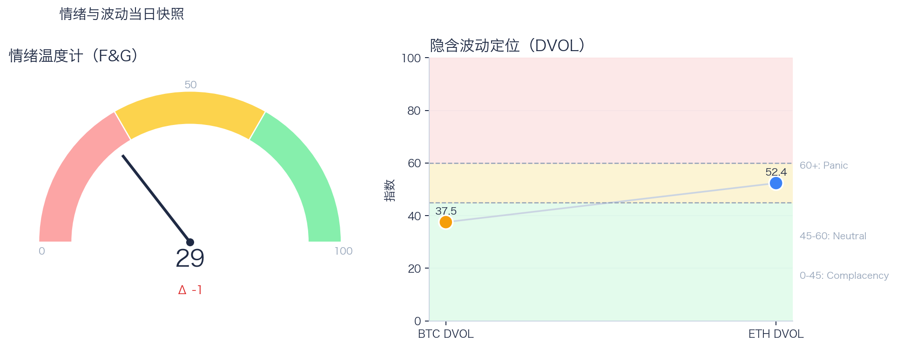

# 二级市场日报（2026-07-28）

## 今日亮点
- 前排交易所样本成交普遍收缩：上涨 10 家、下跌 0 家，24h 变化均值 +39.63%。
- Tokenized Stocks 类别规模 $1.87B，7D +29.37%（截至 2026-07-27）。
- RWA 映射异动居前：AMD -11.31%、RIOT -10.52%、MARA -7.95%；底层市场休市时仅作为链上价格变化观察，不作溢折价结论。

## 数据时点与口径
- 采集完成时间：2026-07-28T20:06:47.296733+08:00（Asia/Shanghai）；全市场指标：当日；F&G：截至 2026-07-28；RWA 类别：截至 2026-07-27。
- Top10 来源：demo；BTC/ETH rolling 24h：Binance global；永续与 DVOL：Deribit public/ticker / Deribit public/get_volatility_index_data。
- fallback 只替换等价指标并保留真实来源和截止时间；来源失败详情仅记录在 manifest 后台字段。

## 关键结论
- 全市场指标当日：市值 $2.18T（24h -2.43%），成交额 $68.15B（24h +61.57%）。
- BTC 主导率 58.64%（-0.03pct），Top10 外市值占比（集中度口径）8.13%。
- 头部风险资产（排除稳定币、质押及信用映射）上涨 0 / 下跌 7 / 平盘 0，平均涨跌幅 -4.11%，首尾分化 7.96pct。
- 衍生品：BTC/ETH 资金费率分别为 +0.00bps / +0.02bps，DVOL 收盘 37.52 / 52.36。

## 今日盘面判断
今日市场状态为“压力重定价”。价格回撤但换手抬升，说明市场在高分歧下重估风险，波动脉冲概率偏高。头部风险资产下跌覆盖率较高，风险参与度偏弱。当前证据尚不足以确认新一轮趋势启动。

## 核心驱动因素
交易所成交方面，多数平台成交回暖，短线流动性环境较前一日改善；杠杆方面，杠杆拥挤度整体可控；期权定价方面，隐含波动率处于相对低位，期权保护成本当前不高；情绪方面，情绪与价格修复节奏尚未完全同步。几项指标共同用于确认市场状态，但暂不足以归因于特定事件。

## BTC/ETH 24h 趋势判断

口径：文字涨跌来自交易所 rolling 24h ticker；图内路径为当前可得 23 个小时点，首尾变化 BTC -1.93%、ETH -2.94%，两者窗口不可混用。
- BTC（交易所 rolling 24h）：$63,434.00（-2.67%，区间 $63,059.39 - $65,718.00，当前位于区间 14%）=> 偏弱，下行主导。
- ETH（交易所 rolling 24h）：$1,875.27（-4.48%，区间 $1,866.31 - $1,977.99，当前位于区间 8%）=> 偏弱，下行主导。
- 简评：BTC 偏弱震荡下行，ETH 相对更弱。

## 稳定币收益情况（链上协议）
按安全优先（协议成熟度、链层风险、是否依赖激励）筛选了 10 个主流池；原生供给利率均值约 +2.73%。
其中包含奖励补贴的池有 3 个，补贴收益已单列，不与原生利率混合。

核心观察
- 利率结构：Total APY 位于 2.02% 至 4.70% 区间。
- 资金集中：TVL 主要集中在 Spark-USDT（Ethereum，TVL $406.83M）、Aave-USDT（Ethereum，TVL $79.93M）。
- 收益领先：当前收益靠前样本包括 Aave-USDC（Ethereum，Total 4.70%）、Compound-USDS（Ethereum，Total 4.12%）。

风险提示
- 利用率达到 70% 以上的池有 7 个，杠杆需求主要集中在头部池。
- 利用率最高样本：Compound-USDS（Ethereum） 90.27%，Borrow APY 4.99%。
- 奖励收益池数量：3 个。当前收益主体仍以原生利率为主。

数据覆盖：Aave API(8)，Compound API(6)，DefiLlama(21)。

稳定币收益对照表（安全优先）
| 协议 | 链 | 币种 | Supply | Borrow | Rewards | Total | Utilization | TVL | 数据源 |
|---|---|---|---:|---:|---:|---:|---:|---:|---|
| Aave | Ethereum | DAI | 3.36% | 5.02% | N/A | 3.36% | 90.11% | $11.08M | DefiLlama+Aave API |
| Spark | Ethereum | USDT | 2.75% | N/A | N/A | 2.75% | N/A | $406.83M | DefiLlama |
| Compound | Ethereum | USDS | 4.12% | 4.99% | 0.00% | 4.12% | 90.27% | $1.83M | Compound API |
| Aave | Ethereum | PYUSD | 3.02% | 4.47% | N/A | 3.02% | 75.79% | $2.54M | DefiLlama+Aave API |
| Aave | Ethereum | USDT | 2.69% | 3.64% | 1.27% | 3.96% | 82.31% | $79.93M | DefiLlama+Aave API |
| Aave | Ethereum | USDC | 3.20% | 3.98% | 1.50% | 4.70% | 89.69% | $65.03M | DefiLlama+Aave API |
| Aave | Ethereum | USDS | 0.13% | 5.68% | 3.38% | 3.50% | 3.06% | $11.85M | DefiLlama+Aave API |
| Aave | Arbitrum | USDC | 2.60% | 3.62% | N/A | 2.60% | 80.06% | $34.38M | DefiLlama+Aave API |
| Aave | Base | USDC | 3.46% | 4.44% | N/A | 3.46% | 86.97% | $22.79M | DefiLlama+Aave API |
| Aave | Arbitrum | DAI | 2.02% | 3.93% | N/A | 2.02% | 69.32% | $1.09M | DefiLlama+Aave API |

稳定币收益对比（扩展样本共 22 条，展示 Top10）
| 币种 | 协议 | 链 | Supply | Borrow | Rewards | Total | Utilization | TVL | 数据源 |
|---|---|---|---:|---:|---:|---:|---:|---:|---|
| USDC | Aave | Ethereum | 3.20% | 3.98% | 1.50% | 4.70% | 89.69% | $65.03M | DefiLlama+Aave API |
| USDC | Aave | Arbitrum | 2.60% | 3.62% | N/A | 2.60% | 80.06% | $34.38M | DefiLlama+Aave API |
| USDC | Aave | Base | 3.46% | 4.44% | N/A | 3.46% | 86.97% | $22.79M | DefiLlama+Aave API |
| USDC | Spark | Ethereum | 3.52% | N/A | N/A | 3.52% | N/A | $272.54M | DefiLlama |
| USDC | Compound | Ethereum | 3.14% | 3.92% | 0.10% | 3.23% | 87.09% | $344.94M | DefiLlama+Compound API |
| USDC | Compound | Arbitrum | 2.70% | 3.58% | 0.00% | 2.70% | 75.04% | $15.44M | DefiLlama+Compound API |
| USDC | Compound | Base | 3.23% | 3.99% | 0.00% | 3.23% | 89.75% | $8.46M | DefiLlama+Compound API |
| USDT | Aave | Ethereum | 2.69% | 3.64% | 1.27% | 3.96% | 82.31% | $79.93M | DefiLlama+Aave API |
| USDT | Spark | Ethereum | 2.75% | N/A | N/A | 2.75% | N/A | $406.83M | DefiLlama |
| USDT | Compound | Ethereum | 3.11% | 3.90% | 0.10% | 3.21% | 86.32% | $172.01M | DefiLlama+Compound API |

跨源补充（比 taoli 更全）
- 新增对比源：DefiLlama 全量稳定币池（筛选口径）+ Bitcompare 平台 APY（CeFi/DeFi/Hybrid），并与现有链上主流池快照交叉核对。
- 覆盖规模：原链上精表 22 条；DefiLlama 扩展样本 94 条（展示 Top10）；Bitcompare 稳定币利率样本 10 条。
- 覆盖维度：扩展样本覆盖 48 个协议、14 条链、61 类稳定币。
- 口径说明：Bitcompare 混合 CeFi、DeFi 与 Hybrid 平台展示 APY；taoli 为 Binance 借币年化。两者用于横向参考，不等价于无风险套利收益。

稳定币收益补充表（DefiLlama 扩展，TVL≥$30M，展示 Top10）
| 币种 | 协议 | 链 | Base | Rewards | Total | TVL | 数据源 |
|---|---|---|---:|---:|---:|---:|---|
| SUSDS | sky-lending | Ethereum | 3.52% | N/A | 3.52% | $4.61B | DefiLlama API |
| USYC | circle-usyc | BSC | 3.26% | N/A | 3.26% | $2.91B | DefiLlama API |
| USDC | maple | Ethereum | 5.03% | 0.00% | 5.03% | $2.51B | DefiLlama API |
| SUSDE | ethena-usde | Ethereum | 4.13% | N/A | 4.13% | $1.54B | DefiLlama API |
| USDY | ondo-yield-assets | Ethereum | 3.55% | N/A | 3.55% | $1.11B | DefiLlama API |
| BUIDL | blackrock-buidl | Ethereum | 3.57% | N/A | 3.57% | $963.38M | DefiLlama API |
| USDT | maple | Ethereum | 4.37% | 0.00% | 4.37% | $889.42M | DefiLlama API |
| USDS | centrifuge-protocol | Ethereum | 3.33% | N/A | 3.33% | $870.39M | DefiLlama API |
| BUIDL | blackrock-buidl | Aptos | 3.23% | N/A | 3.23% | $821.89M | DefiLlama API |
| USTB | invesco-ustb | Ethereum | 3.34% | N/A | 3.34% | $723.88M | DefiLlama API |

稳定币平台聚合报价与借币成本（不可直接计算套利利差）
| 币种 | Bitcompare 平台最高APY | 对应平台 | taoli(Binance借币年化) | 可执行性 |
|---|---:|---|---:|---|
| DAI | 10.50% | Nexo | N/A | 未验证期限、额度、锁仓、奖励构成与地区准入 |
| PYUSD | 3.99% | Kamino | N/A | 未验证期限、额度、锁仓、奖励构成与地区准入 |
| SUSDS | 5.35% | Pendle | N/A | 未验证期限、额度、锁仓、奖励构成与地区准入 |
| TUSD | 11.00% | YouHodler | N/A | 未验证期限、额度、锁仓、奖励构成与地区准入 |
| USD0 | 0.02% | Morpho | N/A | 未验证期限、额度、锁仓、奖励构成与地区准入 |
| USDC | 29.50% | Lune.fi | 4.29% | 高收益聚合报价；未验证期限、容量、奖励构成与地区准入 |
| USDD | 0.00% | JustLend | N/A | 未验证期限、额度、锁仓、奖励构成与地区准入 |
| USDE | 7.87% | Pendle | N/A | 未验证期限、额度、锁仓、奖励构成与地区准入 |
| USDS | 4.40% | Kamino | N/A | 未验证期限、额度、锁仓、奖励构成与地区准入 |
| USDT | 29.50% | Lune.fi | 3.74% | 高收益聚合报价；未验证期限、容量、奖励构成与地区准入 |
说明：平台 APY 与保证金借币成本的产品期限、风险、准入和容量不同，不计算或宣称可执行套利利差。

交易含义：当前稳定币收益更偏“头部池中等收益 + 局部高利用率”结构，策略上优先流动性与透明度，再考虑收益增强。
部分池的 Borrow 与 Utilization 暂未返回，表内仅展示已获取字段。

## RWA 结构观察
### 今日 tokenized stocks 异动雷达
筛选口径：核心美股/ETF 映射观察池按链上代币 24h 绝对涨跌选出前 5，再结合 1h K 线、技术指标、链上买卖流、持仓集中度和底层美股交易状态解释。
| 标的 | 24h | RSI14 | SMA6/24 | 链上净买入 | 映射溢折价 | 状态/事件 |
|---|---:|---:|---|---:|---:|---|
| AMD | -11.31% | 20.6 | 空头 | N/A | 不可计算（参考价冻结） | TRADING |
| RIOT | -10.52% | 11.1 | 空头 | N/A | 不可计算（参考价冻结） | TRADING |
| MARA | -7.95% | 21.8 | 空头 | N/A | 不可计算（参考价冻结） | TRADING |
| NVDA | -6.16% | 45.1 | 空头 | N/A | 不可计算（参考价冻结） | TRADING |
| HOOD | -3.82% | 30.7 | 空头 | N/A | 不可计算（参考价冻结） | TRADING |

- **AMD**：24h -11.31%，RSI14 20.6，短周期均线未站上长周期均线；链上买卖流不可用；未观测到聪明钱持有地址或活跃信号。映射溢折价 不可计算（参考价冻结）。资产状态显示 `TRADING`，这是可验证的事件线索。
- **RIOT**：24h -10.52%，RSI14 11.1，短周期均线未站上长周期均线；链上买卖流不可用；聪明钱持有地址与活跃信号不可用。映射溢折价 不可计算（参考价冻结）。资产状态显示 `TRADING`，这是可验证的事件线索。
- **MARA**：24h -7.95%，RSI14 21.8，短周期均线未站上长周期均线；链上买卖流不可用；聪明钱持有地址与活跃信号不可用。映射溢折价 不可计算（参考价冻结）。资产状态显示 `TRADING`，这是可验证的事件线索。

24×7 交易含义：美股休市期间，tokenized stock 的变化更像对新闻、指数期货和加密风险偏好的提前定价；但底层现货缺少连续套利锚、链上流动性通常更薄，溢折价可能放大。美股开盘后若底层价格不确认，夜间涨跌可能快速回归。
归因纪律：公司行动/财报限制、K 线和链上流向属于事实；只有事件时间、价格方向和资金方向一致时才写成高置信归因，其余仅标记为相关性或待验证假设。

### 币安 bStocks / 特殊映射池
筛选口径：单独观察 Binance `type=3` 的 bStocks/特殊映射资产，不与核心美股映射 Top5 混排；SPCX 等标的只写经济敞口和价格发现，不把衍生/准股权属性写成普通股票套利。
| 标的 | 交易资产 | 24h | RSI14 | SMA6/24 | 链上净买入 | 产品口径 |
|---|---|---:|---:|---|---:|---|
| INTW | INTWB | -14.22% | 22.3 | 空头 | N/A | binance_bstocks |
| AXTI | AXTIB | -7.99% | 31.4 | N/A | N/A | binance_bstocks |
| INTC | INTCB | -7.18% | 17.5 | 空头 | N/A | binance_bstocks |
| CRWV | CRWVB | -5.93% | N/A | N/A | N/A | binance_bstocks |
| SPCX | SPCXB | -3.35% | 37.8 | 空头 | N/A | binance_bstocks |
| BABA | BABAB | +1.33% | 60.3 | 空头 | N/A | binance_bstocks |
解读边界：这些资产更适合作为 CEX RWA 新品类和 24×7 价格发现观察池；若底层锚、转换权或交易时段不可验证，不计算普通映射溢折价，也不把链上成交直接解释为底层股票资金流。

### 港股 tokenized 覆盖状态
本轮 Binance 公开 RWA 源未命中可验证的港股 tokenized 标的；BABA 等美股/ADR 映射不计入港股池，避免把 ADR 价格代理写成港股现货。

### RWA 资产类别背景

RWA.xyz 公开页快照显示，样本资产类别合计约 $30.98B；最大类别为 U.S. Treasuries（$16.16B，7D +5.38%）。7D 上升类别 4 个、下降类别 2 个，说明 RWA 当前更适合当作结构变量，而不是日内方向信号。
其中股票、主动策略和非美债这类交易属性更强的类别合计约 $7.65B，占样本 24.68%。这部分更接近 CEX 新品类、Perps 和跨资产成交额的观察入口。

RWA 资产类别对照表
| 类别 | 规模 | 7D变化 | as of |
|---|---:|---:|---|
| U.S. Treasuries | $16.16B | +5.38% | 2026-07-27 |
| Credit | $6.98B | -0.92% | 2026-07-27 |
| Active Strategies | $4.44B | +2.70% | 2026-07-27 |
| Tokenized Stocks | $1.87B | +29.37% | 2026-07-27 |
| Non-U.S. Government Debt | $1.34B | +1.40% | 2026-07-27 |
| Real Estate | $202.63M | -0.01% | 2026-07-27 |

交易含义：RWA 放在日报里可以，但应定位为二级市场的产品线与风险偏好背景；只有 tokenized stocks、RWA perps、可交易收益资产扩容时，才更直接影响交易所成交结构。
数据源：RWA.xyz 公开资产类别页；正式 API 可在设置 RWA_API_KEY 后替换为更稳定口径。

## 非 DeFi（交易所期现）

本期可用样本仅覆盖 Binance、OKX 的 BTC/ETH 现货与永续。Funding 与 basis 均有可用记录。
- Funding 最高样本：Binance-BTC，年化约 4.37%。
- Funding 最低样本：Binance-ETH，年化约 -3.91%。
- Basis 偏离最大：Binance-ETH，相对指数约 -0.05%。

借币成本多源对比表
| 资产 | Binance(日/年) | OKX(日/年) | Bybit(日/年) | Backpack(日/年) | KuCoin(日/年) | 最低日利率 |
|---|---:|---:|---:|---:|---:|---:|
| USDT | 0.01%/3.74% · 500k | 0.01%/2.51% · 5.0M | 0.01%/3.74% · 8.0M | 0.01%/4.07% · 50.0M | N/A | OKX 0.01% |
| USDC | 0.01%/4.29% · 500k | 0.01%/2.51% · 1.0M | 0.01%/3.65% · 3.5M | 0.01%/2.17% · 300.0M | N/A | Backpack 0.01% |
| USDE | N/A | N/A | 0.01%/5.00% · 1.0M | N/A | N/A | Bybit 0.01% |
| BTC | 0.00%/0.38% · 100 | 0.00%/0.51% · 175 | 0.00%/0.38% · 300 | 0.00%/0.45% · 3k | N/A | Bybit 0.00% |
| ETH | 0.01%/2.14% · 2k | 0.00%/1.51% · 7k | 0.01%/2.14% · 2k | 0.00%/0.56% · 20k | N/A | Backpack 0.00% |
说明：统一按日利率/年化展示，单元格尾部为可借额度。
- 交易含义：Funding 与 basis 同时可用时才能评估 carry；当前数值只代表快照，不代表可持续收益。
该部分与链上收益分开统计，便于比较两类策略的收益与风险结构。

## 市场脉冲

当日，全市场市值 $2.18T，24h 成交额 $68.15B，BTC 主导率 58.64%。
价格下行但换手放大，反映分歧加剧，通常伴随更高的日内波动。

相对前一观测日，市值 -2.43%、成交 +61.57%、BTC.D -0.03pct。
市值与成交是同步观测；缺少事件时点和资金路径证据时，暂不作特定事件归因。

## 主导率与市值集中度

当前市值结构为 BTC 58.64% / Top10 其余 33.23% / Top10 外 8.13%。该图含稳定币与质押映射，只描述集中度，不证明风险偏好扩散。
方向样本为 7 个头部风险资产，已排除 USDT, USDC, FIGR_HELOC；Top10 外占比仅是市值集中度，不作为风险扩散代理。

## 资产表现与交易所成交

按头部资产统一快照口径，领涨 BNB（-1.19%），尾部 HYPE（-9.15%），均值 -4.11%，首尾相差 7.96pct。
下跌家数占优，风险偏好修复仍较脆弱，短线追高性价比一般。对交易而言，优先控制回撤并等待上涨覆盖率改善。

前排样本上涨 10 家、下跌 0 家，均值 +39.63%。Bitget 最强（+65.64%），Upbit 最弱（+6.05%）。
最强与最弱平台的 24h 变化差达到 59.59pct，说明平台间成交变化分化，但不能据此推断资金因果流向。报价连续性和滑点是否同步变化仍需盘口数据验证，执行层面应继续监控成交质量。

样本内衍生品成交占比 88.44%。该比例描述成交结构，不单独用于判断后续波动方向或幅度。
衍生品占比处于高位；是否放大波动仍需结合盘口、强平与 DVOL 数据验证。后续需用盘口深度、强平和事件窗口数据验证具体传导机制。

## 衍生品与情绪
资金费率（Funding）接近中性，BTC/ETH 分别 +0.00bps / +0.02bps；隐含波动率指数（DVOL）位于 Complacency（低波动定价） / Neutral（中性波动定价）。
Funding 与 DVOL 暂未显示极端方向拥挤；当前读数本身不足以判断尾部风险是否重新抬升。因此更合适的做法不是激进追单边，而是围绕波动管理仓位和节奏。

恐惧与贪婪指数（F&G）当日 29（较前一观测日 -1）；BTC/ETH DVOL 为 37.52/52.36，对应 Complacency（低波动定价） / Neutral（中性波动定价）。
情绪仍在恐惧区但已脱离极端恐惧，是否修复仍需成交和广度确认。只有当情绪、广度和成交三者同时改善，市场才更可能从“反弹交易”切换到“趋势交易”。

## Binance Web3 RWA 聪明钱信号
公开接口覆盖 Top5 中 5 个标的，当前命中 0 个活跃信号。未命中表示本次公开信号页没有对应记录，不等于聪明钱地址数为零。
| 标的 | 覆盖状态 | 方向 | 聪明钱地址 | 信号金额 | 状态 |
|---|---|---|---:|---:|---|
| AMD | 已覆盖/未命中 | N/A | N/A | N/A | N/A |
| RIOT | 已覆盖/未命中 | N/A | N/A | N/A | N/A |
| MARA | 已覆盖/未命中 | N/A | N/A | N/A | N/A |
| NVDA | 已覆盖/未命中 | N/A | N/A | N/A | N/A |
| HOOD | 已覆盖/未命中 | N/A | N/A | N/A | N/A |

交易含义：该数据是代币级链上信号，用于验证资金参与方向，不代表全市场交易员排行榜，也不应单独作为开仓触发。

## 可选交易员仓位增强
未启用或未取得公开交易员榜单；不影响 Binance Web3 代币级信号覆盖。

仓位结构暂不可用，本期不作仓位方向判断。

BTC/ETH 聪明钱聚合信号未启用（设置 `OKX_SMARTMONEY_FETCH_SIGNAL=1` 可尝试拉取）。

交易含义：交易员仓位只用于方向与拥挤度补充观察。

## 新闻事件热点（固定结构）
口径：新闻源统一写入 `data/news_events.json`；本期抓取 80 条新闻，形成 5 个热点。新闻只作为事件背景和验证线索，不单独解释价格或资金流。
| 排名 | 主题 | 摘要 | 关联标的 | 来源 | 因果边界 |
|---:|---|---|---|---|---|
| 1 | market_news | market_news 相关新闻在 46 条样本中出现，涉及 BNB, BTC, ETH, HOOD, NVDA。当前仅作为事件背景和验证线索，不单独解释价格或资金流。代表标题：1inch 推出共享流动性协议 Aqua，支持钱包内资产跨多头寸复用；Across Protocol 攻击者返还 331.8 枚 ETH 至项目多签地址 | BNB, BTC, ETH, HOOD, NVDA, SOL | Cointelegraph, Decrypt, TechFlow 深潮, Yahoo Finance | news_context_only |
| 2 | rwa | rwa 相关新闻在 8 条样本中出现，涉及 BNB, BTC, COIN, ETH, HOOD。当前仅作为事件背景和验证线索，不单独解释价格或资金流。代表标题：链上美股成版本主线，ONDO 三周涨 30%，资金在炒作什么催化剂？；5 美元买下全球资产配置权：币安九年，让「金融」触手可及 | BNB, BTC, COIN, ETH, HOOD, RIOT, SOL, TSLA | Cointelegraph, TechFlow 深潮 | news_context_only |
| 3 | exchange | exchange 相关新闻在 7 条样本中出现，涉及 BNB, BTC, COIN, ETH。当前仅作为事件背景和验证线索，不单独解释价格或资金流。代表标题：Morning Minute: Strategy Chooses Cash, STRC Over BTC；去中心化存储老兵 Storj 申请破产，「代币换股权」能否自救？ | BNB, BTC, COIN, ETH | Cointelegraph, Decrypt, TechFlow 深潮 | news_context_only |
| 4 | stablecoin | stablecoin 相关新闻在 7 条样本中出现，涉及 BNB, BTC。当前仅作为事件背景和验证线索，不单独解释价格或资金流。代表标题：TechFlow 情报局：月之暗面 Kimi K3 正式开源并发布技术报告，韩国芯片股暴跌触发熔断；Hyperscale Data 比特币储备增至 1106 枚 | BNB, BTC | Cointelegraph, TechFlow 深潮 | news_context_only |
| 5 | regulation | regulation 相关新闻在 6 条样本中出现，涉及 BNB, BTC, NVDA。当前仅作为事件背景和验证线索，不单独解释价格或资金流。代表标题：IOSG｜从热存储到冷记忆：AI 时代存储热潮下的去中心化存储；Apple faces lawsuit over alleged $1.8M Bitcoin wallet app losses | BNB, BTC, NVDA | Cointelegraph, Decrypt, TechFlow 深潮 | news_context_only |

新闻源状态：
- TechFlow 深潮: ok（items=40）
- PANews: ok（items=0）
- Cointelegraph: ok（items=16）
- Decrypt: ok（items=16）
- Yahoo Finance: ok（items=27）

### 事件驱动影响分析
方法：按发布时间对齐 1h/4h/24h 事件窗口；有足够基准数据时计算市场模型异常收益，再用资金流、聪明钱与技术结构验证传导。L0-L3 均不是因果证明，自动流程不授予 L4。
| 事件 | 标的 | 4h收益 | 4h异常收益 | 信号关系 | 归因等级 | 结论 |
|---|---|---:|---:|---|---|---|
| 代币化股票规模三个月增幅达 56%，加密如何破解流动性碎片化困局？ | ETH | -0.48% | -0.67% | opposed | L2 | ETH 在事件后 4 小时收益 -0.48%，相对基准异常收益 -0.67%；多信号关系为 opposed，归因等级 L2，不等同于因果证明。 |
| 5 美元买下全球资产配置权：币安九年，让「金融」触手可及 | HOOD | N/A | N/A | opposed | L1 | HOOD 缺少与事件时点对齐的价格窗口，当前只保留事件背景。 |
| 代币化股票规模三个月增幅达 56%，加密如何破解流动性碎片化困局？ | HOOD | -1.05% | N/A | opposed | L1 | HOOD 在事件后 4 小时收益 -1.05%，缺少可用基准，未计算异常收益；多信号关系为 opposed，归因等级 L1，不等同于因果证明。 |
| Jito 用 JTX 抢夺用户流量，为何仍被市场低估？ | RIOT | N/A | N/A | opposed | L1 | RIOT 缺少与事件时点对齐的价格窗口，当前只保留事件背景。 |
| Robinhood Chain 在 Uniswap 上的交易量突破 100 亿美元 | HOOD | N/A | N/A | inconclusive | L1 | HOOD 缺少与事件时点对齐的价格窗口，当前只保留事件背景。 |
| 链上美股成版本主线，ONDO 三周涨 30%，资金在炒作什么催化剂？ | BTC | N/A | N/A | inconclusive | L1 | BTC 缺少与事件时点对齐的价格窗口，当前只保留事件背景。 |
| 链上美股成版本主线，ONDO 三周涨 30%，资金在炒作什么催化剂？ | ETH | N/A | N/A | inconclusive | L1 | ETH 缺少与事件时点对齐的价格窗口，当前只保留事件背景。 |
| 链上美股成版本主线，ONDO 三周涨 30%，资金在炒作什么催化剂？ | HOOD | N/A | N/A | inconclusive | L1 | HOOD 缺少与事件时点对齐的价格窗口，当前只保留事件背景。 |

## 未来24小时观察
1. 若头部风险资产上涨覆盖率连续改善且 BTC.D 回落，再结合更广币种样本验证风险偏好是否扩散。
2. 若衍生品占比继续上升而 funding 仍中性，只能确认交易向杠杆侧集中；是否放大波动仍需结合 DVOL 与成交验证。
3. 若 F&G 回升而 DVOL 不降，代表情绪改善尚未获得风险定价确认，应降低对追涨信号的置信度。

## 交易与风控含义
- 仓位管理优先级高于方向押注，建议保持核心仓位稳定、战术仓位滚动。
- 若衍生品占比上升并伴随 Funding 快速偏离中性或 DVOL 抬升，再考虑降低杠杆并收紧风险参数。
- 关注情绪改善与广度扩散是否同步发生，二者背离时避免追逐单边。

