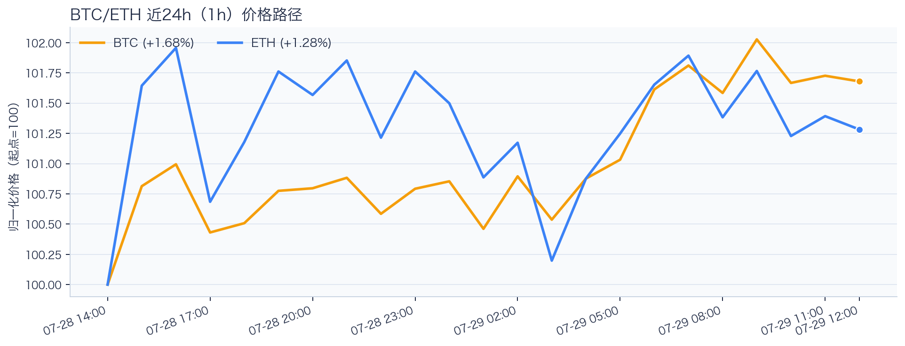
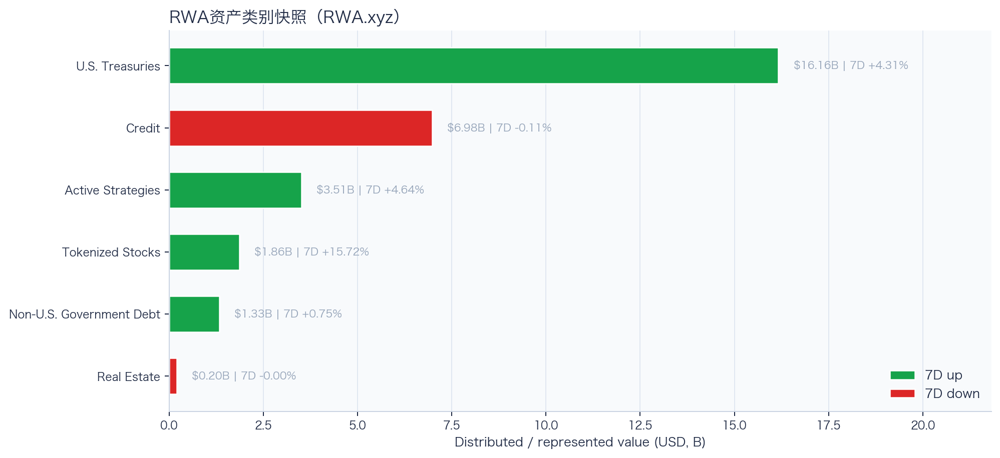
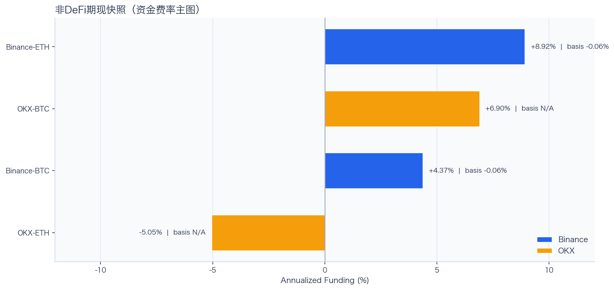
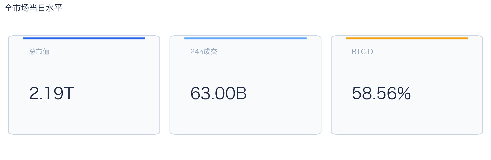
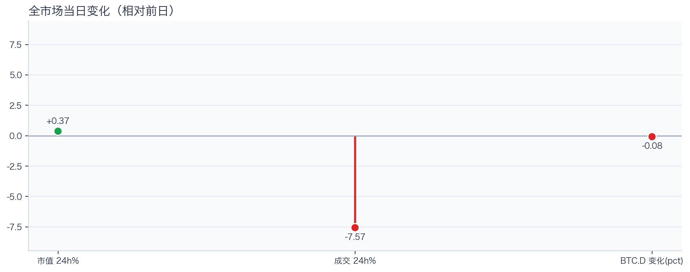
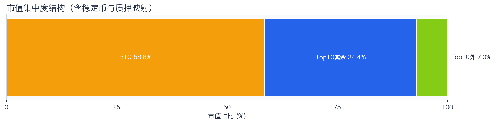
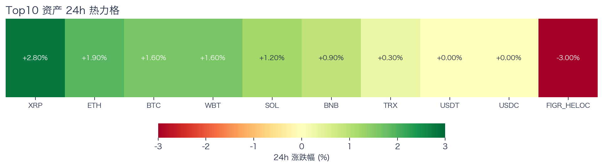
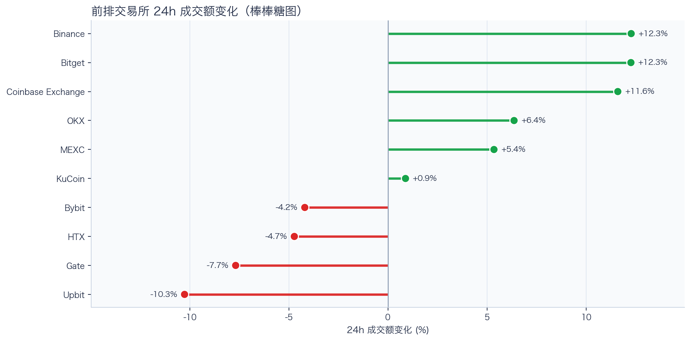
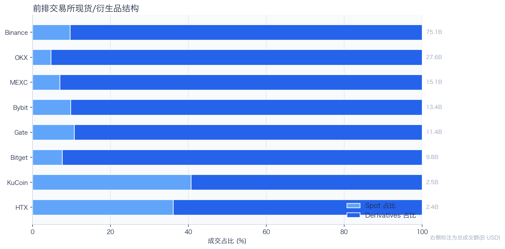
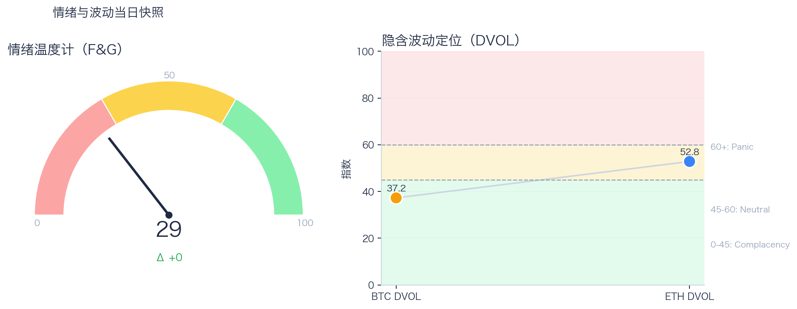

# 二级市场日报（2026-07-29）

## 今日亮点
- 前排交易所样本成交普遍回升：上涨 6 家、下跌 4 家，24h 变化均值 +2.19%。
- Tokenized Stocks 类别规模 $1.86B，7D +15.72%（截至 2026-07-28）。
- RWA 映射异动居前：AMD -3.92%、COIN +3.01%、GOOGL +2.41%；底层市场休市时仅作为链上价格变化观察，不作溢折价结论。

## 数据时点与口径
- 采集完成时间：2026-07-29T20:07:45.891205+08:00（Asia/Shanghai）；全市场指标：当日；F&G：截至 2026-07-29；RWA 类别：截至 2026-07-28。
- Top10 来源：demo；BTC/ETH rolling 24h：Binance global；永续与 DVOL：Deribit public/ticker / Deribit public/get_volatility_index_data。
- fallback 只替换等价指标并保留真实来源和截止时间；来源失败详情仅记录在 manifest 后台字段。

## 关键结论
- 全市场指标当日：市值 $2.19T（24h +0.37%），成交额 $63.00B（24h -7.57%）。
- BTC 主导率 58.56%（-0.08pct），Top10 外市值占比（集中度口径）7.02%。
- 头部风险资产（排除稳定币、质押及信用映射）上涨 7 / 下跌 0 / 平盘 0，平均涨跌幅 +1.47%，首尾分化 2.50pct。
- 衍生品：BTC/ETH 资金费率分别为 +0.38bps / +0.65bps，DVOL 收盘 37.25 / 52.83。

## 今日盘面判断
今日市场状态为“缩量修复”。市值上升但成交下降，价格修复尚未得到交易活跃度确认。头部风险资产上涨覆盖率较高，但该样本不能外推为长尾扩散。当前证据尚不足以确认新一轮趋势启动。

## 核心驱动因素
交易所成交方面，多数平台样本成交回升，但盘口深度、报价连续性与滑点尚未验证，不能直接等同于流动性改善；杠杆方面，当前资金费率未显示极端拥挤，但单一平台样本不足以概括整体杠杆状态；期权定价方面，隐含波动率处于相对低位，但单凭 DVOL 不足以判断期权保护成本是否便宜；情绪方面，情绪与价格修复节奏尚未完全同步。几项指标共同用于确认市场状态，但暂不足以归因于特定事件。

## BTC/ETH 24h 趋势判断

口径：文字涨跌来自交易所 rolling 24h ticker；图内路径为当前可得 23 个小时点，首尾变化 BTC +1.68%、ETH +1.28%，两者窗口不可混用。
- BTC（交易所 rolling 24h）：$64,482.56（+1.65%，区间 $62,742.47 - $64,744.81，当前位于区间 87%）=> 偏强震荡。
- ETH（交易所 rolling 24h）：$1,913.39（+2.03%，区间 $1,856.88 - $1,929.67，当前位于区间 78%）=> 偏强，上行主导。
- 简评：BTC 与 ETH 同步偏强，短线仍有上行动能。

## 稳定币收益情况（链上协议）
按安全优先（协议成熟度、链层风险、是否依赖激励）筛选了 10 个主流池；原生供给利率均值约 +2.89%。
其中包含奖励补贴的池有 3 个，补贴收益已单列，不与原生利率混合。

核心观察
- 利率结构：Total APY 位于 2.02% 至 5.48% 区间。
- 资金集中：TVL 主要集中在 Spark-USDT（Ethereum，TVL $405.74M）、Aave-USDT（Ethereum，TVL $77.12M）。
- 收益领先：当前收益靠前样本包括 Compound-USDS（Ethereum，Total 5.48%）、Aave-USDC（Ethereum，Total 4.74%）。

风险提示
- 利用率达到 70% 以上的池有 7 个，杠杆需求主要集中在头部池。
- 利用率最高样本：Compound-USDS（Ethereum） 90.70%，Borrow APY 6.53%。
- 奖励收益池数量：3 个。当前收益主体仍以原生利率为主。

数据覆盖：Aave API(8)，Compound API(6)，DefiLlama(21)。

稳定币收益对照表（安全优先）
| 协议 | 链 | 币种 | Supply | Borrow | Rewards | Total | Utilization | TVL | 数据源 |
|---|---|---|---:|---:|---:|---:|---:|---:|---|
| Aave | Ethereum | DAI | 3.36% | 5.01% | N/A | 3.36% | 90.02% | $11.18M | DefiLlama+Aave API |
| Spark | Ethereum | USDT | 2.75% | N/A | N/A | 2.75% | N/A | $405.74M | DefiLlama |
| Compound | Ethereum | USDS | 5.48% | 6.53% | 0.00% | 5.48% | 90.70% | $1.82M | Compound API |
| Aave | Ethereum | PYUSD | 2.95% | 4.42% | N/A | 2.95% | 74.71% | $2.72M | DefiLlama+Aave API |
| Aave | Ethereum | USDT | 2.71% | 3.66% | 1.32% | 4.03% | 82.68% | $77.12M | DefiLlama+Aave API |
| Aave | Ethereum | USDC | 3.24% | 4.01% | 1.50% | 4.74% | 90.33% | $64.76M | DefiLlama+Aave API |
| Aave | Ethereum | USDS | 0.13% | 5.68% | 3.43% | 3.55% | 3.06% | $11.85M | DefiLlama+Aave API |
| Aave | Arbitrum | USDC | 2.63% | 3.64% | N/A | 2.63% | 80.50% | $33.19M | DefiLlama+Aave API |
| Aave | Base | USDC | 3.60% | 4.53% | N/A | 3.60% | 88.62% | $19.87M | DefiLlama+Aave API |
| Aave | Arbitrum | DAI | 2.02% | 3.92% | N/A | 2.02% | 69.30% | $1.09M | DefiLlama+Aave API |

稳定币收益对比（扩展样本共 22 条，展示 Top10）
| 币种 | 协议 | 链 | Supply | Borrow | Rewards | Total | Utilization | TVL | 数据源 |
|---|---|---|---:|---:|---:|---:|---:|---:|---|
| USDC | Aave | Ethereum | 3.24% | 4.01% | 1.50% | 4.74% | 90.33% | $64.76M | DefiLlama+Aave API |
| USDC | Aave | Arbitrum | 2.63% | 3.64% | N/A | 2.63% | 80.50% | $33.19M | DefiLlama+Aave API |
| USDC | Aave | Base | 3.60% | 4.53% | N/A | 3.60% | 88.62% | $19.87M | DefiLlama+Aave API |
| USDC | Spark | Ethereum | 3.52% | N/A | N/A | 3.52% | N/A | $273.53M | DefiLlama |
| USDC | Compound | Ethereum | 3.15% | 3.93% | 0.10% | 3.25% | 87.64% | $343.02M | DefiLlama+Compound API |
| USDC | Compound | Arbitrum | 2.73% | 3.61% | 0.00% | 2.73% | 75.83% | $15.41M | DefiLlama+Compound API |
| USDC | Compound | Base | 5.02% | 6.00% | 0.00% | 5.02% | 90.56% | $8.40M | DefiLlama+Compound API |
| USDT | Aave | Ethereum | 2.71% | 3.66% | 1.32% | 4.03% | 82.68% | $77.12M | DefiLlama+Aave API |
| USDT | Spark | Ethereum | 2.75% | N/A | N/A | 2.75% | N/A | $405.74M | DefiLlama |
| USDT | Compound | Ethereum | 3.11% | 3.90% | 0.10% | 3.21% | 86.26% | $172.10M | DefiLlama+Compound API |

跨源补充（比 taoli 更全）
- 新增对比源：DefiLlama 全量稳定币池（筛选口径）+ Bitcompare 平台 APY（CeFi/DeFi/Hybrid），并与现有链上主流池快照交叉核对。
- 覆盖规模：原链上精表 22 条；DefiLlama 扩展样本 95 条（展示 Top10）；Bitcompare 稳定币利率样本 7 条。
- 覆盖维度：扩展样本覆盖 48 个协议、14 条链、62 类稳定币。
- 口径说明：Bitcompare 混合 CeFi、DeFi 与 Hybrid 平台展示 APY；taoli 为 Binance 借币年化。两者用于横向参考，不等价于无风险套利收益。

稳定币收益补充表（DefiLlama 扩展，TVL≥$30M，展示 Top10）
| 币种 | 协议 | 链 | Base | Rewards | Total | TVL | 数据源 |
|---|---|---|---:|---:|---:|---:|---|
| SUSDS | sky-lending | Ethereum | 3.52% | N/A | 3.52% | $4.61B | DefiLlama API |
| USYC | circle-usyc | BSC | 3.36% | N/A | 3.36% | $2.91B | DefiLlama API |
| USDC | maple | Ethereum | 5.07% | 0.00% | 5.07% | $2.56B | DefiLlama API |
| SUSDE | ethena-usde | Ethereum | 4.12% | N/A | 4.12% | $1.54B | DefiLlama API |
| USDY | ondo-yield-assets | Ethereum | 3.55% | N/A | 3.55% | $1.11B | DefiLlama API |
| BUIDL | blackrock-buidl | Ethereum | 3.59% | N/A | 3.59% | $963.47M | DefiLlama API |
| USDT | maple | Ethereum | 4.35% | 0.00% | 4.35% | $892.92M | DefiLlama API |
| USDS | centrifuge-protocol | Ethereum | 2.84% | N/A | 2.84% | $870.43M | DefiLlama API |
| BUIDL | blackrock-buidl | Aptos | 3.25% | N/A | 3.25% | $821.89M | DefiLlama API |
| USTB | invesco-ustb | Ethereum | 3.69% | N/A | 3.69% | $732.92M | DefiLlama API |

稳定币平台聚合报价与借币成本（不可直接计算套利利差）
| 币种 | Bitcompare 平台最高APY | 对应平台 | taoli(Binance借币年化) | 可执行性 |
|---|---:|---|---:|---|
| DAI | 10.50% | Nexo | N/A | 未验证期限、额度、锁仓、奖励构成与地区准入 |
| PYUSD | 4.82% | Kamino | N/A | 未验证期限、额度、锁仓、奖励构成与地区准入 |
| SUSDS | 5.32% | Pendle | N/A | 未验证期限、额度、锁仓、奖励构成与地区准入 |
| USDC | 35.41% | OKX | 4.63% | 高收益聚合报价；未验证期限、容量、奖励构成与地区准入 |
| USDE | 7.56% | Pendle | N/A | 未验证期限、额度、锁仓、奖励构成与地区准入 |
| USDS | 5.48% | Compound V3 | N/A | 未验证期限、额度、锁仓、奖励构成与地区准入 |
| USDT | 29.50% | Lune.fi | 3.91% | 高收益聚合报价；未验证期限、容量、奖励构成与地区准入 |
说明：平台 APY 与保证金借币成本的产品期限、风险、准入和容量不同，不计算或宣称可执行套利利差。

交易含义：当前稳定币收益更偏“头部池中等收益 + 局部高利用率”结构，策略上优先流动性与透明度，再考虑收益增强。
部分池的 Borrow 与 Utilization 暂未返回，表内仅展示已获取字段。

## RWA 结构观察
### 今日 tokenized stocks 异动雷达
筛选口径：核心美股/ETF 映射观察池按链上代币 24h 绝对涨跌选出前 5，再结合 1h K 线、技术指标、链上买卖流、持仓集中度和底层美股交易状态解释。
| 标的 | 24h | RSI14 | SMA6/24 | 链上净买入 | 映射溢折价 | 状态/事件 |
|---|---:|---:|---|---:|---:|---|
| AMD | -3.92% | 57.6 | 多头 | N/A | 不可计算（参考价冻结） | TRADING |
| COIN | +3.01% | 53.6 | 多头 | N/A | 不可计算（参考价冻结） | TRADING |
| GOOGL | +2.41% | 57.8 | 多头 | N/A | 不可计算（参考价冻结） | TRADING |
| CRCL | +2.21% | 58.2 | 多头 | N/A | 不可计算（参考价冻结） | TRADING |
| PLTR | -2.04% | 54.6 | 多头 | N/A | 不可计算（参考价冻结） | TRADING |

- **AMD**：24h -3.92%，RSI14 57.6，短周期均线位于长周期上方；链上买卖流不可用；未观测到聪明钱持有地址或活跃信号。映射溢折价 不可计算（参考价冻结）。资产状态显示 `TRADING`，这是可验证的事件线索。
- **COIN**：24h +3.01%，RSI14 53.6，短周期均线位于长周期上方；链上买卖流不可用；未观测到聪明钱持有地址或活跃信号。映射溢折价 不可计算（参考价冻结）。资产状态显示 `TRADING`，这是可验证的事件线索。
- **GOOGL**：24h +2.41%，RSI14 57.8，短周期均线位于长周期上方；链上买卖流不可用；未匹配到活跃交易信号，聪明钱持有地址 31 个。映射溢折价 不可计算（参考价冻结）。资产状态显示 `TRADING`，这是可验证的事件线索。

24×7 交易含义：美股休市期间，tokenized stock 的变化更像对新闻、指数期货和加密风险偏好的提前定价；但底层现货缺少连续套利锚、链上流动性通常更薄，溢折价可能放大。美股开盘后若底层价格不确认，夜间涨跌可能快速回归。
归因纪律：公司行动/财报限制、K 线和链上流向属于事实；只有事件时间、价格方向和资金方向一致时才写成高置信归因，其余仅标记为相关性或待验证假设。

### 币安 bStocks / 特殊映射池
筛选口径：单独观察 Binance `type=3` 的 bStocks/特殊映射资产，不与核心美股映射 Top5 混排；SPCX 等标的只写经济敞口和价格发现，不把衍生/准股权属性写成普通股票套利。
| 标的 | 交易资产 | 24h | RSI14 | SMA6/24 | 链上净买入 | 产品口径 |
|---|---|---:|---:|---|---:|---|
| SPCX | SPCXB | +5.10% | 52.4 | 多头 | N/A | binance_bstocks |
| AXTI | AXTIB | -3.50% | 21.7 | N/A | N/A | binance_bstocks |
| CRWV | CRWVB | -2.80% | N/A | N/A | N/A | binance_bstocks |
| INTW | INTWB | +0.82% | 37.4 | 空头 | N/A | binance_bstocks |
| INTC | INTCB | +0.65% | 60.8 | 多头 | N/A | binance_bstocks |
| BABA | BABAB | +0.12% | 77.9 | 多头 | N/A | binance_bstocks |
解读边界：这些资产更适合作为 CEX RWA 新品类和 24×7 价格发现观察池；若底层锚、转换权或交易时段不可验证，不计算普通映射溢折价，也不把链上成交直接解释为底层股票资金流。

### 港股 tokenized 覆盖状态
本轮 Binance 公开 RWA 源未命中可验证的港股 tokenized 标的；BABA 等美股/ADR 映射不计入港股池，避免把 ADR 价格代理写成港股现货。

### RWA 资产类别背景

RWA.xyz 公开页快照显示，样本资产类别合计约 $30.04B；最大类别为 U.S. Treasuries（$16.16B，7D +4.31%）。7D 上升类别 4 个、下降类别 2 个，说明 RWA 当前更适合当作结构变量，而不是日内方向信号。
其中股票、主动策略和非美债这类交易属性更强的类别合计约 $6.69B，占样本 22.29%。这部分更接近 CEX 新品类、Perps 和跨资产成交额的观察入口。

RWA 资产类别对照表
| 类别 | 规模 | 7D变化 | as of |
|---|---:|---:|---|
| U.S. Treasuries | $16.16B | +4.31% | 2026-07-28 |
| Credit | $6.98B | -0.11% | 2026-07-28 |
| Active Strategies | $3.51B | +4.64% | 2026-07-28 |
| Tokenized Stocks | $1.86B | +15.72% | 2026-07-28 |
| Non-U.S. Government Debt | $1.33B | +0.75% | 2026-07-28 |
| Real Estate | $202.63M | -0.00% | 2026-07-28 |

交易含义：RWA 放在日报里可以，但应定位为二级市场的产品线与风险偏好背景；只有 tokenized stocks、RWA perps、可交易收益资产扩容时，才更直接影响交易所成交结构。
数据源：RWA.xyz 公开资产类别页；正式 API 可在设置 RWA_API_KEY 后替换为更稳定口径。

## 非 DeFi（交易所期现）

本期可用样本仅覆盖 Binance、OKX 的 BTC/ETH 现货与永续。Funding 与 basis 均有可用记录。
- Funding 最高样本：Binance-ETH，年化约 8.92%。
- Funding 最低样本：OKX-ETH，年化约 -5.05%。
- Basis 偏离最大：Binance-ETH，相对指数约 -0.06%。

借币成本多源对比表
| 资产 | Binance(日/年) | OKX(日/年) | Bybit(日/年) | Backpack(日/年) | KuCoin(日/年) | 最低日利率 |
|---|---:|---:|---:|---:|---:|---:|
| USDT | 0.01%/3.91% · 500k | 0.01%/2.51% · 5.0M | 0.01%/3.91% · 8.0M | 0.01%/4.08% · 50.0M | N/A | OKX 0.01% |
| USDC | 0.01%/4.63% · 500k | 0.02%/8.90% · 1.0M | 0.01%/3.83% · 3.5M | 0.01%/2.21% · 300.0M | N/A | Backpack 0.01% |
| USDE | N/A | N/A | 0.01%/5.00% · 1.0M | N/A | N/A | Bybit 0.01% |
| BTC | 0.00%/0.38% · 100 | 0.00%/0.51% · 175 | 0.00%/0.38% · 300 | 0.00%/0.45% · 3k | N/A | Binance 0.00% |
| ETH | 0.01%/2.04% · 2k | 0.00%/1.51% · 7k | 0.01%/2.04% · 2k | 0.00%/0.56% · 20k | N/A | Backpack 0.00% |
说明：统一按日利率/年化展示，单元格尾部为可借额度。
- 交易含义：Funding 与 basis 同时可用时才能评估 carry；当前数值只代表快照，不代表可持续收益。
该部分与链上收益分开统计，便于比较两类策略的收益与风险结构。

## 市场脉冲

当日，全市场市值 $2.19T，24h 成交额 $63.00B，BTC 主导率 58.56%。
价格上涨但成交回落，反弹质量偏弱，需警惕高位回吐。

相对前一观测日，市值 +0.37%、成交 -7.57%、BTC.D -0.08pct。
市值与成交是同步观测；缺少事件时点和资金路径证据时，暂不作特定事件归因。

## 主导率与市值集中度

当前市值结构为 BTC 58.56% / Top10 其余 34.42% / Top10 外 7.02%。该图含稳定币与质押映射，只描述集中度，不证明风险偏好扩散。
方向样本为 7 个头部风险资产，已排除 USDT, USDC, FIGR_HELOC；Top10 外占比仅是市值集中度，不作为风险扩散代理。

## 资产表现与交易所成交

按头部资产统一快照口径，领涨的是 XRP（+2.80%），尾部的是 TRX（+0.30%），均值 +1.47%，首尾相差 2.50pct。
头部风险资产温和同涨，首尾差有限，当前更接近普涨而非显著结构分化。后续重点观察成交能否确认上涨覆盖率，而不是仅凭当日小幅收益差进行选币。

前排样本上涨 6 家、下跌 4 家，均值 +2.19%。Binance 最强（+12.28%），Upbit 最弱（-10.26%）。
最强与最弱平台的 24h 变化差达到 22.54pct，说明平台间成交变化分化，但不能据此推断资金因果流向。报价连续性和滑点是否同步变化仍需盘口数据验证，执行层面应继续监控成交质量。

样本内衍生品成交占比 89.59%。该比例描述成交结构，不单独用于判断后续波动方向或幅度。
衍生品占比处于高位；该比例本身不说明波动方向。后续需用盘口深度、强平和事件窗口数据验证具体传导机制。

## 衍生品与情绪
Deribit 样本的资金费率（Funding）接近中性，BTC/ETH 8h 费率分别为 +0.38bps / +0.65bps；隐含波动率指数（DVOL）位于 Complacency（低波动定价） / Neutral（中性波动定价）。
| 资产 | OKX 多头清算样本 | OKX 空头清算样本 | 近月年化基差 | 远月年化基差 | ATM IV | 25Δ 偏度 |
|---|---:|---:|---:|---:|---:|---:|
| BTC | $2.18M | $3.06M | +3.21% | +4.04% | 35.88% | 5.72 pp |
| ETH | $6.94M | $5.43M | +0.27% | +0.57% | 51.12% | 4.03 pp |
清算口径：仅为 OKX 公共接口返回的近期样本，不代表 OKX 或全市场清算总量；25Δ 偏度定义为 Put IV 减 Call IV。
Funding 与 DVOL 暂未显示极端方向拥挤；当前读数本身不足以判断尾部风险是否重新抬升。因此更合适的做法不是激进追单边，而是围绕波动管理仓位和节奏。

恐惧与贪婪指数（F&G）当日 29（较前一观测日 +0）；BTC/ETH DVOL 为 37.25/52.83，对应 Complacency（低波动定价） / Neutral（中性波动定价）。
情绪仍在恐惧区但已脱离极端恐惧，是否修复仍需成交和广度确认。只有当情绪、广度和成交三者同时改善，市场才更可能从“反弹交易”切换到“趋势交易”。

## 关键价位与失效条件
| 资产 | 24h 支撑 | 24h 阻力 | ATR14(1h) | 向上触发 | 多头失效 | 向下触发 | 空头失效 |
|---|---:|---:|---:|---:|---:|---:|---:|
| BTC | 62965.38 | 64744.81 | 297.46 | 64819.17 | 64670.45 | 62891.02 | 63039.74 |
| ETH | 1867.74 | 1929.67 | 13.35 | 1933.01 | 1926.33 | 1864.40 | 1871.08 |
计算口径：以当前可得 23 个 1h 小时点的高低点作为支撑/阻力，触发缓冲取现价 0.1% 与 0.25×ATR14 的较大值；触发价用于观察确认，不是自动交易指令。

## Binance Web3 RWA 聪明钱信号
公开接口覆盖 Top5 中 5 个标的，当前命中 0 个活跃信号。未命中表示本次公开信号页没有对应记录，不等于聪明钱地址数为零。
| 标的 | 覆盖状态 | 方向 | 聪明钱地址 | 信号金额 | 状态 |
|---|---|---|---:|---:|---|
| AMD | 已覆盖/未命中 | N/A | N/A | N/A | N/A |
| COIN | 已覆盖/未命中 | N/A | N/A | N/A | N/A |
| GOOGL | 已覆盖/未命中 | N/A | N/A | N/A | N/A |
| CRCL | 已覆盖/未命中 | N/A | N/A | N/A | N/A |
| PLTR | 已覆盖/未命中 | N/A | N/A | N/A | N/A |

交易含义：该数据是代币级链上信号，用于验证资金参与方向，不代表全市场交易员排行榜，也不应单独作为开仓触发。

## 可选交易员仓位增强
未启用或未取得公开交易员榜单；不影响 Binance Web3 代币级信号覆盖。

仓位结构暂不可用，本期不作仓位方向判断。

BTC/ETH 聪明钱聚合信号未启用（设置 `OKX_SMARTMONEY_FETCH_SIGNAL=1` 可尝试拉取）。

交易含义：交易员仓位只用于方向与拥挤度补充观察。

## 新闻事件热点（固定结构）
口径：新闻源统一写入 `data/news_events.json`；本期抓取 80 条新闻，形成 5 个热点。新闻只作为事件背景和验证线索，不单独解释价格或资金流。
| 排名 | 主题 | 摘要 | 关联标的 | 来源 | 因果边界 |
|---:|---|---|---|---|---|
| 1 | market_news | market_news 相关新闻在 38 条样本中出现，涉及 BTC, ETH, MARA, SOL。当前仅作为事件背景和验证线索，不单独解释价格或资金流。代表标题：AmericanFortress proposes quantum-safe crypto wallet protection without fund migration；Morgan Sta | BTC, ETH, MARA, SOL | Cointelegraph, TechFlow 深潮, Yahoo Finance | news_context_only |
| 2 | rwa | rwa 相关新闻在 9 条样本中出现，涉及 BNB, BTC, COIN, ETH, MSTR。当前仅作为事件背景和验证线索，不单独解释价格或资金流。代表标题：比特币 6.6 万反弹遭遇 Warsh 时刻：本周 FOMC 才是加密市场的指挥棒；消失的买入键 | BNB, BTC, COIN, ETH, MSTR, NVDA, SOL, TSLA | Cointelegraph, TechFlow 深潮 | news_context_only |
| 3 | stablecoin | stablecoin 相关新闻在 9 条样本中出现，涉及 BTC, ETH, MSTR。当前仅作为事件背景和验证线索，不单独解释价格或资金流。代表标题：俄罗斯央行发布加密交易所及托管机构监管规则草案；Bybit 上线定投挑战赛，特设 BTC, ETH和 XAUT 奖池 | BTC, ETH, MSTR | Cointelegraph, TechFlow 深潮 | news_context_only |
| 4 | macro | macro 相关新闻在 8 条样本中出现。当前仅作为事件背景和验证线索，不单独解释价格或资金流。代表标题：多年来「最不确定」的一次，今晚的美联储会给「惊吓」吗？；Stocks muted as investors count down to Fed verdict, tech earnings | N/A | TechFlow 深潮, Yahoo Finance | news_context_only |
| 5 | earnings | earnings 相关新闻在 6 条样本中出现。当前仅作为事件背景和验证线索，不单独解释价格或资金流。代表标题：Johnson & Johnson vs. Eli Lilly: Reliable Stability vs. Rapid Revenue Growth；Dow Jones Futures Fall, Oil Jumps On Iran News; | N/A | Cointelegraph, Yahoo Finance | news_context_only |

新闻源状态：
- TechFlow 深潮: ok（items=40）
- PANews: ok（items=0）
- Cointelegraph: ok（items=22）
- Decrypt: failed（items=0）
- Yahoo Finance: ok（items=32）

### 事件驱动影响分析
方法：按发布时间对齐 1h/4h/24h 事件窗口；有足够基准数据时计算市场模型异常收益，再用资金流、聪明钱与技术结构验证传导。L0-L3 均不是因果证明，自动流程不授予 L4。
| 事件 | 标的 | 4h收益 | 4h异常收益 | 信号关系 | 归因等级 | 结论 |
|---|---|---:|---:|---|---|---|
| 比特币 6.6 万反弹遭遇 Warsh 时刻：本周 FOMC 才是加密市场的指挥棒 | COIN | N/A | N/A | aligned | L1 | COIN 缺少与事件时点对齐的价格窗口，当前只保留事件背景。 |
| Bybit 上线定投挑战赛，特设 BTC, ETH和 XAUT 奖池 | ETH | N/A | N/A | aligned | L1 | ETH 缺少与事件时点对齐的价格窗口，当前只保留事件背景。 |
| 比特币 6.6 万反弹遭遇 Warsh 时刻：本周 FOMC 才是加密市场的指挥棒 | BTC | N/A | N/A | inconclusive | L1 | BTC 缺少与事件时点对齐的价格窗口，当前只保留事件背景。 |
| 比特币 6.6 万反弹遭遇 Warsh 时刻：本周 FOMC 才是加密市场的指挥棒 | ETH | N/A | N/A | inconclusive | L1 | ETH 缺少与事件时点对齐的价格窗口，当前只保留事件背景。 |
| 俄罗斯央行发布加密交易所及托管机构监管规则草案 | BTC | N/A | N/A | inconclusive | L1 | BTC 缺少与事件时点对齐的价格窗口，当前只保留事件背景。 |
| 俄罗斯央行发布加密交易所及托管机构监管规则草案 | ETH | N/A | N/A | inconclusive | L1 | ETH 缺少与事件时点对齐的价格窗口，当前只保留事件背景。 |
| Bybit 上线定投挑战赛，特设 BTC, ETH和 XAUT 奖池 | BTC | N/A | N/A | inconclusive | L1 | BTC 缺少与事件时点对齐的价格窗口，当前只保留事件背景。 |
| Strategy 称 MSTR 自采用比特币储备以来年化回报达 42%，持仓仍浮亏约 180 亿美元 | BTC | N/A | N/A | inconclusive | L1 | BTC 缺少与事件时点对齐的价格窗口，当前只保留事件背景。 |

## 未来24小时观察
1. 若头部风险资产上涨覆盖率连续改善且 BTC.D 回落，再结合更广币种样本验证风险偏好是否扩散。
2. 若衍生品占比继续上升而 funding 仍中性，只能确认交易向杠杆侧集中；是否放大波动仍需结合 DVOL 与成交验证。
3. 若 F&G 回升而 DVOL 不降，代表情绪改善尚未获得风险定价确认，应降低对追涨信号的置信度。

## 交易与风控含义
- 仓位管理优先级高于方向押注，建议保持核心仓位稳定、战术仓位滚动。
- 若衍生品占比上升并伴随 Funding 快速偏离中性或 DVOL 抬升，再考虑降低杠杆并收紧风险参数。
- 关注情绪改善与广度扩散是否同步发生，二者背离时避免追逐单边。

