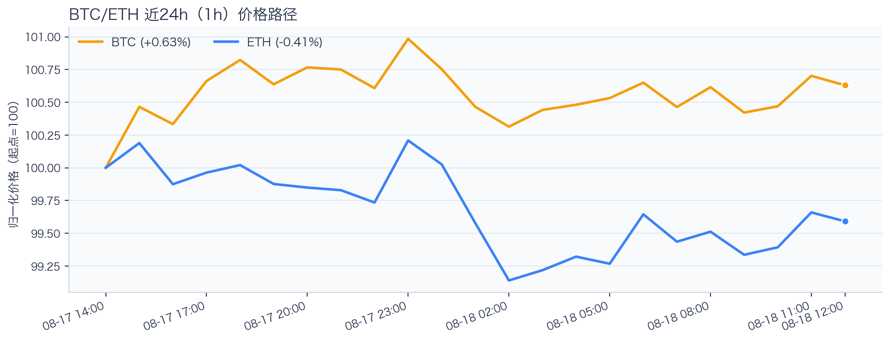
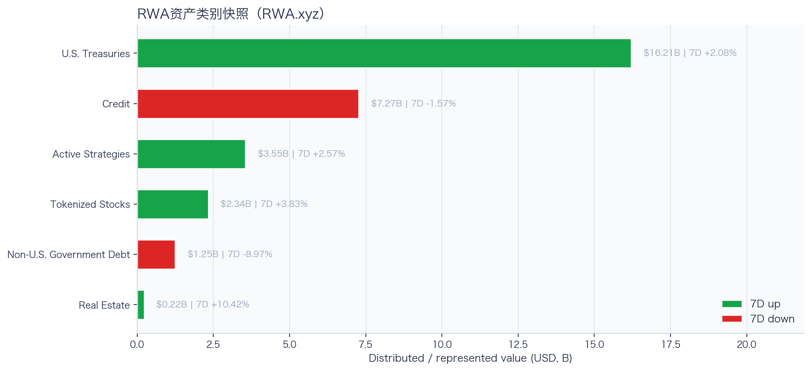
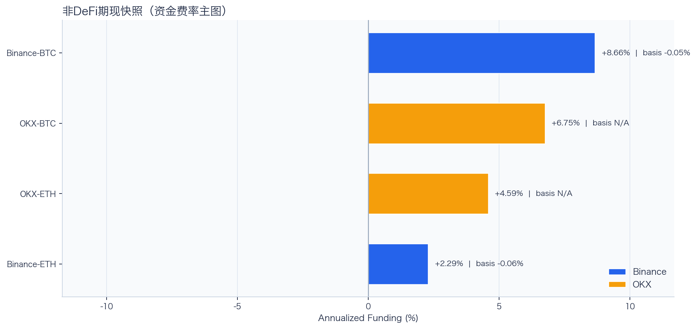
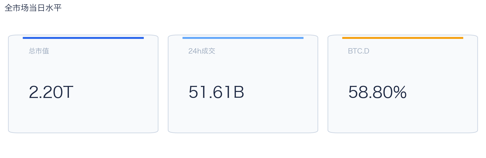
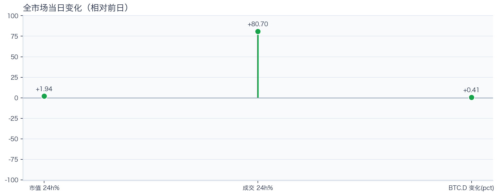
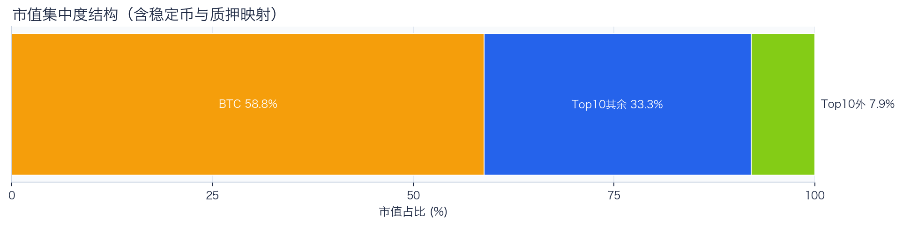
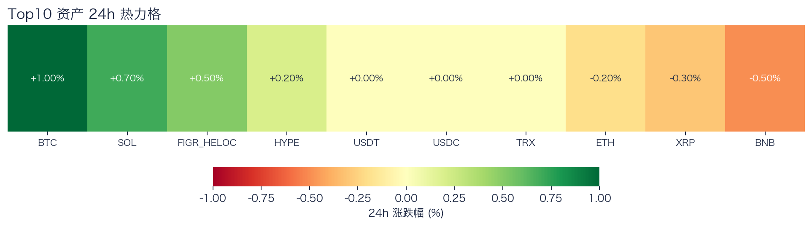
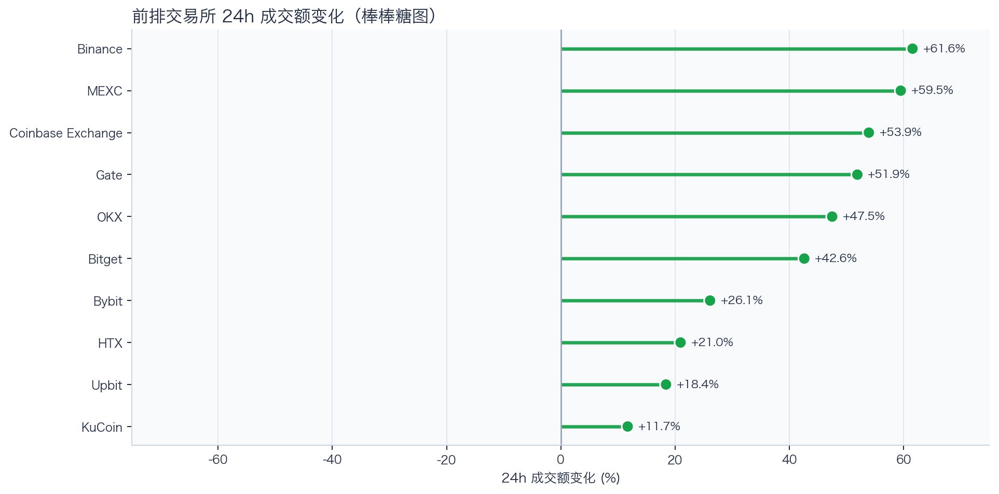
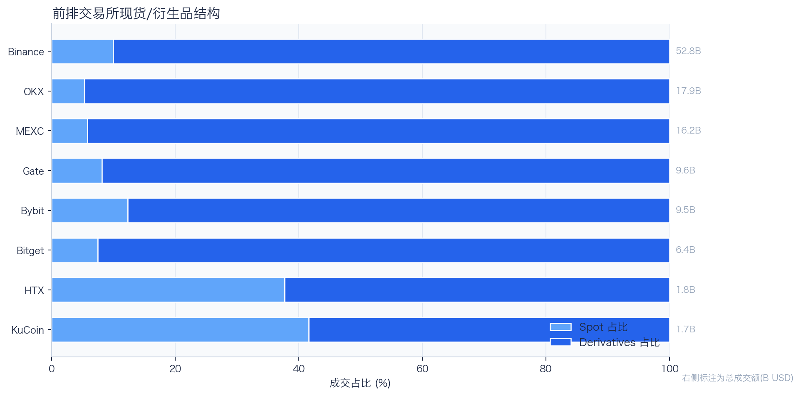
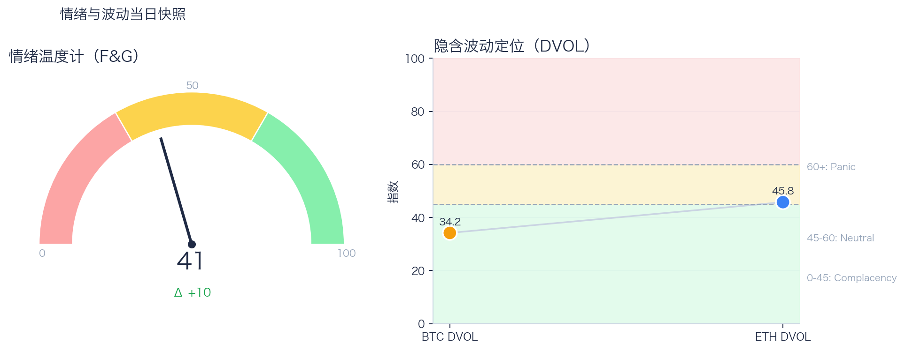

# 二级市场日报（2026-08-18）

## 今日亮点
- 前排交易所样本成交普遍回升：上涨 10 家、下跌 0 家，24h 变化均值 +39.43%。
- Tokenized Stocks 类别规模 $2.34B，7D +3.83%（截至 2026-08-17）。
- RWA 映射异动居前：AMD -4.46%、META -4.26%、NVDA -2.64%；底层市场休市时仅作为链上价格变化观察，不作溢折价结论。

## 数据时点与口径
- 采集完成时间：2026-08-18T20:25:22.471833+08:00（Asia/Shanghai）；全市场指标：当日；F&G：截至 2026-08-18；RWA 类别：截至 2026-08-17。
- Top10 来源：demo；BTC/ETH rolling 24h：Binance global；永续与 DVOL：Deribit public/ticker / Deribit public/get_volatility_index_data。
- fallback 只替换等价指标并保留真实来源和截止时间；来源失败详情仅记录在 manifest 后台字段。

## 关键结论
- 全市场指标当日：市值 $2.20T（24h +1.94%），成交额 $51.61B（24h +80.70%）。
- BTC 主导率 58.80%（+0.41pct），Top10 外市值占比（集中度口径）7.93%。
- 头部风险资产（排除稳定币、质押及信用映射）上涨 3 / 下跌 3 / 平盘 1，平均涨跌幅 +0.13%，首尾分化 1.50pct。
- 衍生品：BTC/ETH 资金费率分别为 +0.14bps / +0.00bps，DVOL 收盘 34.18 / 45.77。

## 今日盘面判断
今日市场状态为“交易性修复”。价格与成交共振上行；现有样本只覆盖头部风险资产，尚不足以证明长尾市场已扩散。头部风险资产涨跌分化，方向一致性有限。当前证据尚不足以确认新一轮趋势启动。

## 核心驱动因素
交易所成交方面，多数平台样本成交回升，但盘口深度、报价连续性与滑点尚未验证，不能直接等同于流动性改善；杠杆方面，当前资金费率未显示极端拥挤，但单一平台样本不足以概括整体杠杆状态；期权定价方面，隐含波动率处于相对低位，但单凭 DVOL 不足以判断期权保护成本是否便宜；情绪方面，情绪与价格修复节奏尚未完全同步。几项指标共同用于确认市场状态，但暂不足以归因于特定事件。

## BTC/ETH 24h 趋势判断

口径：文字涨跌来自交易所 rolling 24h ticker；图内路径为当前可得 23 个小时点，首尾变化 BTC +0.63%、ETH -0.41%，两者窗口不可混用。
- BTC（交易所 rolling 24h）：$64,305.41（+1.06%，区间 $63,444.17 - $64,610.01，当前位于区间 74%）=> 偏强震荡。
- ETH（交易所 rolling 24h）：$1,901.81（-0.03%，区间 $1,885.78 - $1,918.71，当前位于区间 49%）=> 区间震荡。
- 简评：BTC 与 ETH 出现分化，短线以结构性机会为主。

## 稳定币收益情况（链上协议）
按安全优先（协议成熟度、链层风险、是否依赖激励）筛选了 10 个主流池；原生供给利率均值约 +2.69%。
其中包含奖励补贴的池有 3 个，补贴收益已单列，不与原生利率混合。

核心观察
- 利率结构：Total APY 位于 1.69% 至 4.80% 区间。
- 资金集中：TVL 主要集中在 Spark-USDT（Ethereum，TVL $373.97M）、Aave-USDT（Ethereum，TVL $74.88M）。
- 收益领先：当前收益靠前样本包括 Aave-USDC（Ethereum，Total 4.80%）、Aave-USDT（Ethereum，Total 4.36%）。

风险提示
- 利用率达到 70% 以上的池有 8 个，杠杆需求主要集中在头部池。
- 利用率最高样本：Aave-USDC（Ethereum） 91.66%，Borrow APY 4.07%。
- 奖励收益池数量：3 个。当前收益主体仍以原生利率为主。

数据覆盖：Aave API(8)，Compound API(6)，DefiLlama(21)。

稳定币收益对照表（安全优先）
| 协议 | 链 | 币种 | Supply | Borrow | Rewards | Total | Utilization | TVL | 数据源 |
|---|---|---|---:|---:|---:|---:|---:|---:|---|
| Aave | Ethereum | DAI | 2.36% | 4.20% | N/A | 2.36% | 75.65% | $32.77M | DefiLlama+Aave API |
| Spark | Ethereum | USDT | 3.00% | N/A | N/A | 3.00% | N/A | $373.97M | DefiLlama |
| Compound | Ethereum | USDS | 3.23% | 3.99% | 0.00% | 3.23% | 89.61% | $1.85M | Compound API |
| Aave | Ethereum | PYUSD | 3.67% | 4.86% | N/A | 3.67% | 84.28% | $1.48M | DefiLlama+Aave API |
| Aave | Ethereum | USDT | 3.00% | 3.85% | 1.36% | 4.36% | 86.91% | $74.88M | DefiLlama+Aave API |
| Aave | Ethereum | USDC | 3.34% | 4.07% | 1.46% | 4.80% | 91.66% | $66.43M | DefiLlama+Aave API |
| Aave | Ethereum | USDS | 0.12% | 5.68% | 1.57% | 1.69% | 2.96% | $11.79M | DefiLlama+Aave API |
| Aave | Arbitrum | USDC | 2.42% | 3.50% | N/A | 2.42% | 77.36% | $38.70M | DefiLlama+Aave API |
| Aave | Base | USDC | 3.58% | 4.52% | N/A | 3.58% | 88.44% | $20.47M | DefiLlama+Aave API |
| Aave | Arbitrum | DAI | 2.17% | 4.07% | N/A | 2.17% | 71.85% | $1.00M | DefiLlama+Aave API |

稳定币收益对比（扩展样本共 22 条，展示 Top10）
| 币种 | 协议 | 链 | Supply | Borrow | Rewards | Total | Utilization | TVL | 数据源 |
|---|---|---|---:|---:|---:|---:|---:|---:|---|
| USDC | Aave | Ethereum | 3.34% | 4.07% | 1.46% | 4.80% | 91.66% | $66.43M | DefiLlama+Aave API |
| USDC | Aave | Arbitrum | 2.42% | 3.50% | N/A | 2.42% | 77.36% | $38.70M | DefiLlama+Aave API |
| USDC | Aave | Base | 3.58% | 4.52% | N/A | 3.58% | 88.44% | $20.47M | DefiLlama+Aave API |
| USDC | Spark | Ethereum | 3.52% | N/A | N/A | 3.52% | N/A | $270.38M | DefiLlama |
| USDC | Compound | Ethereum | 3.23% | 3.99% | 0.10% | 3.33% | 89.58% | $342.98M | DefiLlama+Compound API |
| USDC | Compound | Arbitrum | 2.74% | 3.61% | 0.00% | 2.74% | 76.12% | $15.31M | DefiLlama+Compound API |
| USDC | Compound | Base | 3.18% | 3.95% | 0.00% | 3.18% | 88.36% | $8.68M | DefiLlama+Compound API |
| USDT | Aave | Ethereum | 3.00% | 3.85% | 1.36% | 4.36% | 86.91% | $74.88M | DefiLlama+Aave API |
| USDT | Spark | Ethereum | 3.00% | N/A | N/A | 3.00% | N/A | $373.97M | DefiLlama |
| USDT | Compound | Ethereum | 2.86% | 3.70% | 0.10% | 2.96% | 79.37% | $186.97M | DefiLlama+Compound API |

跨源补充（比 taoli 更全）
- 新增对比源：DefiLlama 全量稳定币池（筛选口径）+ Bitcompare 平台 APY（CeFi/DeFi/Hybrid），并与现有链上主流池快照交叉核对。
- 覆盖规模：原链上精表 22 条；DefiLlama 扩展样本 96 条（展示 Top10）；Bitcompare 稳定币利率样本 4 条。
- 覆盖维度：扩展样本覆盖 48 个协议、14 条链、63 类稳定币。
- 口径说明：Bitcompare 混合 CeFi、DeFi 与 Hybrid 平台展示 APY；taoli 为 Binance 借币年化。两者用于横向参考，不等价于无风险套利收益。

稳定币收益补充表（DefiLlama 扩展，TVL≥$30M，展示 Top10）
| 币种 | 协议 | 链 | Base | Rewards | Total | TVL | 数据源 |
|---|---|---|---:|---:|---:|---:|---|
| SUSDS | sky-lending | Ethereum | 3.52% | N/A | 3.52% | $4.73B | DefiLlama API |
| USYC | circle-usyc | BSC | 3.27% | N/A | 3.27% | $2.91B | DefiLlama API |
| USDC | maple | Ethereum | 4.81% | 0.00% | 4.81% | $2.60B | DefiLlama API |
| SUSDE | ethena-usde | Ethereum | 4.60% | N/A | 4.60% | $1.37B | DefiLlama API |
| USDY | ondo-yield-assets | Ethereum | 3.55% | N/A | 3.55% | $1.11B | DefiLlama API |
| BUIDL | blackrock-buidl | Ethereum | 3.60% | N/A | 3.60% | $965.23M | DefiLlama API |
| USDT | maple | Ethereum | 4.11% | 0.00% | 4.11% | $927.84M | DefiLlama API |
| USDS | centrifuge-protocol | Ethereum | 3.23% | N/A | 3.23% | $872.54M | DefiLlama API |
| BUIDL | blackrock-buidl | Aptos | 3.26% | N/A | 3.26% | $821.92M | DefiLlama API |
| USTB | invesco-ustb | Ethereum | 3.37% | N/A | 3.37% | $766.01M | DefiLlama API |

稳定币平台聚合报价与借币成本（不可直接计算套利利差）
| 币种 | Bitcompare 平台最高APY | 对应平台 | taoli(Binance借币年化) | 可执行性 |
|---|---:|---|---:|---|
| DAI | 6.00% | AQRU | N/A | 未验证期限、额度、锁仓、奖励构成与地区准入 |
| USDC | 29.50% | Lune.fi | 5.39% | 高收益聚合报价；未验证期限、容量、奖励构成与地区准入 |
| USDS | 4.12% | Kamino | N/A | 未验证期限、额度、锁仓、奖励构成与地区准入 |
| USDT | 29.50% | Lune.fi | 4.00% | 高收益聚合报价；未验证期限、容量、奖励构成与地区准入 |
说明：平台 APY 与保证金借币成本的产品期限、风险、准入和容量不同，不计算或宣称可执行套利利差。

交易含义：当前稳定币收益更偏“头部池中等收益 + 局部高利用率”结构，策略上优先流动性与透明度，再考虑收益增强。
部分池的 Borrow 与 Utilization 暂未返回，表内仅展示已获取字段。

## RWA 结构观察
### 今日 tokenized stocks 异动雷达
筛选口径：核心美股/ETF 映射观察池按链上代币 24h 绝对涨跌选出前 5，再结合 1h K 线、技术指标、链上买卖流、持仓集中度和底层美股交易状态解释。
| 标的 | 24h | RSI14 | SMA6/24 | 链上净买入 | 映射溢折价 | 状态/事件 |
|---|---:|---:|---|---:|---:|---|
| AMD | -4.46% | 24.1 | 空头 | N/A | 不可计算（参考价冻结） | TRADING |
| META | -4.26% | 26.0 | 空头 | N/A | 不可计算（参考价冻结） | TRADING |
| NVDA | -2.64% | 19.2 | 空头 | N/A | 不可计算（参考价冻结） | TRADING |
| AVGO | -2.57% | 23.1 | 空头 | N/A | 不可计算（参考价冻结） | TRADING |
| MARA | +2.51% | 19.6 | 空头 | N/A | 不可计算（参考价冻结） | TRADING |

- **AMD**：24h -4.46%，RSI14 24.1，短周期均线未站上长周期均线；链上买卖流不可用；未观测到聪明钱持有地址或活跃信号。映射溢折价 不可计算（参考价冻结）。资产状态显示 `TRADING`，这是可验证的事件线索。
- **META**：24h -4.26%，RSI14 26.0，短周期均线未站上长周期均线；链上买卖流不可用；未匹配到活跃交易信号，聪明钱持有地址 3 个。映射溢折价 不可计算（参考价冻结）。资产状态显示 `TRADING`，这是可验证的事件线索。
- **NVDA**：24h -2.64%，RSI14 19.2，短周期均线未站上长周期均线；链上买卖流不可用；未匹配到活跃交易信号，聪明钱持有地址 81 个。映射溢折价 不可计算（参考价冻结）。资产状态显示 `TRADING`，这是可验证的事件线索。

24×7 交易含义：美股休市期间，tokenized stock 的变化更像对新闻、指数期货和加密风险偏好的提前定价；但底层现货缺少连续套利锚、链上流动性通常更薄，溢折价可能放大。美股开盘后若底层价格不确认，夜间涨跌可能快速回归。
归因纪律：公司行动/财报限制、K 线和链上流向属于事实；只有事件时间、价格方向和资金方向一致时才写成高置信归因，其余仅标记为相关性或待验证假设。

### 币安 bStocks / 特殊映射池
筛选口径：单独观察 Binance `type=3` 的 bStocks/特殊映射资产，不与核心美股映射 Top5 混排；SPCX 等标的只写经济敞口和价格发现，不把衍生/准股权属性写成普通股票套利。
| 标的 | 交易资产 | 24h | RSI14 | SMA6/24 | 链上净买入 | 产品口径 |
|---|---|---:|---:|---|---:|---|
| INTW | INTWB | -9.31% | 37.1 | 空头 | N/A | binance_bstocks |
| INTC | INTCB | -4.61% | 23.9 | 空头 | N/A | binance_bstocks |
| AXTI | AXTIB | +4.40% | 66.1 | 多头 | N/A | binance_bstocks |
| CRWV | CRWVB | -2.95% | 15.9 | 空头 | N/A | binance_bstocks |
| SPCX | SPCXB | +1.93% | 24.4 | 空头 | N/A | binance_bstocks |
| BABA | BABAB | +1.81% | 65.4 | 多头 | N/A | binance_bstocks |
解读边界：这些资产更适合作为 CEX RWA 新品类和 24×7 价格发现观察池；若底层锚、转换权或交易时段不可验证，不计算普通映射溢折价，也不把链上成交直接解释为底层股票资金流。

### 港股 tokenized 覆盖状态
本轮 Binance 公开 RWA 源未命中可验证的港股 tokenized 标的；BABA 等美股/ADR 映射不计入港股池，避免把 ADR 价格代理写成港股现货。

### RWA 资产类别背景

RWA.xyz 公开页快照显示，样本资产类别合计约 $30.84B；最大类别为 U.S. Treasuries（$16.21B，7D +2.08%）。7D 上升类别 4 个、下降类别 2 个，说明 RWA 当前更适合当作结构变量，而不是日内方向信号。
其中股票、主动策略和非美债这类交易属性更强的类别合计约 $7.14B，占样本 23.14%。这部分更接近 CEX 新品类、Perps 和跨资产成交额的观察入口。

RWA 资产类别对照表
| 类别 | 规模 | 7D变化 | as of |
|---|---:|---:|---|
| U.S. Treasuries | $16.21B | +2.08% | 2026-08-17 |
| Credit | $7.27B | -1.57% | 2026-08-17 |
| Active Strategies | $3.55B | +2.57% | 2026-08-17 |
| Tokenized Stocks | $2.34B | +3.83% | 2026-08-17 |
| Non-U.S. Government Debt | $1.25B | -8.97% | 2026-08-17 |
| Real Estate | $224.05M | +10.42% | 2026-08-17 |

交易含义：RWA 放在日报里可以，但应定位为二级市场的产品线与风险偏好背景；只有 tokenized stocks、RWA perps、可交易收益资产扩容时，才更直接影响交易所成交结构。
数据源：RWA.xyz 公开资产类别页；正式 API 可在设置 RWA_API_KEY 后替换为更稳定口径。

## 非 DeFi（交易所期现）

本期可用样本仅覆盖 Binance、OKX 的 BTC/ETH 现货与永续。Funding 与 basis 均有可用记录。
- Funding 最高样本：Binance-BTC，年化约 8.66%。
- Funding 最低样本：Binance-ETH，年化约 2.29%。
- Basis 偏离最大：Binance-ETH，相对指数约 -0.06%。

借币成本多源对比表
| 资产 | Binance(日/年) | OKX(日/年) | Bybit(日/年) | Backpack(日/年) | KuCoin(日/年) | 最低日利率 |
|---|---:|---:|---:|---:|---:|---:|
| USDT | 0.01%/4.00% · 500k | 0.01%/2.80% · 5.0M | 0.01%/3.92% · 8.0M | 0.01%/4.25% · 50.0M | N/A | OKX 0.01% |
| USDC | 0.01%/5.39% · 500k | 0.01%/2.80% · 1.0M | 0.01%/4.70% · 3.5M | 0.01%/1.98% · 300.0M | N/A | Backpack 0.01% |
| USDE | N/A | N/A | 0.01%/5.00% · 1.0M | N/A | N/A | Bybit 0.01% |
| BTC | 0.00%/0.44% · 100 | 0.00%/0.51% · 175 | 0.00%/0.44% · 300 | 0.00%/0.48% · 3k | N/A | Bybit 0.00% |
| ETH | 0.01%/2.35% · 2k | 0.00%/1.01% · 7k | 0.00%/1.70% · 2k | 0.00%/0.86% · 20k | N/A | Backpack 0.00% |
说明：统一按日利率/年化展示，单元格尾部为可借额度。
- 交易含义：Funding 与 basis 同时可用时才能评估 carry；当前数值只代表快照，不代表可持续收益。
该部分与链上收益分开统计，便于比较两类策略的收益与风险结构。

## 市场脉冲

当日，全市场市值 $2.20T，24h 成交额 $51.61B，BTC 主导率 58.80%。
价格与成交同步上行，属于健康修复结构；若次日成交不掉队，修复延续概率更高。

相对前一观测日，市值 +1.94%、成交 +80.70%、BTC.D +0.41pct。
市值与成交是同步观测；缺少事件时点和资金路径证据时，暂不作特定事件归因。

## 主导率与市值集中度

当前市值结构为 BTC 58.80% / Top10 其余 33.27% / Top10 外 7.93%。该图含稳定币与质押映射，只描述集中度，不证明风险偏好扩散。
方向样本为 7 个头部风险资产，已排除 USDT, USDC, FIGR_HELOC；Top10 外占比仅是市值集中度，不作为风险扩散代理。

## 资产表现与交易所成交

按头部资产统一快照口径，领涨的是 BTC（+1.00%），跌幅最大的是 BNB（-0.50%），均值 +0.13%，首尾相差 1.50pct。
下跌家数占优，风险偏好修复仍较脆弱，短线追高性价比一般。对交易而言，优先控制回撤并等待上涨覆盖率改善。

前排样本上涨 10 家、下跌 0 家，均值 +39.43%。Binance 最强（+61.58%），KuCoin 最弱（+11.71%）。
最强与最弱平台的 24h 变化差达到 49.87pct，说明平台间成交变化分化，但不能据此推断资金因果流向。报价连续性和滑点是否同步变化仍需盘口数据验证，执行层面应继续监控成交质量。

样本内衍生品成交占比 89.49%。该比例描述成交结构，不单独用于判断后续波动方向或幅度。
衍生品占比处于高位；该比例本身不说明波动方向。后续需用盘口深度、强平和事件窗口数据验证具体传导机制。

## 衍生品与情绪
Deribit 样本的资金费率（Funding）接近中性，BTC/ETH 8h 费率分别为 +0.14bps / +0.00bps；隐含波动率指数（DVOL）位于 Complacency（低波动定价） / Neutral（中性波动定价）。
| 资产 | OKX 多头清算样本 | OKX 空头清算样本 | 近月年化基差 | 远月年化基差 | ATM IV | 25Δ 偏度 |
|---|---:|---:|---:|---:|---:|---:|
| BTC | $394,100 | $4.63M | +2.92% | +4.64% | 26.55% | 4.04 pp |
| ETH | $4.27M | $2.09M | -0.34% | +1.80% | 36.02% | 1.30 pp |
清算口径：仅为 OKX 公共接口返回的近期样本，不代表 OKX 或全市场清算总量；25Δ 偏度定义为 Put IV 减 Call IV。
Funding 与 DVOL 暂未显示极端方向拥挤；当前读数本身不足以判断尾部风险是否重新抬升。因此更合适的做法不是激进追单边，而是围绕波动管理仓位和节奏。

恐惧与贪婪指数（F&G）当日 41（较前一观测日 +10）；BTC/ETH DVOL 为 34.18/45.77，对应 Complacency（低波动定价） / Neutral（中性波动定价）。
情绪仍在恐惧区但已脱离极端恐惧，是否修复仍需成交和广度确认。只有当情绪、广度和成交三者同时改善，市场才更可能从“反弹交易”切换到“趋势交易”。

## 关键价位与失效条件
| 资产 | 24h 支撑 | 24h 阻力 | ATR14(1h) | 向上触发 | 多头失效 | 向下触发 | 空头失效 |
|---|---:|---:|---:|---:|---:|---:|---:|
| BTC | 63588.00 | 64610.01 | 187.91 | 64674.32 | 64545.70 | 63523.69 | 63652.31 |
| ETH | 1885.78 | 1918.71 | 8.24 | 1920.77 | 1916.65 | 1883.72 | 1887.84 |
计算口径：以当前可得 23 个 1h 小时点的高低点作为支撑/阻力，触发缓冲取现价 0.1% 与 0.25×ATR14 的较大值；触发价用于观察确认，不是自动交易指令。

## Binance Web3 RWA 聪明钱信号
公开接口覆盖 Top5 中 5 个标的，当前命中 0 个活跃信号。未命中表示本次公开信号页没有对应记录，不等于聪明钱地址数为零。
| 标的 | 覆盖状态 | 方向 | 聪明钱地址 | 信号金额 | 状态 |
|---|---|---|---:|---:|---|
| AMD | 已覆盖/未命中 | N/A | N/A | N/A | N/A |
| META | 已覆盖/未命中 | N/A | N/A | N/A | N/A |
| NVDA | 已覆盖/未命中 | N/A | N/A | N/A | N/A |
| AVGO | 已覆盖/未命中 | N/A | N/A | N/A | N/A |
| MARA | 已覆盖/未命中 | N/A | N/A | N/A | N/A |

交易含义：该数据是代币级链上信号，用于验证资金参与方向，不代表全市场交易员排行榜，也不应单独作为开仓触发。

## 可选交易员仓位增强
未启用或未取得公开交易员榜单；不影响 Binance Web3 代币级信号覆盖。

仓位结构暂不可用，本期不作仓位方向判断。

BTC/ETH 聪明钱聚合信号未启用（设置 `OKX_SMARTMONEY_FETCH_SIGNAL=1` 可尝试拉取）。

交易含义：交易员仓位只用于方向与拥挤度补充观察。

## 新闻事件热点（固定结构）
口径：新闻源统一写入 `data/news_events.json`；本期抓取 80 条新闻，形成 5 个热点。新闻只作为事件背景和验证线索，不单独解释价格或资金流。
| 排名 | 主题 | 摘要 | 关联标的 | 来源 | 因果边界 |
|---:|---|---|---|---|---|
| 1 | market_news | market_news 相关新闻在 31 条样本中出现，涉及 BTC, ETH, SOL。当前仅作为事件背景和验证线索，不单独解释价格或资金流。代表标题：花旗推出 Custody+ 托管解决方案套件，计划年内上线比特币托管；Bitcoin price spike to $64.5K was ‘low-volume liquidity trap’: Analy | BTC, ETH, SOL | Cointelegraph, Decrypt, TechFlow 深潮, Yahoo Finance | news_context_only |
| 2 | earnings | earnings 相关新闻在 17 条样本中出现，涉及 BTC, MARA, RIOT。当前仅作为事件背景和验证线索，不单独解释价格或资金流。代表标题：比特币矿企 all in AI，代价是什么？；Earnings live updates: Klarna stock plunges on trimmed guidance, Home Depot gains | BTC, MARA, RIOT | TechFlow 深潮, Yahoo Finance | news_context_only |
| 3 | rwa | rwa 相关新闻在 10 条样本中出现，涉及 BNB, ETH, NVDA, SOL。当前仅作为事件背景和验证线索，不单独解释价格或资金流。代表标题：Bitget 首发推出美股 FCN 固定票息票据，最高可享 71% APR；巨鲸集结，巅峰对决：Bybit 双币投资挑战赛第 7 季开战，赢家最高独享 2900 USDT | BNB, ETH, NVDA, SOL | Cointelegraph, Decrypt, TechFlow 深潮 | news_context_only |
| 4 | exchange | exchange 相关新闻在 8 条样本中出现，涉及 BNB, BTC。当前仅作为事件背景和验证线索，不单独解释价格或资金流。代表标题：不丹王国政府转移 300 枚 BTC 至新钱包，价值约 1928 万美元；早期买入牛来地址将 121 美元变为 31.1 万美元，收益约 2527 倍 | BNB, BTC | Cointelegraph, Decrypt, TechFlow 深潮 | news_context_only |
| 5 | regulation | regulation 相关新闻在 8 条样本中出现，涉及 BTC。当前仅作为事件背景和验证线索，不单独解释价格或资金流。代表标题：Here’s what happened in crypto today；Chainalysis 就 ICE 向 TRM Labs 授予 9460 万美元合同提起诉讼 | BTC | Cointelegraph, Decrypt, TechFlow 深潮 | news_context_only |

新闻源状态：
- TechFlow 深潮: ok（items=40）
- PANews: ok（items=0）
- Cointelegraph: ok（items=16）
- Decrypt: ok（items=11）
- Yahoo Finance: ok（items=38）

### 事件驱动影响分析
方法：按发布时间对齐 1h/4h/24h 事件窗口；有足够基准数据时计算市场模型异常收益，再用资金流、聪明钱与技术结构验证传导。L0-L3 均不是因果证明，自动流程不授予 L4。
| 事件 | 标的 | 4h收益 | 4h异常收益 | 信号关系 | 归因等级 | 结论 |
|---|---|---:|---:|---|---|---|
| 马克・库班预言芯片将成为新加密资产，这次会翻车吗？ | BTC | N/A | N/A | opposed | L1 | BTC 缺少与事件时点对齐的价格窗口，当前只保留事件背景。 |
| Bitget 首发推出美股 FCN 固定票息票据，最高可享 71% APR | NVDA | N/A | N/A | inconclusive | L1 | NVDA 缺少与事件时点对齐的价格窗口，当前只保留事件背景。 |
| 比特币矿企 all in AI，代价是什么？ | BTC | N/A | N/A | inconclusive | L1 | BTC 缺少与事件时点对齐的价格窗口，当前只保留事件背景。 |
| 比特币矿企 all in AI，代价是什么？ | MARA | N/A | N/A | inconclusive | L1 | MARA 缺少与事件时点对齐的价格窗口，当前只保留事件背景。 |
| 不丹王国政府转移 300 枚 BTC 至新钱包，价值约 1928 万美元 | BTC | N/A | N/A | inconclusive | L1 | BTC 缺少与事件时点对齐的价格窗口，当前只保留事件背景。 |
| Here’s what happened in crypto today | BTC | -0.18% | N/A | inconclusive | L1 | BTC 在事件后 4 小时收益 -0.18%，缺少可用基准，未计算异常收益；多信号关系为 inconclusive，归因等级 L1，不等同于因果证明。 |
| Bitmine nears 5% of Ethereum supply despite $8.4B in unrealized losses | ETH | -0.03% | -0.49% | inconclusive | L1 | ETH 在事件后 4 小时收益 -0.03%，相对基准异常收益 -0.49%；多信号关系为 inconclusive，归因等级 L1，不等同于因果证明。 |
| 花旗推出 Custody+ 托管解决方案套件，计划年内上线比特币托管 | BTC | N/A | N/A | inconclusive | L1 | BTC 缺少与事件时点对齐的价格窗口，当前只保留事件背景。 |

## 未来24小时观察
1. 若头部风险资产上涨覆盖率连续改善且 BTC.D 回落，再结合更广币种样本验证风险偏好是否扩散。
2. 若衍生品占比继续上升而 funding 仍中性，只能确认交易向杠杆侧集中；是否放大波动仍需结合 DVOL 与成交验证。
3. 若 F&G 回升而 DVOL 不降，代表情绪改善尚未获得风险定价确认，应降低对追涨信号的置信度。

## 交易与风控含义
- 仓位管理优先级高于方向押注，建议保持核心仓位稳定、战术仓位滚动。
- 若衍生品占比上升并伴随 Funding 快速偏离中性或 DVOL 抬升，再考虑降低杠杆并收紧风险参数。
- 关注情绪改善与广度扩散是否同步发生，二者背离时避免追逐单边。

